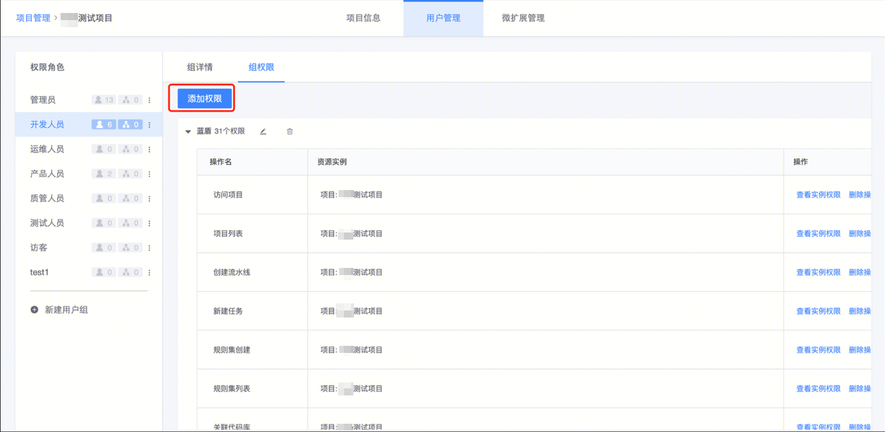
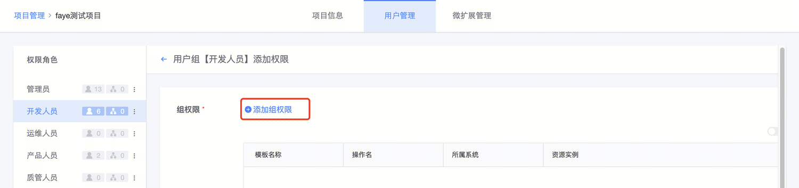
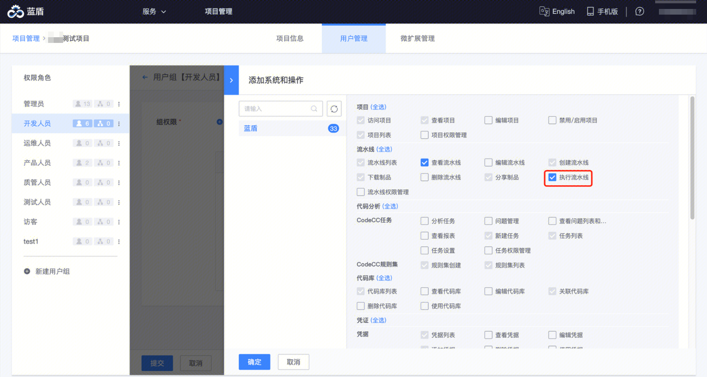
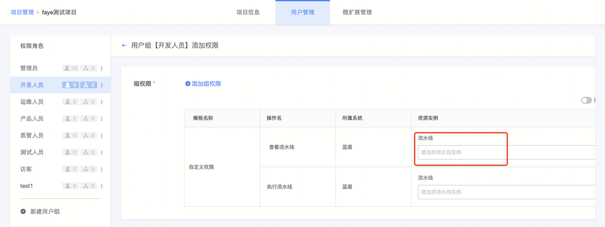
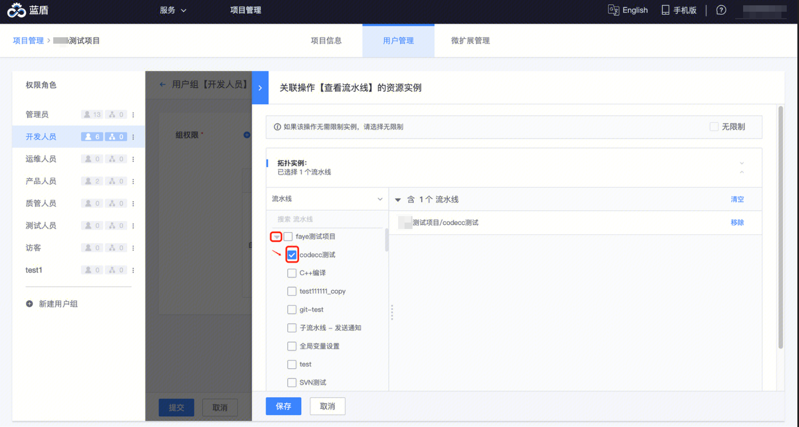
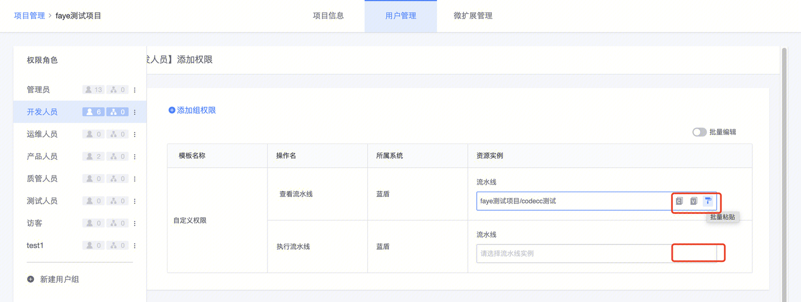
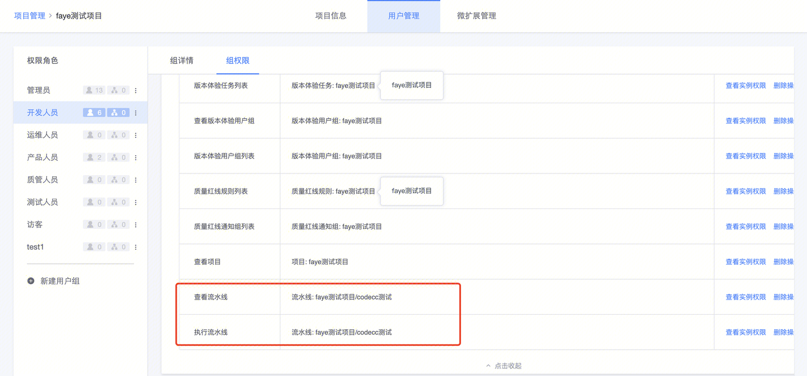
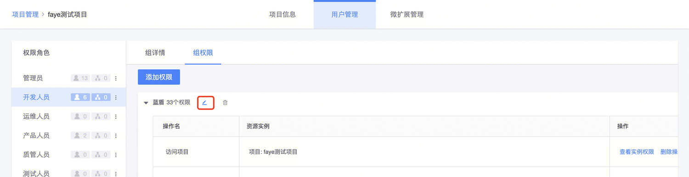
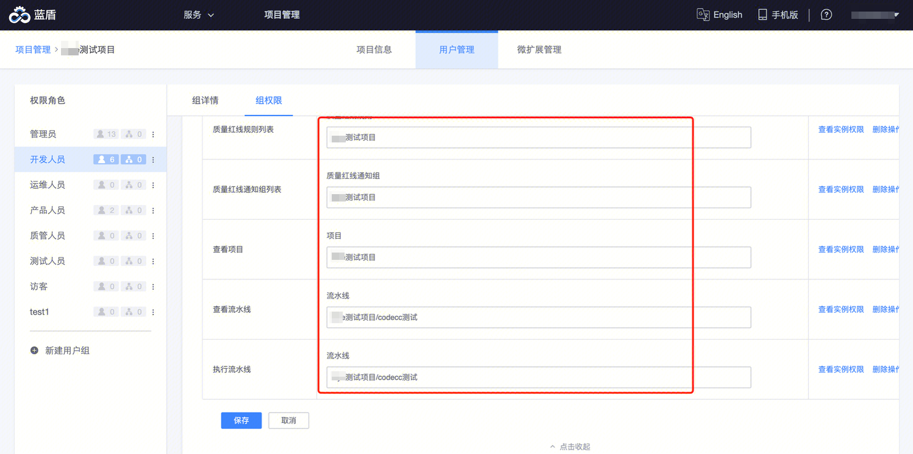

# 给项目级别的用户组添加权限
当项目级别的用户组权限不满足需求时，可以修改用户组权限。

权限包括操作和操作对象（资源实例）。

> 本指引以希望项目下的「开发人员」组有执行流水线「xxx」的权限为例

## 当用户组中还没有对应的操作时

1、 进入用户组的“组权限”tab，点击「添加权限」

2、选择待添加的操作

比如选择 「执行流水线」

> 此时系统会自动选中「查看流水线」，因为执行流水线的用户一般需要查看构建结果，需要查看权限

3、选择操作对象（资源实例）

选择好操作后的界面如下所示：

点击上图中红框所示，选择目标流水线：

- 可以选择一条或多条流水线

- 也可以选择项目，对项目下的所有流水线生效

选择ok后，保存，进入如下页面：

可以把选好的资源实例复制到其他操作的操作对象下

设置完毕，提交后，可以在组权限页面看到上述添加的操作和操作对象。

此时，「开发人员」组下的所有用户，都可以执行对应的流水线

## 当用户组中已有操作，仅操作对象不满足需求时

编辑入口如下：

点编辑进去，修改对应操作的操作对象即可

