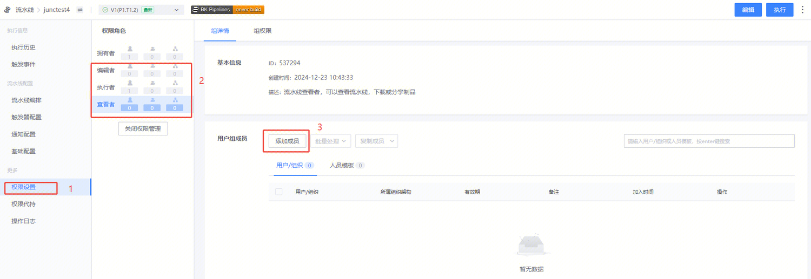
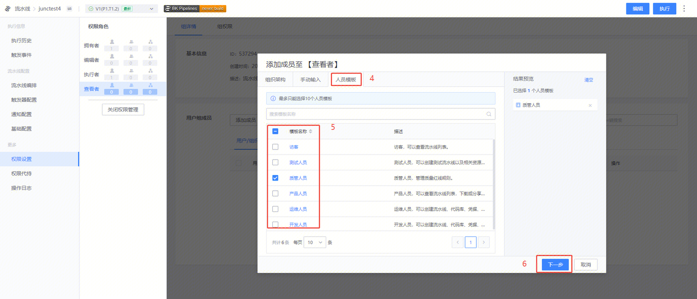

# 给一组用户开通指定流水线的权限

通常情况下，管理员会在项目下创建一个用户组，管理一组用户。给这组用户添加流水线权限有两种方式：

## 方式一：编辑组权限，将需要的流水线和操作添加到组权限里
操作指引见：给项目级别的用户组添加权限

## 方式二：权限设置，将整个用户组添加到流水线
> 拥有者不支持添加用户组，其他角色可以添加用户组。

流水线的拥有者，可以根据需要给用户组开通流水线的权限

 

1. 入口在查看流水线页面，“权限” tab

2. 系统默认的 4 个权限角色，其中拥有者不支持添加用户组，其他角色可以添加用户组

3. 可以添加用户组到相应的权限角色

4. 可以按项目用户组进行添加的界面

5. 可以选择该流水线所需授权的用户组
