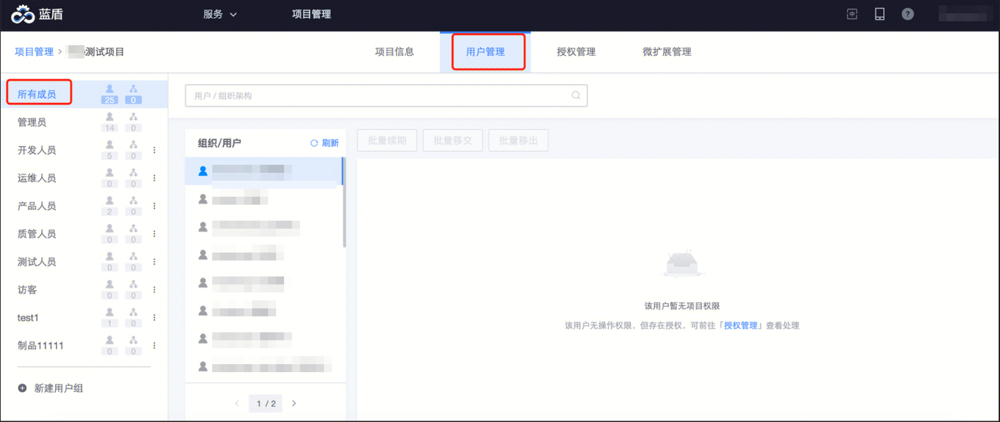
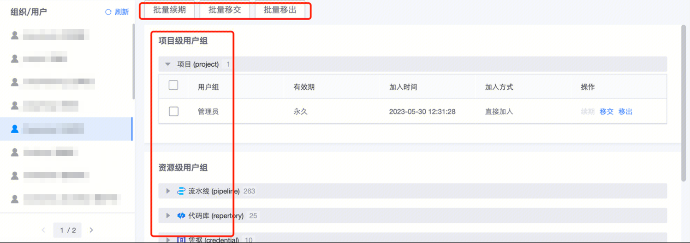
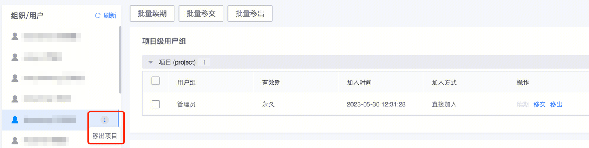
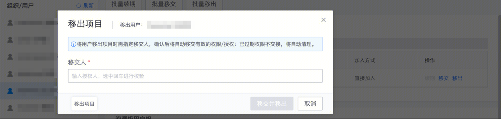

# 项目成员管理（批量续期/移交/移出）

**项目管理员**，可以管理项目下的所有成员，对成员权限进行续期、移交、删除操作，或者将成员移出项目，入口在项目管理->用户管理->所有成员 tab 下：

 
## 成员列表
包括：

- 在项目下有操作权限的用户

- 在项目下有操作权限的组织架构

- 在项目下有过资源授权（参考[授权管理](authorize.md)）的用户

hover 到成员上，有移出成员操作入口

## 用户名下的权限管理
选中用户后，右侧展示此用户在当前项目下加入的所有用户组列表：

 

- 用户组列表包括：

  - 项目级别的用户组

  - 资源级别（如流水线、代码库等资源）的用户组

  - 当用户创建资源时，将默认成为资源的拥有者

- 若需回收用户权限，将用户从对应的组内移出即可

- 当用户是资源的唯一拥有者时，不能直接移出组，需添加新的负责人到资源拥有者组里

- 当用户通过将「项目用户组」加入流水线的方式获得流水线权限时，不能直接将用户从流水线用户组中移出。调整时需要对应的「项目用户组」下操作

## 将用户移出项目
入口：

 

移出时，若用户名下有尚未过期的权限未交接，需指定移交人：

 

已过期的权限自动清理，不会移交

部分历史用户还存在一种情况：没有任何资源的操作权限，但曾经对某些资源做过授权（[授权管理](authorize.md)），这种情况也需要新负责人重新授权后，才能将用户移出项目
