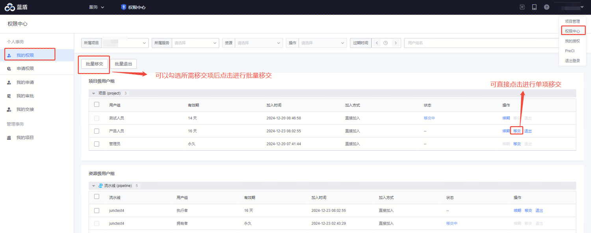
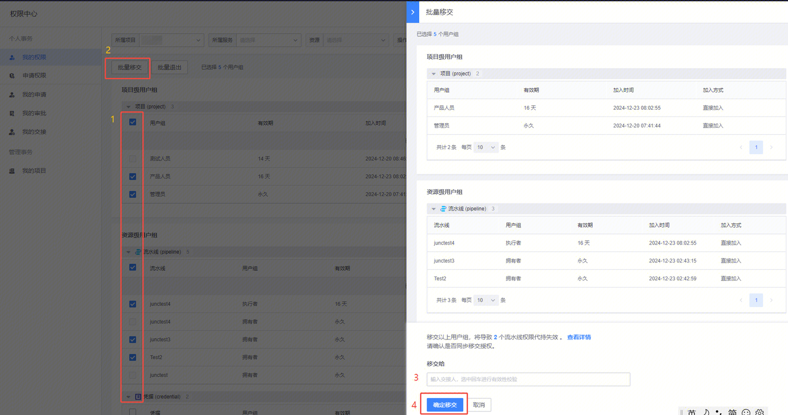
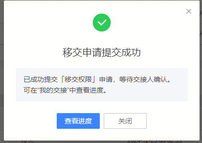
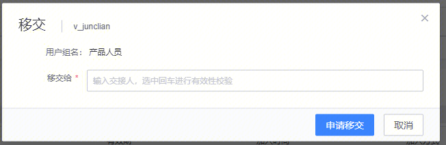

# 权限移交

当用户负责的工作范围发生变更，或者离职时，可以将自己的权限移交给新的负责人

权限移交入口如下所示：

进行批量移交:

- 选择待移交的权限（用户组）
- 点击”批量移交“
- 填写新的负责人
- 点击”申请移交“
等待交接人同意移交即可完成权限移交

进行单项移交：

- 待移交的权限（用户组）点击”移交“
- 填写新的负责人
- 点击”申请移交“
等待交接人同意移交即可完成权限交接

