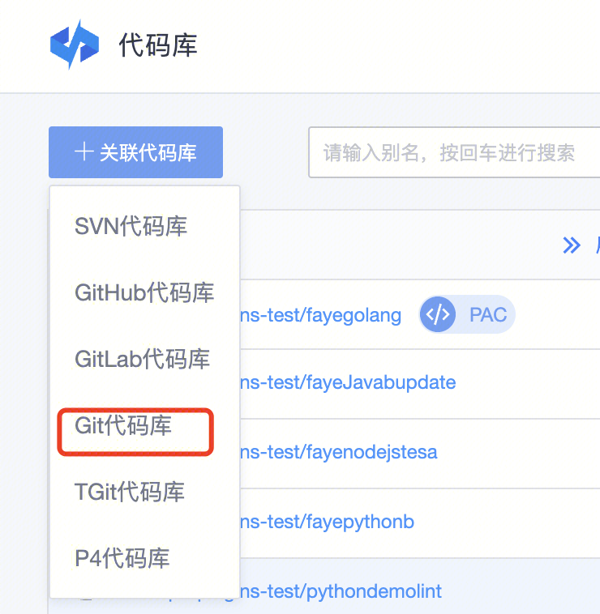
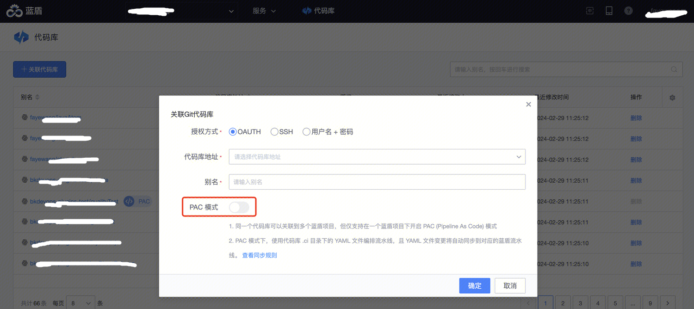
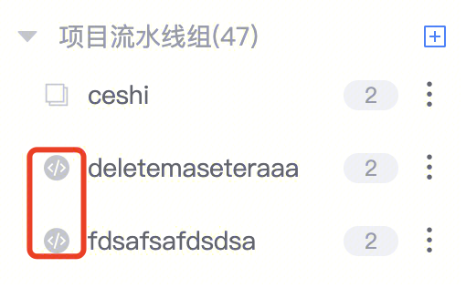

# 快速上手 PAC 模式

# 准备工作

1. 准备一个工蜂代码库

# 开启 PAC 模式

在蓝盾代码库服务下，将准备好的工蜂代码库关联到蓝盾，并`开启 PAC 模式`（Pipeline as Code 模式，统一简称为 PAC 模式）。


 



 
若代码库已存在，在查看代码库页面开启即可。
PAC模式需 OAUTH 方式授权。
# 提交流水线文件到代码库

PAC 模式下，使用 YAML 文件来定义流水线。
YAML 文件示例：

 ```
version: v3.0

on:
  push: 
    branches: [ "*" ]

steps:
- run: |
    echo "Hello, world!"

notices:
- type: email
- type: wework-message
```
 
有两种方式提交代码：
1.  通过IDE 或工蜂页面直接提交代码文件到代码库
2. 通过蓝盾创建流水线，并提交到代码库：[ 使用 UI 辅助编排 YAML 文件 ](https://iwiki.woa.com/p/4009967219)
	
	 
流水线文件需存放在代码库的 `.ci 目录`下：
- .ci 目录下可以添加 `1 级`子目录，来按照模块管理流水线
	- 若存在 1 级子目录，将自动创建对应的流水线组，流水线组名为子目录名称
	- 若没有 1 级子目录，.ci 目录下的所有流水线将在以代码库名称为名的流水线组下

此类系统自动创建的流水线组，标识和普通的流水线组不同，如下所示：



- `templates` 为系统内置的模版文件目录，不能存放流水线文件

 
流水线 YAML 文件提交后，即可以使用代码库来更新流水线。
YAML 文件的任何变更，都将自动同步到蓝盾流水线。