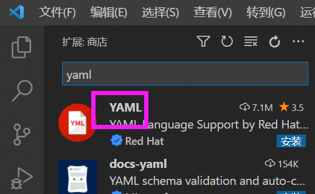

# 语法检测/补全工具 - vscode 插件

使用 vscode 编写流水线 YAML 时，可以安装语法检测/补全工具，协助编写YAML，减少语法问题失败带来的挫败感。
 
安装 vscode 的 通用 YAMl 插件，如：




打开VS Code配置文件（setting.json）进行配置：

 ```
"yaml.schemas": {
        // 编写ci文件的语法检查
       "http://staticfile.woa.com/bkdevops/ci-yaml-schema/latest/ci-v3.json": ".ci/*.yml"
}

```