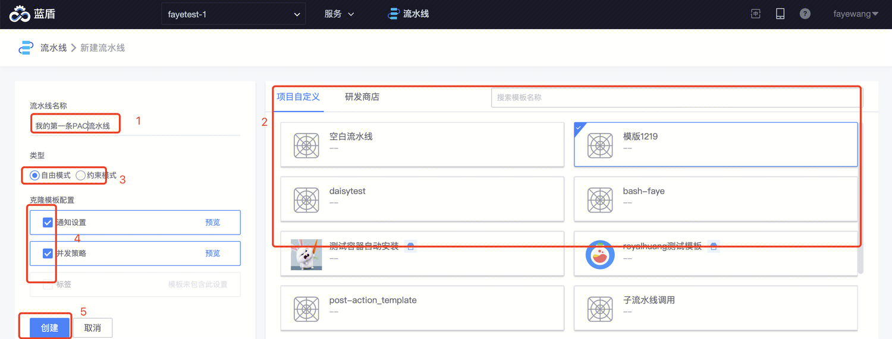
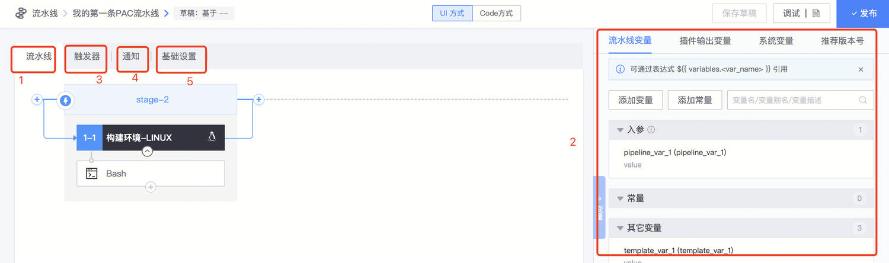
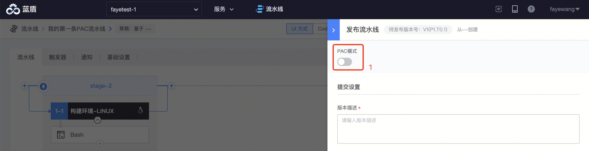
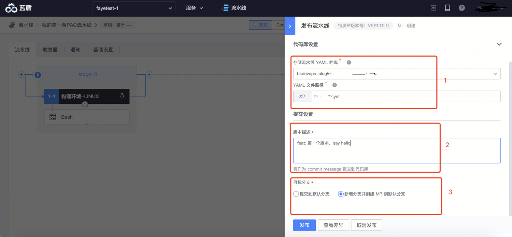
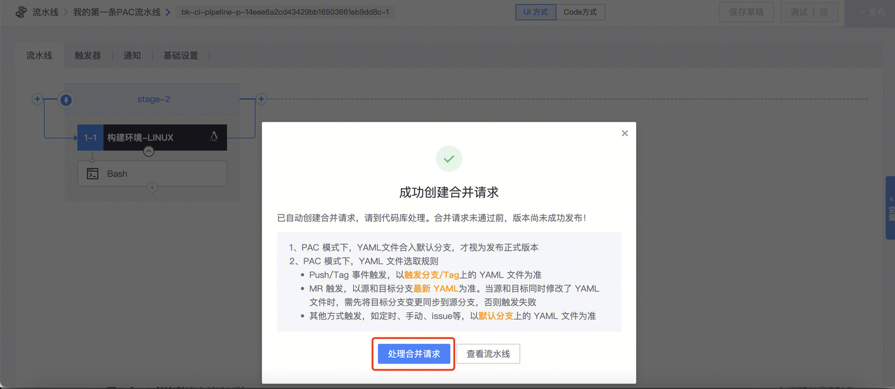
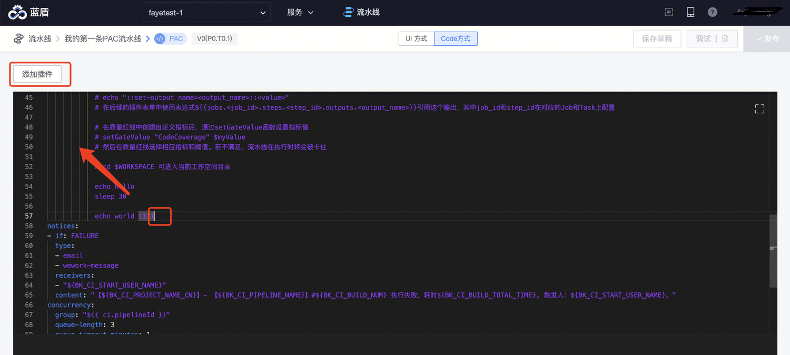
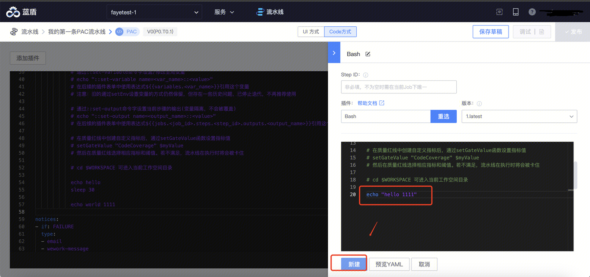
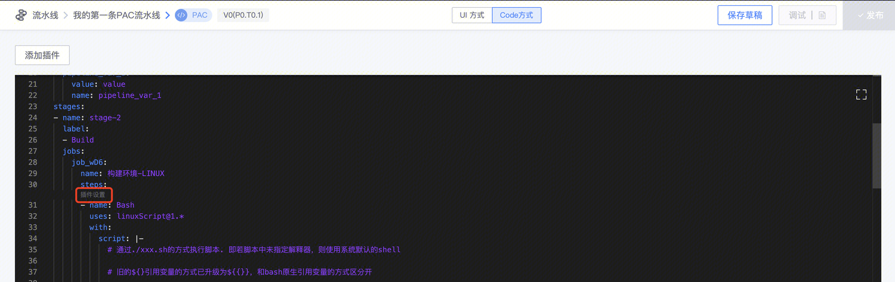

# 使用 UI 辅助编排 YAML 文件

## 从 BK-CI 创建 PAC 流水线

可以直接在 BK-CI 上通过 UI 编排的方式创建一个 PAC 流水线，自动生成流水线对应的 YAML 文件，无需手动写 YAML。

## Step1: 进入 BK-CI 流水线服务

登录 BK-CI

## Step2: 点击「新增流水线」，从模版新建，选择合适的模版生成流水线

 
选择合适的模版，创建流水线：

 
## Step3: 根据场景编排好流水线

 
1. 流水线 stage/job/step
2. 流水线变量
3. 触发器
4. 执行完成通知
5. 基础设置：如名称、描述、并发策略等

 
## Step4: 编排完成后，保存草稿，进行调试

按需调试，没有问题后再提交发布。
调试过程不会影响线上版本：比如线上版本监听了代码库 push 事件，调试过程中的 push 触发仍然使用已发布的最新版本运行

## Step5: 调试完成后，发布版本，提交 YAML 文件到代码库

### 打开流水线的 PAC 模式

 
### 填写提交信息

  
1. 选择流水线将要提交到的代码库、填写流水线YAML文件路径
2. 填写版本变更说明
3. 选择流水线YAML文件提交的目标分支，有两种方式
	1. 提交到默认分支：若代码库已开启默认分支保护，此种方式将提交失败
	2. 由系统新建分支并提交：推荐此方式

### 到代码库处理合并请求

点击「发布」后，系统将创建分支、将变更提交到分支上，并创建合并请求到默认分支。
可以根据提示到代码库，联系代码库 MR 处理人进行代码 review，合并变更到默认分支。

 
### 变更合并到默认分支上之后，版本才正式发布完成

若尚未合并到默认分支，还不会生效

# 使用 UI 配置 YAML 编排的流水线插件

当流水线插件功能比较复杂，或者不熟悉插件的入参字段时，可以通过 UI 方式来配置流水线插件

## 添加一个流水线插件

在 Code 方式编辑页面，可以将光标聚焦在待添加步骤的地方，点击「添加插件」按钮：

 
选择待添加的插件：

 
填写好插件配置后，点击「新建」按钮：

 
系统将自动将对应的插件配置片段插入到 YAML 文件中。
 
## 修改一个插件配置

Code 方式编辑界面，每个插件顶部，有**「插件设置」**入口：

 
点击后唤起侧滑框，插件参数配置界面，可以在侧滑框中修改好后，确定应用修改。