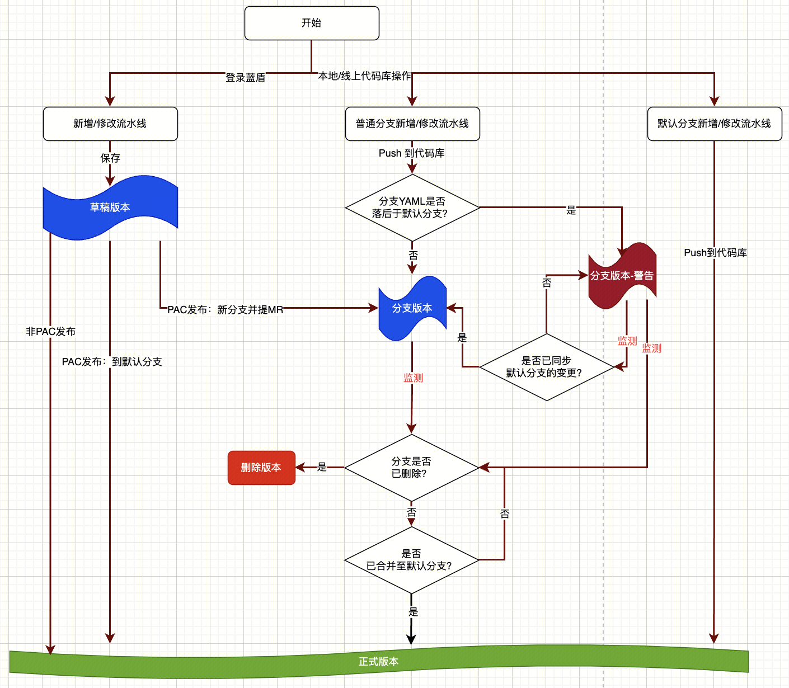

# 流水线版本管理

以`流水线文件的路径`，作为流水线的`唯一`性判定标准。
 
对于同一个路径的流水线文件：
- 当变更提交到流水线仓库`默认分支`上时，将在 BK-CI 生成一个对应的“正式版本”
- 当变更首次提交到除了默认分支以外的其他分支时，将在 BK-CI 生成一个对应的“分支版本”：
	- 尚未合并到默认分支时，分支上的多次提交，不会生成新的“分支版本”
	- 当分支内容合并到默认分支后，关闭分支版本，并发布了一个“正式版本”

 
可以在 BK-CI 上回滚到指定的一个历史版本。回滚操作实际上是使用历史版本生成了一个新的版本。
 
生成一个流水线版本的流程如下：

