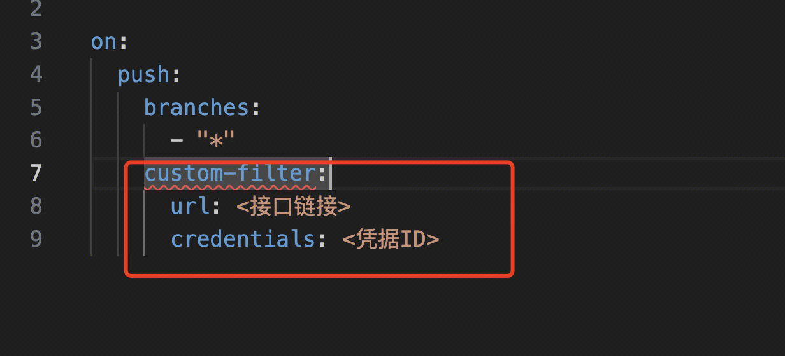

# 在 YAML 文件中添加触发器

通过顶级关键子 on 定义触发器

# on

触发器设置，监听工蜂事件或定时任务等，满足条件时执行流水线
当不配置任何触发器时，等同于：

```yml
version: v3.0

on:
  push:
    branches: [ "*" ]
  tag:
    tags: [ "*" ] 
  mr:
    target-branches:  [ "*" ]
  openapi: enabled
```

`触发器的属性值，不支持通过上下文变量设置。`

### push

监听git push事件，相关配置参数如下


| |
|:--|
|**属性** |**值格式** |**说明** |**备注** |
|branches |Array<String> |在指定的分支上提交时触发执行 |分支名称支持使用`*匹配 0~n 个除斜杠(/)以外的任意字符`，如：<br>*： 不包含斜杠的分支名，如 master,feat_1,develop,test等，不匹配 release/1.0.0, hotfix/2024/5 等此类带斜杠的分支名<br>**: 匹配所有分支<br>release/*：以"release/"开头的双层路径分支，但不能匹配多层路径，如: release/code/backend, release/code/backend/java 等多层路基不能匹配 <br>release/**:  以"release/"开头的所有分支，支持多层路径 |
|branches-ignore |Array<String> |排除的分支，满足条件的分支提交时不触发执行 |规则同上【branches】 |
|path-filter-type |String |区分路径过滤类型，可选值为：<br>- RegexBasedFilter：按通配符匹配<br>- NamePrefixFilter：按路径前缀匹配（默认值） | |
|paths |Array<String> |满足条件的路径上的提交才触发执行 |- 当**【path-filter-type=NamePrefixFilter】**时以路径前缀进行匹配<br>src/main: 匹配所有以"src/main"开头的路径，且无视前缀斜杠，"/src/main"等效于"src/main"<br>- 当**【path-filter-type=RegexBasedFilter】**时以通配符进行匹配，支持使用`*匹配 0~n 个除斜杠(/)以外的任意字符`，如：<br>*： 不包含斜杠的路径，如main.java, 等此类带斜杠的分支名<br>**: 匹配所有路径<br>src/*: 以"src/"开头的双层路径，但不能匹配多层路径，如: src/java/main, src/java/test/com等三层及以上路径不能匹配 <br>src/**:  以"src/"开头的所有路径，支持多层路径<br> <br>注：当【监听路径】和【排除路径】两项所匹配的文件个数相同，则不触发 |
|paths-ignore |Array<String> |排除的路径，满足条件的路径提交时不触发执行 |规则同上【paths】 |
|users |Array<String> |指定用户生成的事件才触发 | |
|users-ignore |Array<String> |排除的用户，满足条件时不触发 | |
|action |Array<String> |`缺省为 new-branch、push-file`<br>区分新增分支或者变更文件，可选值为：<br>- new-branch：新增分支<br>- push-file：变更文件 |监听"new-branch"动作时，webhook中文件变更列表为空，所以不建议配置【paths】选项，避免因路径过滤条件导致流水线未被触发 |
| | | | |

若不需要监听 push 事件，不配置 push 相关设置即可（注意，若 on 关键字缺省，默认监听push事件）
push 触发时，YAML 配置以当前分支为准：
- 若当前分支上没有任何 YAML 文件监听 push 事件，则当前次提交不会触发CI
- 在MR界面提示如下：

#### 监听 push 事件实例

 ```
version: v3.0

on:
  push:
    branches:
      - master
      - release/*

# 可以简写为
on:
  push:
    - master
    - release/*
version: v3.0

=========================    
# 多条件定制

# 监听指定分支指定路径上的 push 事件
on:
  push:
    branches:
      - master
    paths:
      - src/*/test/*
  
# 监听新增分支事件
on:
  push:
    action:
    - new-branch

# 监听变更文件事件
on:
  push:
    branches:
      - "*"
    action:
      - push-file
 
# 监听用户推送事件
on:
  push:
    # 监听zhangsan、lisi、wangwu三位用户基于master和release分支的推送事件
    branches:
      - "master"
      - "release/**"
    action:
      - push-file
    users:
      - zhangsan
      - lisi
      - wangwu
```
	
### tag

监听git tag push事件，暂不支持监听tag删除事件，相关配置参数如下


| |
|:--|
|**属性** |**值格式** |**说明** |**备注** |
|tags |Array<String> |名称满足条件的tag推送时触发 |tag名称支持使用`*匹配 0~n 个除斜杠(/)以外的任意字符`<br>*： 不包含斜杠的tag名，如 v1.0.0,release_1.0.0等，不匹配 release/1.0.0, hotfix/2024/5 等此类带斜杠的分支名<br>**: 匹配所有Tag<br>release/*：以"release/"开头的双层路径Tag名，但不能匹配多层Tag名，如: release/bk-ci/2.0, release/stream/2.0/final 等三层及以上Tag名不能匹配  <br>release/**:  以"release/"开头的所有分支，支持多层路径<br> <br>注：git客户端创建的tag不会含带创建分支的信息，这种情况下创建的tag无法监听目标分支 |
|tags-ignore |Array<String> |排除的tag，满足条件时不触发 | |
|users |Array<String> |指定用户生成的事件才触发 |用户名支持使用`*匹配 0~n 个任意字符` |
|users-ignore |Array<String> |排除的用户，满足条件时不触发 | |
|from-branchs |Array<String> |来源分支，满足条件时不触发 |分支名称支持使用 `*匹配 0~n 个除斜杠(/)以外的任意字符`，如：<br>*： 不包含斜杠的分支名，如 master,feat_1,develop,test等，不匹配 release/1.0.0, hotfix/2024/5 等此类带斜杠的分支名<br>**: 匹配所有分支<br>release/*：以"release/"开头的双层路径分支，但不能匹配多层路径，如: release/code/backend, release/code/backend/java 等多层路基不能匹配 <br>release/**:  以"release/"开头的所有分支，支持多层路径<br> <br>注：git客户端创建的tag不会含带创建分支的信息，这种情况下创建的tag无法监听目标分支 |

#### 监听 Tag 事件实例

 ```
version: v3.0

# 所有tag触发
on:
  tags: [ "*" ]

# 所有名称前缀为release_的tag触发
on:
  tags: [ "release_*" ]
  
# 监听所有由特定分支创建的tag
on:
  tag:
    # tag名以v2开头
    tags:
    - v2.*
    # 排除v1开头的tag
    tags-ignore:
    - v1.*
    # 来源分支为master分支或release开头的分支名
    from-branches:
    - master
    - release/**
    # 操作用户为zhangsan、lisi
    users:
    - zhangsan
    - lisi 
```
 
若不需要监听 tag 事件，不配置 tag 相关设置即可（注意，若 on 关键字缺省，默认监听tag事件）
tag 触发时，YAML 配置以当前 tag 为准：
- 若当前tag上没有任何 YAML 文件监听 tag 事件，则当前次提交不会触发CI
- 若当前分支上存在 YAML 文件监听 tag  事件，但监听条件（如 tag名称）不满足，则当前次提交也不会触发CI

### mr

监听git merge request事件，相关配置参数如下


| |
|:--|
|**属性** |**值格式** |**说明** |**备注** |
|target-branches |Array<String> |mr的目标分支满足条件时触发执行 |分支名称支持使用`*匹配 0~n 个除斜杠(/)以外的任意字符`，如：<br>*： 不包含斜杠的分支名，如 master,feat_1,develop,test等，不匹配 release/1.0.0, hotfix/2024/5 等此类带斜杠的分支名<br>**: 匹配所有分支<br>release/*：以"release/"开头的双层路径分支，但不能匹配多层路径，如: release/code/backend, release/code/backend/java 等多层路基不能匹配 <br>release/**:  以"release/"开头的所有分支，支持多层路径 |
|source-branches-ignore |Array<String> |mr的源分支满足条件时不触发 |规则同上【target-branches】 |
|path-filter-type |String |区分路径过滤类型，可选值为：<br>- RegexBasedFilter：按通配符匹配<br>- NamePrefixFilter：按路径前缀匹配（默认值） | |
|paths |Array<String> |满足条件的路径上的提交才触发执行 |- 当【path-filter-type=NamePrefixFilter】时以路径前缀进行匹配<br>src/main: 匹配所有以"src/main"开头的路径，且无视前缀斜杠，"/src/main"等效于"src/main"<br>- 当【path-filter-type=RegexBasedFilter】时以通配符进行匹配，支持使用`*匹配 0~n 个除斜杠(/)以外的任意字符`，如：<br>*： 不包含斜杠的路径，如main.java、test.go 等此类带斜杠的路径<br>**: 匹配所有路径<br>src/*: 以"src/"开头的双层路径，但不能匹配多层路径，如: src/java/main, src/java/test/com等三层及以上路径不能匹配 <br>src/**:  以"src/"开头的所有路径，支持多层路径<br>注：当【监听路径】和【排除路径】两项所匹配的文件个数相同时流水线不触发 |
|paths-ignore |Array<String> |排除的路径，满足条件的路径提交时不触发执行 |规则同上【paths】 |
|action |Array<String> |`缺省为 open、reopen、push-update`<br>支持如下操作：<br>- open：新建MR<br>- close：MR被关闭<br>- reopen：MR重新被打开<br>- push-update：源分支有代码push<br>- merge：代码已合并 | |
|users |Array<String> |指定用户生成的事件才触发 | |
|users-ignore |Array<String> |排除的用户，满足条件时不触发 | |
|report-commit-check |Bool |值为 true 时，上报 commit check 信息到工蜂<br>缺省值为 true | |
|block-mr |Bool |report-commit-check=`true 时生效`<br>值为 true 时，若流水线运行中或运行失败，block mr，不允许合并 | |

	
#### 监听 MR 事件实例

```yml
version: v3.0

# 可以简写为
on:
  mr: [ master ]   # 目标分支为 master 的 mr 的open、reopen、push-update 均会触发执行
  
# =========================    
# 多条件定制

# 监听指定目标分支，同时指定文件变更要求
on:
  mr:
    target-branches:
      - master
    paths:
      - src/*

#仅监听MR开始和关闭事件
on:
  mr:
    action:
    - open
    - close
    
#监听目标分支为master的MR合并事件
on:
  mr:
    target-branches:
    - master
    action:
    - merge

# 多条件过滤
on:
  mr:
    # 源分支名以"feat_"开头
    source-branches:
    - feat_**
    # 源分支名不能以"test_"开头
    source-branches-ignore:
    - test_**
    # 目标分支为master
    target-branches:
    - master
    # 目标分支不是develop，也不能以"feat_"开头
    target-branches-ignore:
    - develop
    - feat_**
    # 监听涉及"a_1/b_1/c_1"文件变更的MR
    paths:
    - a_1/b_1/c_1
    # 排除涉及"a/b/c_2 "文件变更的MR
    paths-ignore:
    - a/b/c_2      
```
 
若不需要监听 mr 事件，不配置 mr 相关设置即可
**mr 触发时：**
- 若源和目标存在冲突，触发失败，需要先解决冲突。
	- 在消息中心对应的事件触发结果信息下，提示 CI_MERGE_CONFLICT: MR conflict, please resolve the conflict first
- 若源和目标都变更了YAML文件，触发失败。需要先将目标分支上的变更同步到源分支。同步之后，使用源分支的YAML触发执行。
	- 在MR界面提示如下：

          


- 若源和目标分支仅有一方修改了YAML文件，或者都没修改，以最新的配置为准


### schedules


| |
|:--|
|**属性** |**值格式** |**说明** |**备注** |
|cron |String |crontab 表达式 |不支持秒级别的定时任务<br>定时计划以及对应的流水线编排均以 `默认分支`上的YAML为准 |
|branches |Array<String> |非必填，缺省时为默认分支<br>支持在指定的分支上执行定时任务。需指定明确的分支，不支持*通配。<br>最多支持 **3** 个分支 | |
|always |Boolean |缺省为 false，表示只有在代码变更时（和上一次成功触发相比）才执行<br>当值为 true 时，表示始终执行 | |
|repo-id |String |代码库HashId |当repo-id 和 repo-name 同时存在时，优先使用repo-id |
|repo-name |String |代码库别名 |

频率限制：
- 不能定义秒级别的定时任务，yml 推送时检查，不合法时企业微信知会

#### 定时触发事件实例

 ```
version: v3.0

# 每天凌晨1点定时运行
on:
  schedules:
    cron: 0 1 * * * 

# 指定代码库分支有更新时才触发
on:
  schedules:
    # 每隔2分钟检查一次代码库分支版本，分支版本发生变更则触发
    cron: '*/2 * * * *'
    # 监听的代码库别名
    repo-name: bk_ci/schedules_repo
    # 需要监听的分支
    branches:
    - master
    - develop
    # 只有代码库变更时才触发
    always: false
```
	
### issue

监听仓库下的 issue 事件。此时流水线配置以**默认分支**为准。


| |
|:--|
|**属性** |**值格式** |**说明** |
|action |List<String> |可选值为：<br>- open：新建issue<br>- close：关闭issue<br>- reopen：重新打开issue<br>- update：更新issue |

#### 监听 Issue 事件实例

 ```
version: v3.0

# 监听Issue新建和关闭事件
on:
  issue:
    action:
      - open
      - close

steps:
- run: |      
      echo '========Issue事件相关参数========'
      echo 'ci.event = ${{ ci.event }}'
      echo 'ci.repo_url = ${{ ci.repo_url }}'
      echo 'ci.issue_title = ${{ ci.issue_title }}'
      echo 'ci.issue_id = ${{ ci.issue_id }}'
      echo 'ci.issue_iid = ${{ ci.issue_iid }}'
      echo 'ci.issue_description = ${{ ci.issue_description }}'
      echo "ci.issue_state = ${{ ci.issue_state }}"
      echo "ci.issue_owner = ${{ ci.issue_owner }}"
      echo "ci.event_url = ${{ ci.event_url }}"
      echo "ci.issue_milestone_id = ${{ ci.issue_milestone_id }}"
      echo "ci.action is ${{ ci.action }}"

```
### review

监听代码库下的评审事件。此时流水线配置以**默认分支**为准。


| |
|:--|
|**属性** |**值格式** |**说明** |
|states |List<String> |可选值为：<br>- approved：评审通过<br>- approving：评审中<br>- change_denied：评审被拒绝<br>- change_required：代码要求修改 |

#### 监听 CR 事件实例

 ```
version: v3.0

on:
  review:
    states:
      - approved
      - approving
      - change_denied
      - change_required

steps:
- run: |
      echo '========CR事件相关参数========'
      echo 'ci.event = ${{ ci.event }}'
      echo 'ci.event_url = ${{ ci.event_url }}'
      echo 'ci.review_id = ${{ ci.review_id }}'
      echo 'ci.review_iid = ${{ ci.review_iid }}'
      echo 'ci.review_owner = ${{ ci.review_owner }}'
      echo 'ci.review_state = ${{ ci.review_state }}'
      echo 'ci.review_reviewers = ${{ ci.review_reviewers }}'

```
	
### note

监听代码库下的评论事件。此时流水线配置以**默认分支**为准。


| |
|:--|
|**属性** |**值格式** |**说明** |
|types |List<String> |可选值为：<br>- commit # 对提交进行评论<br>- merge_request # 对 mr 进行评论<br>- issue # 对缺陷进行评论 |
|comment |List<String> |过滤评论，支持正则匹配 |

#### 监听 Note 事件实例

 ```
version: v3.0

# 监听来自于提交和Issue的评论事件，并指定评论内容
on:
  note:
    types:
    - commit
    - issue
    # 评论内容，支持正则表达式
    comment:
    - hejie*
    - test*

steps:
- run: |
      echo '========Note事件相关参数========'
      echo 'ci.event = ${{ ci.event }}'
      echo 'ci.event_url = ${{ ci.event_url }}'
      echo 'ci.note_id = ${{ ci.note_id }}'
      echo 'ci.note_comment = ${{ ci.note_comment }}'

```
	
### 组合条件监听

当流水线需要监听多个事件，且事件存在重复时，需指定多个触发器，任意一个触发器满足条件流水线即可触发，具体实例如下
 ```
on:
  - manual: enabled
  # 条件1
  - push:
      name: Git事件触发 - 条件1
      branches:
        - feat_**
      branches-ignore:
        - develop
      users: []
      users-ignore: []
      action:
        - push-file
  # 条件2
  - push:
      name: Git事件触发 - 条件2
      branches:
        - feat_**
      branches-ignore:
        - master,develop
      paths:
        - "src/main"
      paths-ignore:
        - "src/test"
      users: []
      users-ignore: []
      action:
        - push-file
  # 条件3
  - push:
      name: Git事件触发 - 条件3
      branches:
        - bug_**
      branches-ignore:
        - release
      paths:
        - ""
      paths-ignore:
        - ""
      users: ["zhangsan","lisi"]
      users-ignore: ["wangsu"]
      action:
        - push-file
        
 # 注：当事件同时满足两个触发器的过滤条件时，流水线仅触发一次，此处实例当用户向【feat_100】分支上推送【src/main/test.java】文件变更时，可同时满足【条件1】和【条件2】，但流水线仅会匹配【条件1】的触发器，【条件2】直接跳过
 # 同一Git事件满足多个触发器条件，流水线仅触发一次
```