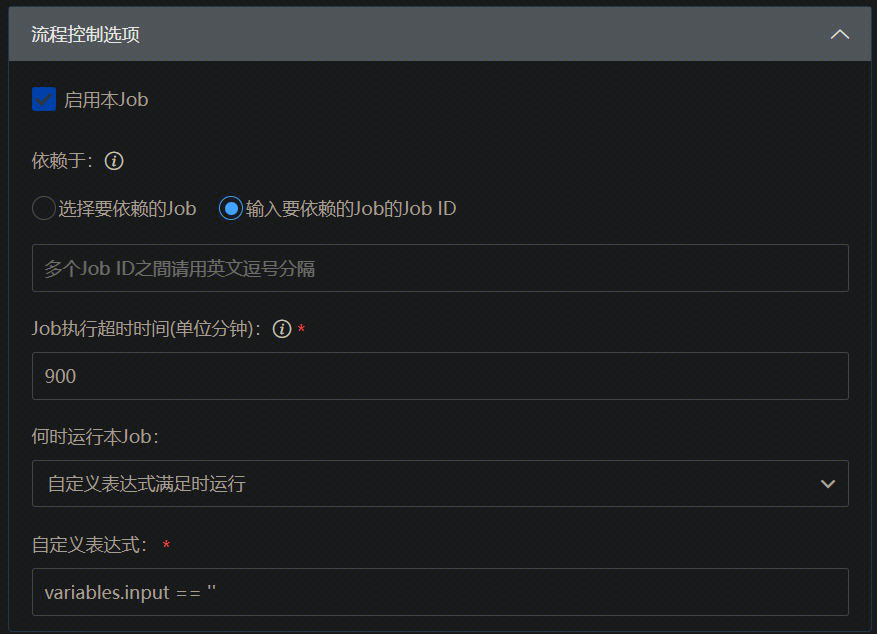

# 条件执行

## Stage层(Finally Stage 不支持条件执行)

| |
|:--|
|`<表达式>` |`表达式满足时`执行 |
|不填 |`上个阶段执行结束时`执行 |


示例：
判断入参input是否为空字符串，如果为空则执行



 
👆👆👆👆👆 UI 👆👆👆👆👆
👇👇👇👇👇Code 👇👇👇👇👇

 ```
version: v3.0
name: 表达式测试
on:
  manual: enabled
variables:
  input:
    value: ""
stages:
- name: stage-1
  label:
  - Build
  jobs:
    job_fkd:
      name: 构建环境-Linux
      if: variables.input == ''
      steps:
      - name: Bash
        uses: linuxScript@1.*
        with:
          script: echo 判断入参是input否为空字符串，如果为空则执行
```

## Job层

| |
|:--|
|`<表达式>` |`表达式满足时`执行 |
|不填 |`当前 Job 开始运行时`执行 |


## Finally Job层

| |
|:--|
|`SUCCESS` |`上游 Job 成功时`执行 |
|`FAILURE` |`上游 Job 失败时`执行 |
|`CANCELLED` |`上游 Job 取消时`执行 |
|不填 |`当前 Job 开始运行时`执行 |


## Step层

| |
|:--|
|`ALWAYS_UNLESS_CANCELLED` |`即使前面有插件运行失败也执行，除非被取消才不执行` |
|`ALWAYS` |`即使前面有插件运行失败也执行，即使被取消也执行` |
|`FAILURE` |`只有前面有插件运行失败时才执行` |
|`<表达式>` |`表达式满足时`执行 |
|不填 |`所有前置插件运行成功时`执行 |


