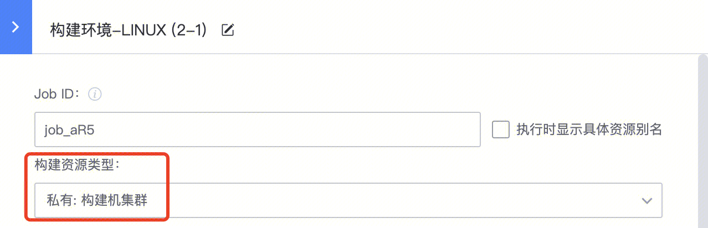

# Job 并发控制

## 功能介绍

在一些场景下，流水线可以并发，但其中的个别 Job 因资源或功能逻辑限制，同一时间运行的任务个数有上限，例如：

- 一些编译任务，占用大量 CPU、内存等构建机资源，并发多个会导致编译无法正常运行
- 一些测试任务或者部署任务，远端资源有限，不能同时运行多个任务

在这些场景下，可以通过 **Job 并发设置**功能来避免并发超限：

- **单节点上的并发**：当前 Job 任务在单个节点上的并发上限
- **所有节点上的并发**：当前 Job 任务在构建资源池下的总并发上限

---

## 使用限制

现阶段仅使用**第三方构建机环境**的场景下，支持此功能。

