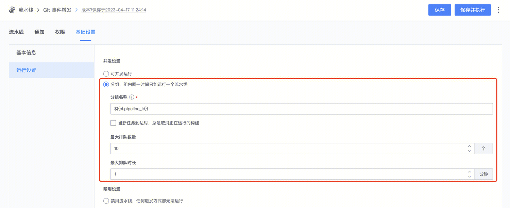

# 控制流水线并发

默认情况下，流水线可以并发运行。但有些场景下，因资源限制、或业务逻辑限制，不能/不需要并发。此时，可通过流水线设置来控制并发：


- 可设置**分组**，每个组内的构建任务排队运行
- 分组名称可引用变量，如触发相关的变量
- 分组在项目下生效，即有可能会跨流水线。若不希望跨流水线生效，建议在分组名中包含当前流水线 ID：`${{ci.pipeline_id}}`
- 每个组可设置**最大排队数量**和**最大排队时长**
- 当队列满，且有新任务到达时，先进队列的任务会被取消，新任务进入队列

---

## 场景示例

在 MR 触发的场景下，若每次构建需要的时间非常长，且总是关注最新一次构建，短时间内多次提交无需运行构建时，可以：

- 分组名设置为：

```
${{ci.pipeline_id}}-${{ci.repo}}-${{ci.base_ref}}-${{ci.head_ref}}
```

- 勾选「**当新任务到达时，总是取消正在运行的构建**」开关，自动取消无效任务。
