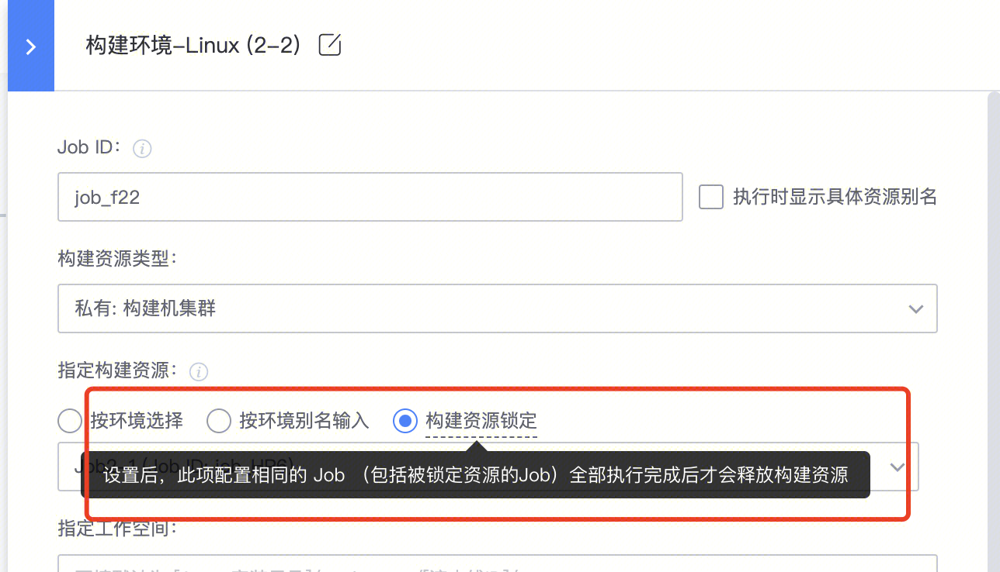

# 多个Job使用集群中的同一台机器进行构建

当使用「第三方构建集群」运行构建任务时，有些场景下需要分 Job 运行，但希望同一次构建运行时，多个 Job 都使用同一台构建机，以便于：

- 在相同的工作空间下运行，无需重复拉代码
- 共享某些大文件，减少通过制品库中传时的上传下载耗时

---

## 配置方式

### 第一步：添加获取节点的 Job

在流水线开始时，添加一个 Job，从构建机池中获取一个节点：

### 第二步：下游 Job 设置构建资源锁定

下游需要与此 Job 共用构建机的 Job，进行如下设置：

选择「构建资源锁定」，并指定对应的 Job。配置相同的 Job 会使用同一台构建机运行任务，构建机在所有 Job 运行完成后才释放。

---

## 补充说明

构建机资源锁定的锁定**维度为第三方构建机节点**，在构建中的锁定资源结束前，当前构建机将一直被该次构建锁定，即：

> **当前被锁定构建在释放前将一直占有第三方构建机的一份构建份额**

**示例：**

- 如果第三方构建机节点的最大并发数设置为 **1**，那么当前节点被构建资源锁定后，同项目的其他构建在被锁定构建结束前，将**无法调度**到该节点。
- 如果最大并发数设置为 **2**，那么资源锁定将只占有一份构建资源，同项目的其他**非构建资源锁定**的构建可以调度到剩余的一份构建资源。
