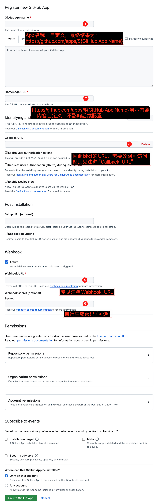
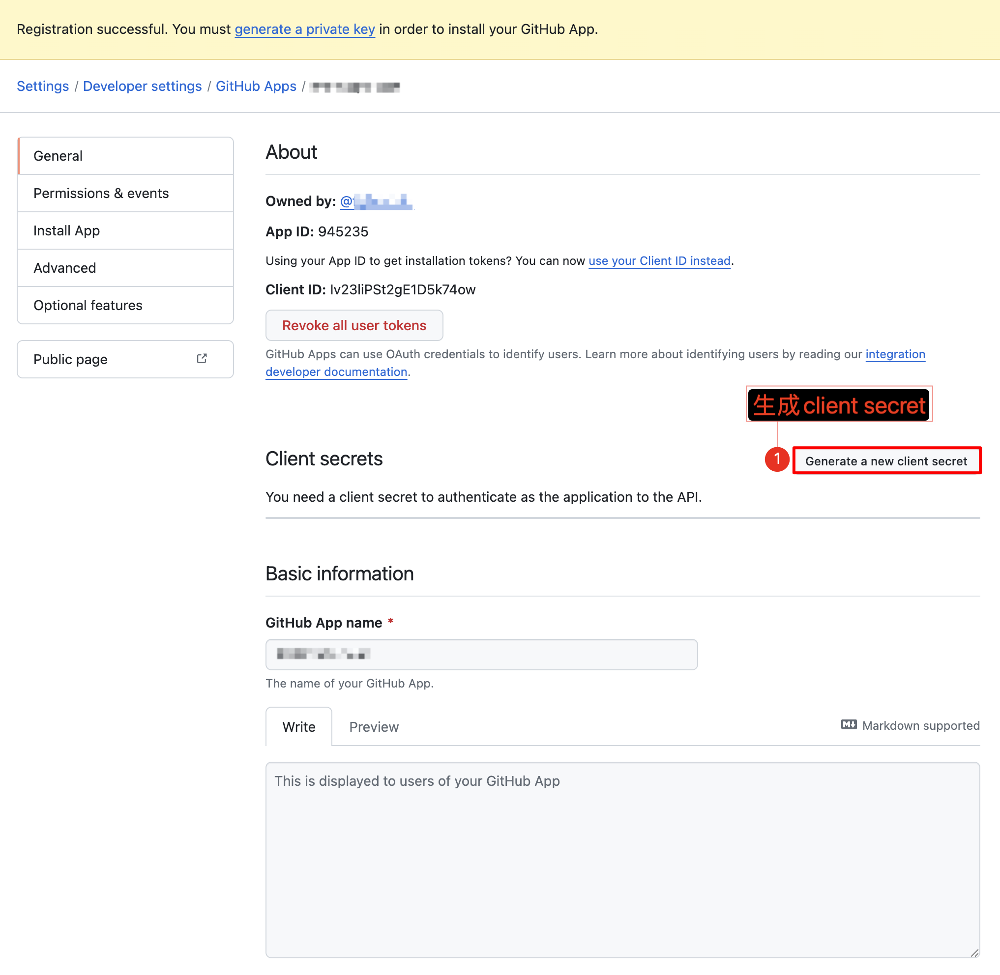
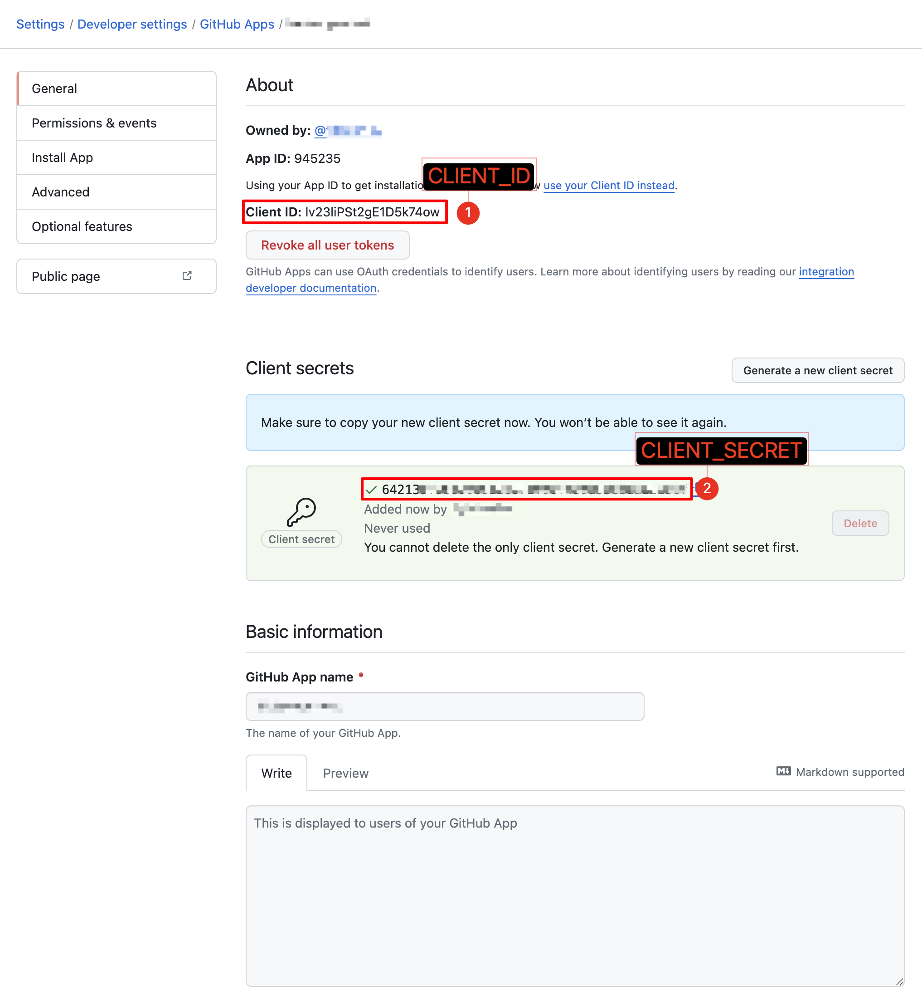
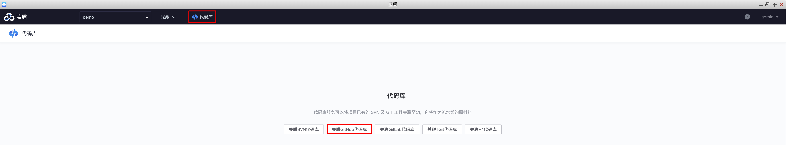
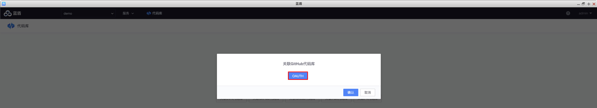
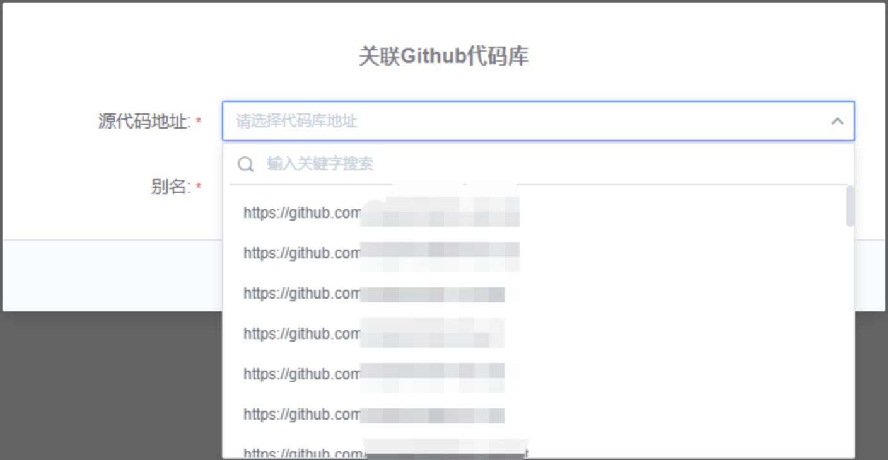
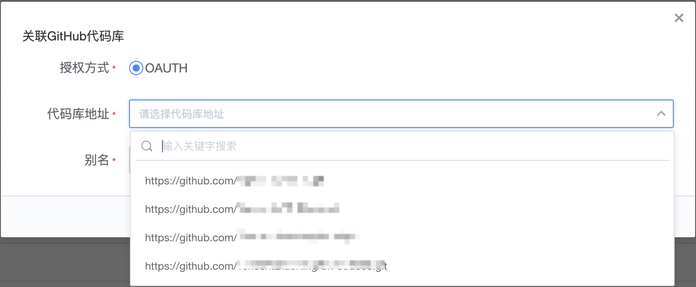
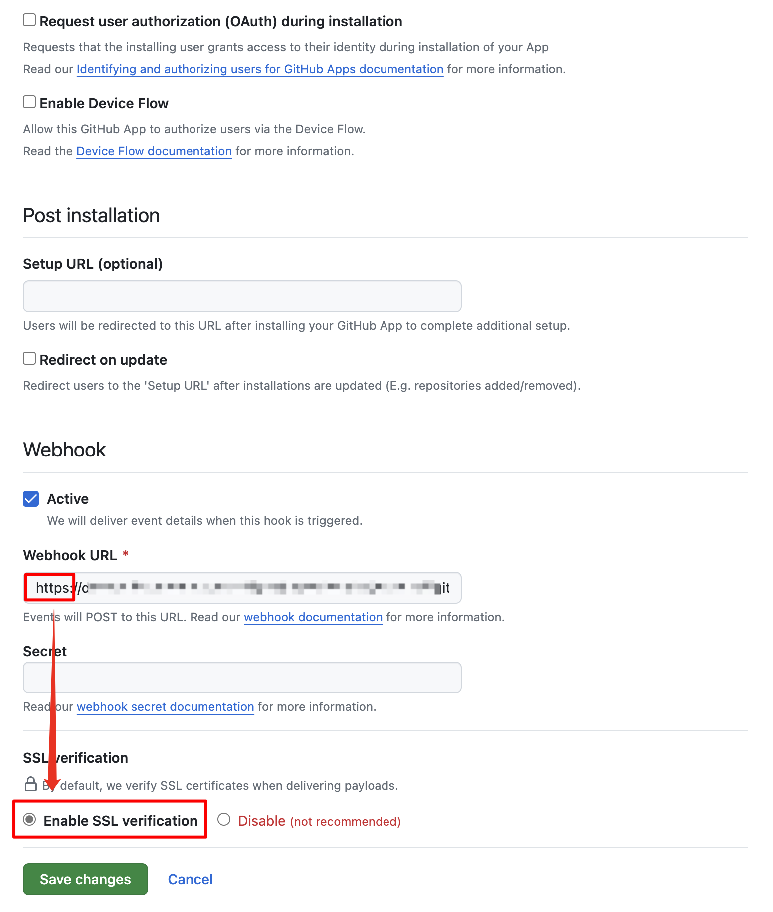

# GitHub APP 的配置指引

## 前提依赖
需要部署了bkci的环境，若没有部署的话，参考进行部署。

## 注册Github App
访问 [https://github.com/settings/apps/new](https://github.com/settings/apps/new)，然后填表（除红框标注的内容，其他默认即可，当然你也可以更改，填完保存）

<div align=left></div>

**GitHub App name** 取值：`应用英文名称`
**Homepage URL** 取值：`https://github.com/apps/${GitHub App Name}` 里面展示的内容，内容自定义，不影响后续配置
**Callback_URL** 取值：`https://devops.bktencent.com:443/repository/api/external/github/oauth/callback` (不要直接复制，把协议、域名、端口调整为用户自己环境的)
参考 bk-ci/#etc#ci#application-repository.yml at v1.5.9 · Tencent/bk-ci
**Webhook_URL** 取值：`https://devops.bktencent.com:443/ms/repository/api/external/github/webhook/commit` (不要直接复制，把协议、域名、端口调整为用户自己环境的)
**Webhook secret(optional)** 取值：自行生成一个秘密填入(可选)

保存后，点击如下图的 **Generate a new client secret** 生成client secret
<div align=left></div>

获取如下信息，**CLIENT_ID** 以及 **CLIENT_SECRET**，准备更新到环境配置中
<div align=left></div>

## 二进制方式部署蓝盾更新方法
### 配置文件更新
``` bash {.line-numbers highlight=[]}
# 在中控机上更新如下env文件
vim /data/install/bin/03-userdef/ci.env
# 写入以下信息
BK_CI_REPOSITORY_GITHUB_APP=              #第一个注册时的“自定义名称” ${GitHub App name}
BK_CI_REPOSITORY_GITHUB_CLIENT_ID=        #上一个图 “CLIENT_ID” 的内容
BK_CI_REPOSITORY_GITHUB_CLIENT_SECRET=    #上一个图 “CLIENT_SECRET” 的内容

# 可选（Webhook secret）
BK_CI_REPOSITORY_GITHUB_SIGN_SECRET=      #Webhook secret填入的值
```

### 重新更新二进制服务
参考 蓝鲸文档中心 > 部署维护 > 持续集成套餐2.0安装指引
https://bk.tencent.com/docs/markdown/ZH/DeploymentGuides/6.2/InstallEnhancePackage/DeployAndInstall/CI-start-V2.md

## 容器化方式部署蓝盾更新方法
### 配置文件更新
``` bash {.line-numbers highlight=[]}
# 在kubectl中控机上更新如下yaml文件, 注意写在config下面
vim ~/bkce7.1-install/blueking/environments/default/bkci/bkci-custom-values.yaml.gotmpl

config:
  # 写入以下信息
  BK_CI_REPOSITORY_GITHUB_APP=              #第一个注册时的“自定义名称” ${GitHub App name}
  BK_CI_REPOSITORY_GITHUB_CLIENT_ID=        #上一个图 “CLIENT_ID” 的内容
  BK_CI_REPOSITORY_GITHUB_CLIENT_SECRET=    #上一个图 “CLIENT_SECRET” 的内容
  # 可选（Webhook secret）
  BK_CI_REPOSITORY_GITHUB_SIGN_SECRET=      #Webhook secret填入的值
```

### 重新更新容器化服务
参考 蓝鲸文档中心 > 部署维护 > 部署持续集成套餐
https://bk.tencent.com/docs/markdown/ZH/DeploymentGuides/7.1/install-ci-suite.md

``` bash {.line-numbers highlight=[]}
cd ~/bkce7.1-install/blueking/  # 进入工作目录
helmfile -f 03-bkci.yaml.gotmpl sync  # 部署
```

## 打开蓝盾关联 GitHub 代码库
进入 蓝盾 - 代码库 http://devops.bktencent.com/console/codelib/
点击 “关联GitHub代码库”
<div align=left></div>

点击 “OAUTH”
<div align=left></div>
下面的按流程走下去即可
然后就可以用了
<div align=left></div>

<div align=left></div>

## FAQ
登录 github 后，回调时打不开，F12 提示协议降级
https://github.com/apps/${GitHub App Name}
<div align=left></div>
