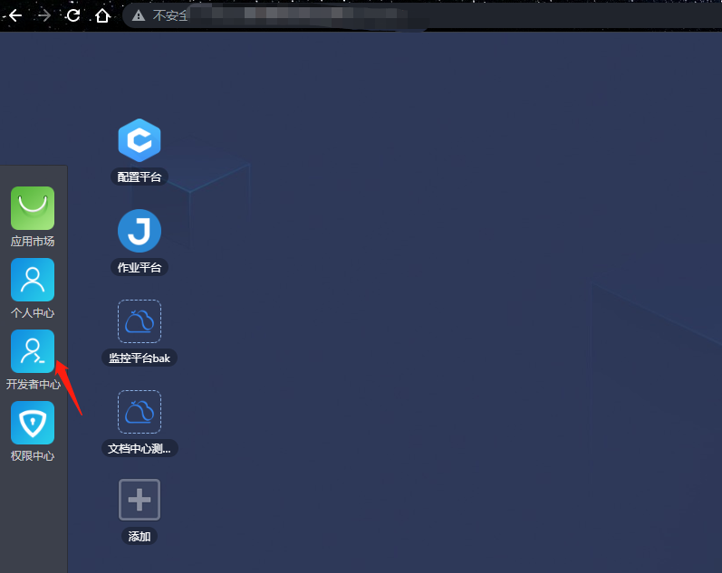
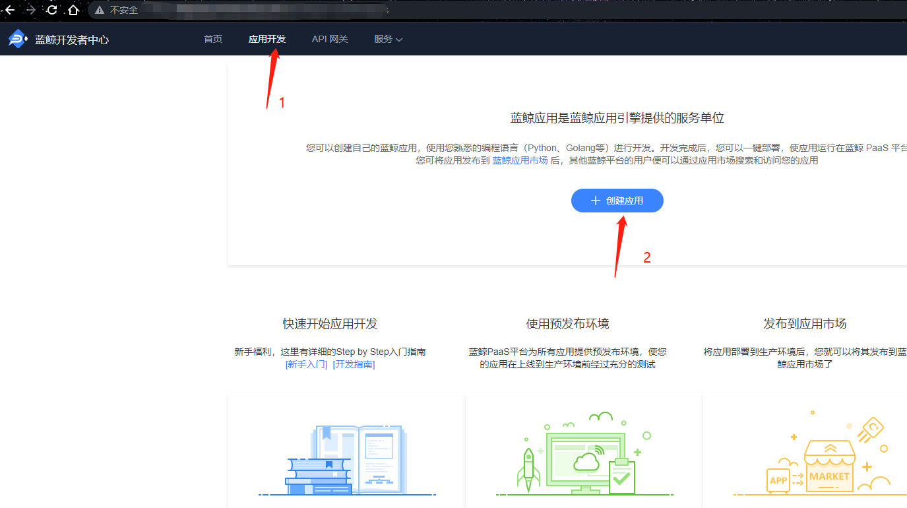
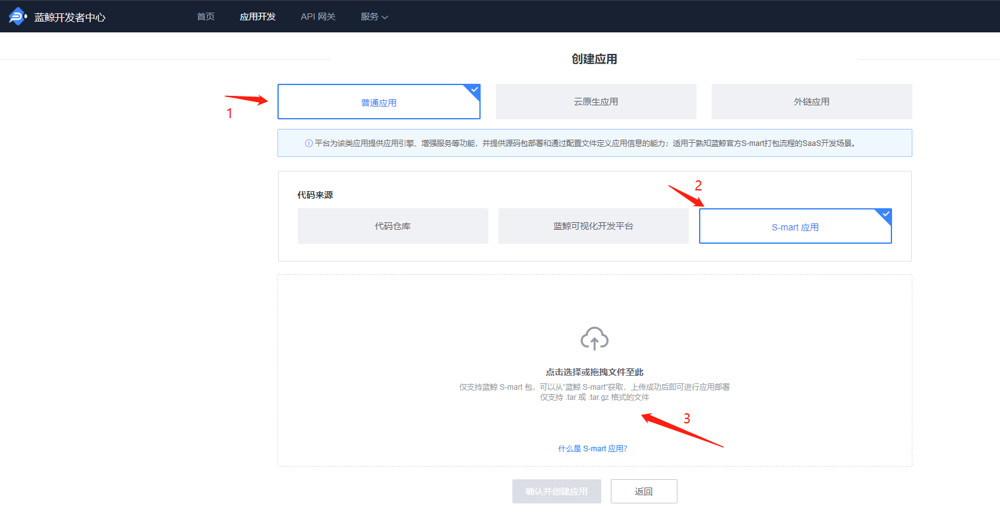
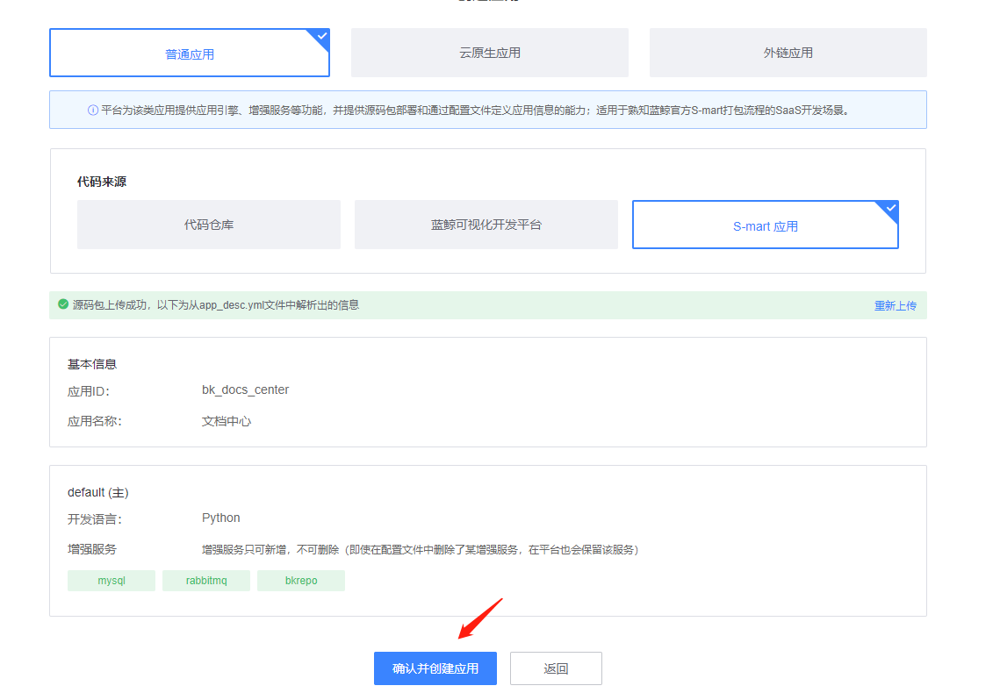
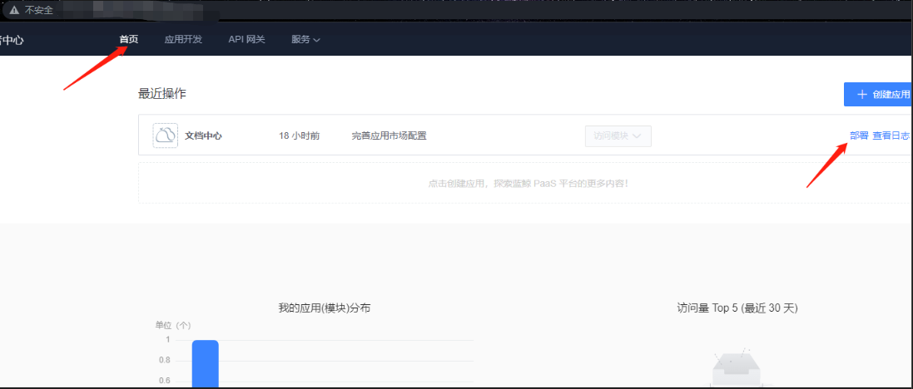
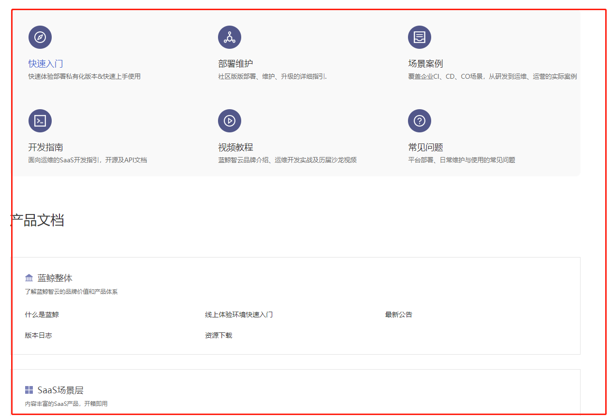
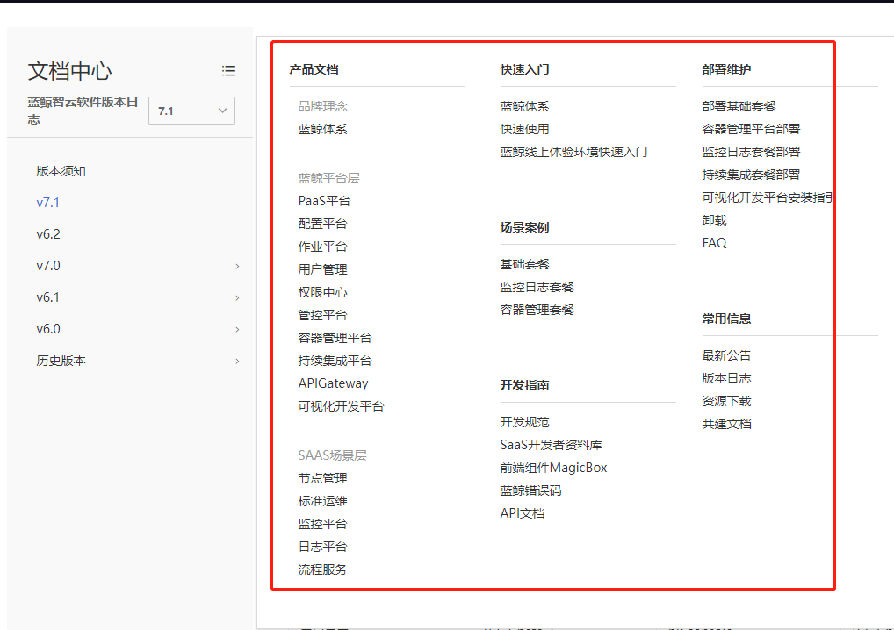
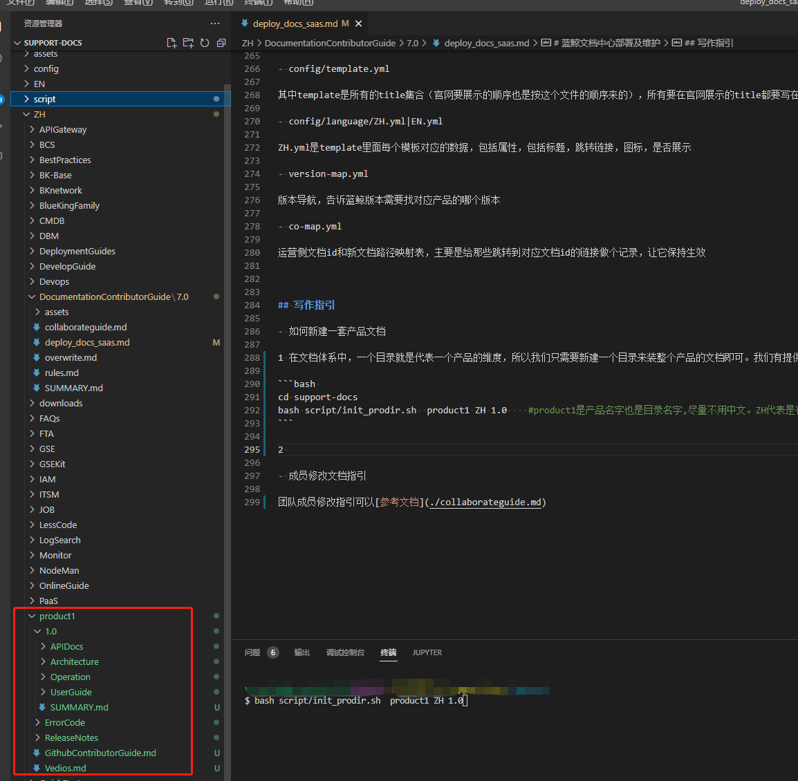
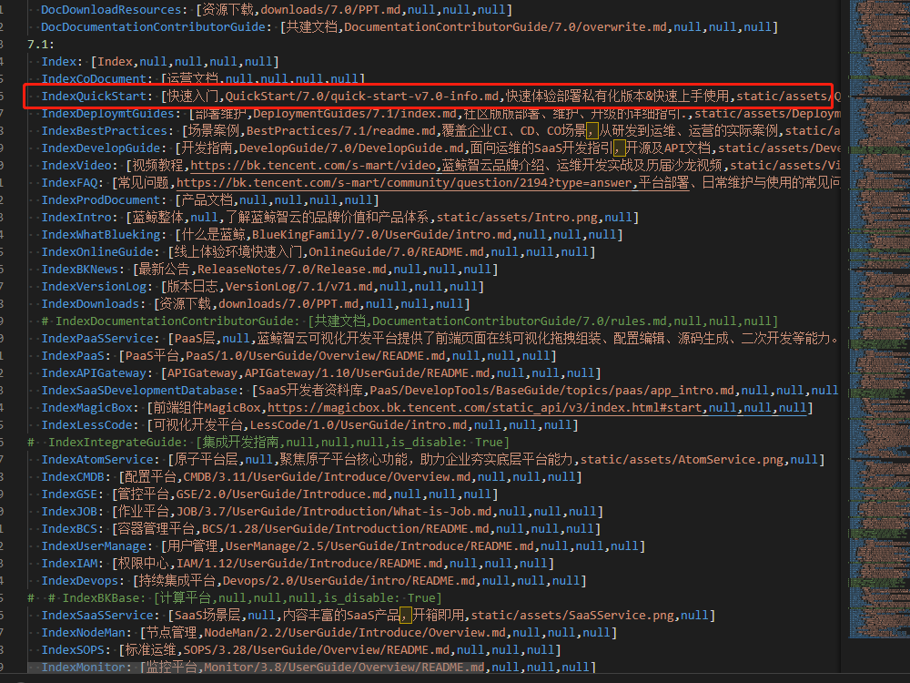
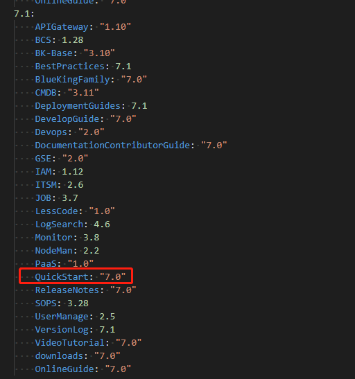

# 蓝鲸文档中心部署及维护

## 文档包组成简介

文档中心包分为两部分，分别为SaaS包和文档内容包。

- SaaS包是承载文档内容的主体，也就是应用，通常由开发编写逻辑去读取文档内容包的内容进行渲染。

- 文档内容包通常就是文档内容存放的地方，由各产品或在里面撰写文档，并由运营对文档内容包配置文件进行控制来渲染文档官网页面所展示的内容。

## 部署指引

### 部署前置准备

- 私有化环境: 部署前需要拥有一套私有化环境,来承载和部署saas，本文档部署条件如下：
    - 版本
        - 蓝鲸版本号：7.1
        - 开发者中心版本号：v1.3.0-beta.1
        - SaaS文档包：v1.1.7
        - 文档包： 无版本

    - 部署权限
    本文档是按admin权限进行实践的，如普通用户遇到权限不足请联系环境负责人或者[参考文档](../7.0/../../IAM/1.12/UserGuide/Feature/PermissionsApply.md)申请权限。

- saas包： 该包有文档的发行版,可用在github进行下载最新的稳定版本进行操作: https://github.com/TencentBlueKing/blueking-docs/releases

- 文档包： 仓库为 https://github.com/TencentBlueKing/support-docs/tree/prod-sg, 该文档包随时下载可用。

- 外网请准备github地址，如内网请准备gitlab地址。

### SaaS部署指引

文档SaaS部署大致部署可以分为以下三个步骤：

1. 进入开发者中心，创建应用
2. 创建S-mart应用
3. 上传saas包
4. 部署saas
5. 验收


具体细节操作步骤如下：

1. 进入开发者中心 


2. 创建文档中心新应用


3. 将下载好的文档saas包上传至开发者中心后台，应用就自动创建好了（注意包要下载tar.gz的格式）


4. 确认创建应用


5. 找到部署点击部署


6. 选择正式环境(这里是验收环境，直接一步到位，如有特殊情况可以先部署预发布)


最后我们进入到访问链接点击访问，能看到正常访问就是完成了。
附截图

### 文档包部署指引及SaaS基本配置

#### 能通外网

- github部署

    准备好gitlabxxx


#### 不能通外网

- gitlab 

-  离线方案(暂时未开放)

## 维护指引

### saas应用配置指引

#### 环境变量: xxxx，跟据实际情况去配置其环境变量xxx

| 环境变量Key                        | 含义                                                         | 默认值                                                      | 示例                                                       |
|--------------------------------|------------------------------------------------------------|----------------------------------------------------------|----------------------------------------------------------|
| SUMMARY_LAYER                  | summary目录层级的最大限制数                                          | 4                                                        | 4                                                        |
| DOCS_SPLIT                     | 文档默认分割符                                                    | ""                                                       | ""                                                       |
| RUN_VER                        | 官网版本配置，例如社区版、Tencent版、本地开发                                 | open                                                     | tencent                                                  |
| RESOURCE_URL                   | 资源地址使用cos资源地址，资源通过流水线上传                                    | your_resource_url                                        | static/                                                  |
| BK_URL                         | 蓝鲸平台url                                                    | your_bk_url                                              | bk.tencent.com                                           |
| BK_PAAS_HOST                   | 蓝鲸PaaS平台url                                                | your_bk_paas_host                                        | bk.tencent.com                                           |
| BK_PAAS_INNER_HOST             | 蓝鲸内部版PaaS平台url                                             | your_paas_inner_host                                     | bk.tencent.com                                           |
| BK_SUB_PATH                    | 蓝鲸平台提供的访问子路径，当 SaaS 部署在 v3 平台以子路径形式提供访问时会默认添加              | "/"                                                      | "/some-sub-path"                                         |
| BKPAAS_DEFAULT_SUBPATH_ADDRESS | 用于 用户认证、用户信息获取 的蓝鲸主机                                       | https://bk.tencent.com/docs/                             | https://bk.tencent.com/docs/                             |
| BK_ONLINE_DEMO_URL             | 在线体验url地址                                                  | https://bk.tencent.com/s-mart/online-env                 | https://bk.tencent.com/s-mart/online-env                 |
| DOCS_EDIT_URL                  | 编辑文档url地址                                                  | https://github.com/TencentBlueKing/BKDocs/tree/main/     | https://github.com/TencentBlueKing/BKDocs/tree/main/     |
| BK_CONTRIBUTION_DOC_PATH       | 共建文档跳转路径                                                   | ZH/DocumentationContributorGuide/7.0/collaborateguide.md | ZH/DocumentationContributorGuide/7.0/collaborateguide.md |
| APP_CODE                       | 兼容component的APP_ID                                         | your_app_code                                            | bkdoc                                                    |
| SECRET_KEY                     | 兼容component的APP_TOKEN                                      | your_secret_key                                          | token信息                                                  |
| BK_DOMAIN                      | 启动访问的蓝鲸根域，影响国际化页面 Cookie 取值                                | bk.tencent.com                                           | bk.tencent.com                                           |
| BK_LOGIN_URL                   | 蓝鲸登录页面                                                     | bk.tencent.com                                           | bk.tencent.com                                           |
| BK_LOGIN_INNER_URL             | 蓝鲸内部版登录页面                                                  | bk.tencent.com                                           | bk.tencent.com                                           |
| BK_COMPONENT_API_URL           | 容器化V3 ESB地址                                                | your_bk_component_api_url                                | bk.tencent.com                                           |
| IS_HIDDEN_SEARCH               | 是否隐藏搜索                                                     | 否                                                        | 0                                                        |
| IS_HIDDEN_HEADER               | 是否隐藏header                                                 | 否                                                        | 0                                                        |
| IS_HIDDEN_SYNC                 | 是否隐藏异步                                                     | 是                                                        | 1                                                        |
| IS_HIDDEN_FEEDBACK             | 是否隐藏反馈                                                     | 是                                                        | 1                                                        |
| IS_HIDDEN_EDIT                 | 是否隐藏文档编辑按钮                                                 | 否                                                        | 0                                                        |
| IS_HIDDEN_PDF_EXPORT           | 是否隐藏 PDF 导出按钮                                              | 否                                                        | 0                                                        |
| IS_HIDDEN_I18N                 | 是否隐藏 i18n 切换按钮                                             | 是                                                        | 1                                                        |
| IS_ENABLE_GIT_SYNC             | 当启用 Git 同步时，每次文档更新将从提供的 Git 信息里更新文档包，并支持当文档包缺省时从远端实时拉取文档内容 | 否                                                        | 0                                                        |
| GIT_REPO_PATH                  | Git 仓库路径                                                   |                                                          | TencentBlueking/support-docs                             |
| GIT_REPO_BRANCH                | git同步分支                                                    | master                                                   | master                                                   |
| GIT_ACCESS_TOKEN               | git认证token                                                 | your_git_access_token                                    | token信息                                                  |
| GIT_USER                       | git用户                                                      | your_git_user                                            | root                                                     |
| GIT_PROVIDER_SCHEMA            | Git 服务协议头                                                  | https                                                    | https                                                    |
| GIT_PROVIDER_ADDR              | Git 服务地址                                                   | github.com                                               | github.com                                               |
| GIT_RAW_FILE_ADDR              | git原始文件地址                                                  | raw.githubusercontent.com                                | raw.githubusercontent.com                                |
| GIT_FILE_URL_TMPL              | Git 服务读取文件内容 URL 模版格式，用于从不同 Git 服务商实时读取文档内容                | your_git_store_url                                       | bk.tencent.com                                           |
| MAX_PAGE_LEN                   | 控制whoosh一次性查询的总条数                                          | 10000                                                    | 10000                                                         |   
| OLD_BKDOCS_CENTER_URL          | 旧版本文档中心URL                                                   |                            |                                                            |

#### 前置命令配置：xxx

#### 其他配置xxx

### 文档包配置维护指引

#### 文档结构

请参考文档的[目录层级模板](./rules.md#目录层级模板)

#### 配置文件详解

##### <span id="jump1">**SUMMARY.md**</span>

SUMMARY.md标准写法案例(后续路径改为英文,标题可以继续用中文)，该文件对应官网参考https://bk.tencent.com/docs/markdown/ZH/CMDB/3.11/UserGuide/Introduce/Overview.md

```text
# Summary

## 配置平台 
* [产品简介](产品简介/README.md)
* [术语解释](术语解释/glossary.md)
* [产品构架图](产品架构图/Architecture.md)
* [产品功能]()
    * [功能列表](产品功能/Function_list.md)
    * [首页](产品功能/Home.md)
    * [基础资源](产品功能/Resource.md)
    * [业务资源](产品功能/BuzResource.md)
    * [审计与分析](产品功能/OperationAnalysis.md)
    * [权限控制](产品功能/PermissionsControl.md)
    * [模型管理](产品功能/ModelManagement.md)
    * [我的收藏](产品功能/Collection.md)
* [快速入门]()
    * [如何创建业务并导入主机到业务中](快速入门/case1.md)
    * [主机由 A 业务模块转移到 B 业务模块](快速入门/case2.md)
    * [快速入门模型和模型拓扑管理](快速入门/case3.md)
* [场景案例]()
    * [业务上线时 CMDB 如何管理主机](5.1/bk_solutions/CD/CMDB/CMDB_management_hosts.md)
    * [CMDB 如何管理进程](5.1/bk_solutions/CD/CMDB/CMDB_management_process.md)
    * [企业原有 CMDB 同步至蓝鲸 CMDB](5.1/bk_solutions/CD/CMDB/CMDB_integration.md)
* [API 文档]()
    * [简介](5.1/API文档/CC/README.md)
    * [新加主机锁](5.1/API文档/CC/add_host_lock.md)
    * [新增主机到资源池](5.1/API文档/CC/add_host_to_resource.md)
    * [新建模型实例之间的关联关系](5.1/API文档/CC/add_instance_association.md)
    * [批量删除实例](5.1/API文档/CC/batch_delete_inst.md)
    * [批量删除集群](5.1/API文档/CC/batch_delete_set.md)
    * [批量更新对象实例](5.1/API文档/CC/batch_update_inst.md)
    * [绑定进程到模块](5.1/API文档/CC/bind_process_module.md)
    * [绑定角色权限](5.1/API文档/CC/bind_role_privilege.md)
    * [克隆主机属性](5.1/API文档/CC/clone_host_property.md)
    * [新建业务](5.1/API文档/CC/create_business.md)
    * [添加模型分类](5.1/API文档/CC/create_classification.md)
    * [添加自定义 API](5.1/API文档/CC/create_custom_query.md)
    * [创建实例](5.1/API文档/CC/create_inst.md)
    * [创建模块](5.1/API文档/CC/create_module.md)
    * [创建模型](5.1/API文档/CC/create_object.md)
    * [创建模型属性](5.1/API文档/CC/create_object_attribute.md)
    * [创建集群](5.1/API文档/CC/create_set.md)
    * [新建用户分组](5.1/API文档/CC/create_user_group.md)
    * [删除业务](5.1/API文档/CC/delete_business.md)
    * [删除模型分类](5.1/API文档/CC/delete_classification.md)
    * [删除自定义 API](5.1/API文档/CC/delete_custom_query.md)
    * [删除主机](5.1/API文档/CC/delete_host.md)
    * [删除主机锁](5.1/API文档/CC/delete_host_lock.md)
    * [删除实例](5.1/API文档/CC/delete_inst.md)
    * [删除模型实例之间的关联关系](5.1/API文档/CC/delete_instance_association.md)
    * [删除模块](5.1/API文档/CC/delete_module.md)
    * [删除模型](5.1/API文档/CC/delete_object.md)
    * [删除对象模型属性](5.1/API文档/CC/delete_object_attribute.md)
    * [解绑进程模块](5.1/API文档/CC/delete_process_module_bind.md)
    * [删除集群](5.1/API文档/CC/delete_set.md)
    * [删除用户分组](5.1/API文档/CC/delete_user_group.md)
    * [根据模块查询主机](5.1/API文档/CC/find_host_by_module.md)
    * [查询模型实例之间的关联关系](5.1/API文档/CC/find_instance_association.md)
    * [查询模型之间的关联关系](5.1/API文档/CC/find_object_association.md)
    * [查询业务的空闲机和故障机模块](5.1/API文档/CC/get_biz_internal_module.md)
    * [根据自定义 api 获取数据](5.1/API文档/CC/get_custom_query_data.md)
    * [获取自定义 API 详情](5.1/API文档/CC/get_custom_query_detail.md)
    * [获取主机详情](5.1/API文档/CC/get_host_base_info.md)
    * [查询主线模型的业务拓扑](5.1/API文档/CC/get_mainline_object_topo.md)
    * [获取操作日志](5.1/API文档/CC/get_operation_log.md)
    * [查询进程绑定模块](5.1/API文档/CC/get_process_bind_module.md)
    * [获取角色绑定权限](5.1/API文档/CC/get_role_privilege.md)
    * [查询用户权限](5.1/API文档/CC/get_user_privilege.md)
    * [查询业务实例拓扑](5.1/API文档/CC/search_biz_inst_topo.md)
    * [查询业务](5.1/API文档/CC/search_business.md)
    * [查询模型分类](5.1/API文档/CC/search_classifications.md)
    * [查询自定义 API](5.1/API文档/CC/search_custom_query.md)
    * [查询分组权限](5.1/API文档/CC/search_group_privilege.md)
    * [根据条件查询主机](5.1/API文档/CC/search_host.md)
    * [查询主机锁](5.1/API文档/CC/search_host_lock.md)
    * [查询实例](5.1/API文档/CC/search_inst.md)
    * [查询实例关联拓扑](5.1/API文档/CC/search_inst_association_topo.md)
    * [查询实例详情](5.1/API文档/CC/search_inst_by_object.md)
    * [查询模块](5.1/API文档/CC/search_module.md)
    * [查询模型](5.1/API文档/CC/search_objects.md)
    * [查询对象模型属性](5.1/API文档/CC/search_object_attribute.md)
    * [查询普通模型拓扑](5.1/API文档/CC/search_object_topo.md)
    * [查询拓扑图](5.1/API文档/CC/search_object_topo_graphics.md)
    * [查询集群](5.1/API文档/CC/search_set.md)
    * [查询订阅](5.1/API文档/CC/search_subscription.md)
    * [查询用户分组](5.1/API文档/CC/search_user_group.md)
    * [订阅事件](5.1/API文档/CC/subscribe_event.md)
    * [测试推送, 只测试连通性](5.1/API文档/CC/testing_connection.md)
    * [业务内主机转移模块](5.1/API文档/CC/transfer_host_module.md)
    * [上交主机到业务的故障机模块](5.1/API文档/CC/transfer_host_to_faultmodule.md)
    * [上交主机到业务的空闲机模块](5.1/API文档/CC/transfer_host_to_idlemodule.md)
    * [上交主机至资源池](5.1/API文档/CC/transfer_host_to_resourcemodule.md)
    * [资源池主机分配至业务的空闲机模块](5.1/API文档/CC/transfer_resourcehost_to_idlemodule.md)
    * [清空业务下集群/模块中主机](5.1/API文档/CC/transfer_sethost_to_idle_module.md)
    * [退订事件](5.1/API文档/CC/unsubcribe_event.md)
    * [修改业务](5.1/API文档/CC/update_business.md)
    * [修改业务启用状态](5.1/API文档/CC/update_business_enable_status.md)
    * [更新模型分类](5.1/API文档/CC/update_classification.md)
    * [更新自定义 API](5.1/API文档/CC/update_custom_query.md)
    * [修改订阅](5.1/API文档/CC/update_event_subscribe.md)
    * [更新主机属性](5.1/API文档/CC/update_host.md)
    * [更新对象实例](5.1/API文档/CC/update_inst.md)
    * [更新模块](5.1/API文档/CC/update_module.md)
    * [更新定义](5.1/API文档/CC/update_object.md)
    * [更新对象模型属性](5.1/API文档/CC/update_object_attribute.md)
    * [更新拓扑图](5.1/API文档/CC/update_object_topo_graphics.md)
    * [更新集群](5.1/API文档/CC/update_set.md)
    * [更新用户分组](5.1/API文档/CC/update_user_group.md)
* [常见问题](常见问题/FAQ.md)
```

##### CONFIG目录

**config/template.yml**

template是所有的title集合，不管这个变量是否需要展示,所有要在官网展示的title都要写在这个文件里面,其作用有两个
1. 控制顺序
2. 占位给ZH.yml去补充其属性进行渲染

template.yml分为两个板块
1. Index：首页的模板变量

2. Doc： 产品页的小容器的变量


**config/language/ZH.yml|EN.yml**

ZH.yml和EN.yml分别是中文的配置和英文的配置，ZH则会去从ZH目录渲染，EN则会去EN目录渲染
每个模板变量对应列表的含义分别为:[官网显示标题,跳转链接(首页),描述,图片链接,is_disable: True]

**version-map.yml**
版本导航，告诉蓝鲸前端版本需要找对应产品的哪个版本，也供运营侧参考，次版本对应关系要和ZH.yml的跳转链接的路径中的版本号要一致

**co-map.yml**
运营侧文档id和新文档路径映射表，主要是给那些跳转到对应文档id的链接做个记录，让它保持生效，私有化环境无需关注该文件，可有可无。


## 写作指引

### 如何新建一套产品文档

1. 在文档体系中，一个目录就是代表一个产品的维度，所以我们只需要新建一个目录来装整个产品的文档即可。我们有提供内置文档目录初始化脚本,可以按以下执行

```bash 
cd support-docs
bash script/init_prodir.sh  product1 ZH 1.0    #product1是产品名字也是目录名字,尽量用英文命名。ZH代表是在中文版本下创建,1.0是产品的版本号,
```

>注意，脚本是bash解释器执行的，如没有可以自行安装git bash或者是wsl。

2. 我们可以在这里看到新建好的产品目录,然后入手点可以从[SUMMARY.md](#jump1)开始写整体框架（<font color="red">建议路径统一用英文</font>），然后跟据框架去新建文档即可

3. 写完文档之后我们要在配置中加入该产品让其渲染到官网,我先在config/template.yml自定义一个变量,按需若只希望显示在首页，那我们在这个变量前面加上Index，并放在Index的数组里

比如上图在首页小板块第一个加一个快速入门的变量

4. 我们将config/template.yml加的变量放到ZH的版本里面来,并且写好他们的属性


5. 在version.map加入版本指引,比如蓝鲸7.1的版本是用的快速入门7.0的目录，那就加入一行


6. 这样新的产品就完成了，上传至gitlab或者github之后重新部署应用就可以刷新文档


### 成员修改文档指引

成员协作方法不唯一，本文档写作指引仅供参考，可以[参考文档](./collaborateguide.md)，注意将仓库替换成自己的仓库