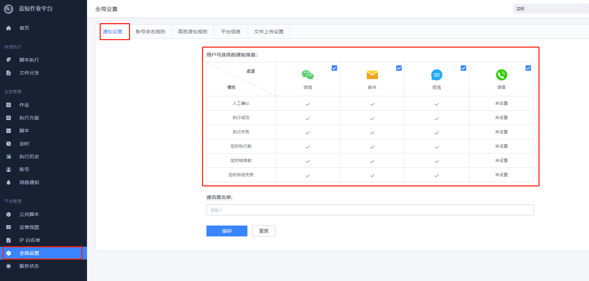
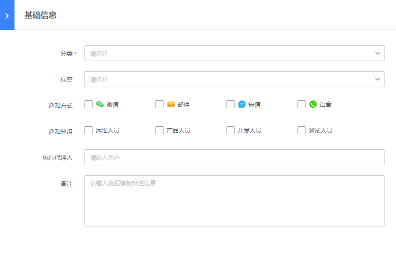
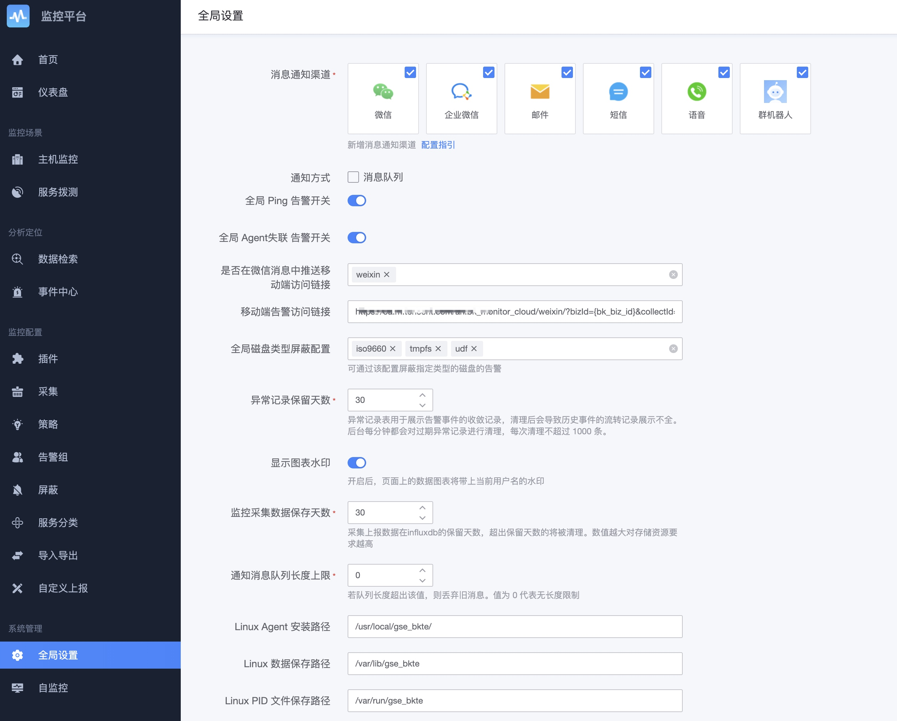

# 短信配置前提

本文以腾讯云为例

蓝鲸内置了邮件、短信、语音消息、微信的通知渠道

> 若想接入第三方消息通知（例飞书，钉钉），请参考 [组件编码](../../../APIGateway/DevelopTools/chapter1.md)，将新接口接入至`CMSI蓝鲸消息管理`，并能通过 `[CMSI] 查询消息发送类型` 接口查到即可。

## 配置消息渠道

* [配置消息通知：短信](../../../PaaS/1.0/UserGuide/UserCase/send_sms.md)

提示：腾讯云短信模板内容不能含有【】符号，但是不代表自定义内容不能带有【】。

## 配置人员信息

- 联系方式配置

用户管理 -> 组织架构 -> 选择用户 -> 编辑 -> 填好相应的用户信息 -> 保存

- 用户角色配置

配置平台 -> 资源 -> 业务 -> 选择相应业务 -> 编辑角色 -> 保存

# 各平台短信配置

## 作业平台

### 作业平台-消息通知配置

作业平台 -> 消息通知 -> 勾选需要的消息通知服务


### 作业平台-通知模板配置

作业平台 -> 全局配置 -> 通知设置 -> 编辑需要的模板



可根据已有的内置变量，自定义模板内容。


若腾讯云审核生效完毕，即可点击消息预览，测试发送通知效果，记得保存模板。

### 作业平台-短信模板示例

- 示例一：执行失败

蓝鲸模板内容

```bash
作业平台通知：您的业务[{{task.app.name}}]当前有一个任务:{{task.name}}({{task.detail.url}})执行失败，请尽快查看。
```

腾讯云模板 - 短信内容

```bash
作业平台通知：您的业务[{1}]当前有一个任务:{2}({3})执行失败，请尽快查看。
```

- 示例二：执行成功

蓝鲸模板内容

```bash
作业平台通知：您的业务[{{task.app.name}}]当前有一个任务:{{task.name}}({{task.detail.url}})已执行成功，请尽快查看。
```

腾讯云模板 - 短信内容

```bash
作业平台通知：您的业务[{1}]当前有一个任务:{2}({3})已执行成功，请尽快查看。
```

## 标准运维

### 标准运维-消息通知配置

方法一：使用标准运维自带消息通知

该方法为标准运维固定模板，需要去腾讯云提交短信模板

标准运维 -> 选择业务 -> 项目流程 -> 新建 -> 基础信息（右上角第二个按钮）



方法二：使用标准运维插件`蓝鲸服务(BK)-发送通知`

添加标准插件节点 -> 选择插件：蓝鲸服务(BK)-发送通知 -> 选择相应通知方式、通知分组、通知主题、通知内容 -> 保存

该方法为用户自定义模板，需要先去腾讯云提交短信模板


### 标准运维-短信模板示例

- 示例一：执行失败

腾讯云模板 - 短信内容

```bash
您在{1}业务中的任务{2}执行失败，当前失败节点是{3}，操作员是{4}，请前往标准运维APP({5})查看详情！
```

- 示例二：执行成功

腾讯云模板 - 短信内容

```bash
您在{1}业务中的任务{2}执行成功，操作员是{3}，请前往标准运维APP({4})查看详情！
```

## 流程服务

### 流程服务-消息通知配置

- 默认通知

每个服务流程的待办通知启用，请在“流程启用设置”中进行管理。开启后，当有相应服务单据产生时，单据的待办通知会自动生效（即单据会自动发送通知至处理人）。


- 自定义通知

流程服务 -> 后台管理-> 流程管理 -> 流程设计 -> 选择节点 -> 高级配置 -> 添加触发器 -> 新建或者引用已有公共触发器 

-> 修改触发机制 -> 修改触发规则：动作名称-发送通知给用户 -> 自定义模板内容 -> 确认


> 注意：引用原则：与引用位置相匹配的触发器。
> 
> 如：在节点中引用触发器，只能引用“触发事件类型=节点信号”的公共触发器。
> 
> 在流转条件配置时引用触发器，只能引用“触发事件类型=线条信号”的公共触发器。
> 
> 系统会根据引用位置来自动过滤不适用的公共触发器。


### 流程服务-通知模板配置

流程服务 -> 后台管理 -> 流程管理 -> 通知设置 -> 手机短信 -> 编辑需要的模板


可根据已有的内置变量，自定义模板内容。


### 流程服务-短信模板示例


腾讯云短信正文模板 - 短信内容

```bash
『ITSM』请求管理单{1}
```

- 示例一：提单


```bash
【腾讯蓝鲸】『ITSM』请求管理单【邀请关注通知】 你有一条请求管理工单需要关注
 标题：111
 单号：<a href="http://paas.bktencent.com:80/o/bk_itsm/weixin/#/ticket/5/">REQ20210609000002</a>
 服务目录：服务反馈->测试消息通知
 当前环节：提单
```

- 示例二：审批

```bash
【腾讯蓝鲸】『ITSM』请求管理单【单据待办通知】
 标题：111
 单号：REQ20210609000002
 服务目录：服务反馈->测试消息通知
 当前环节：审批(admin)
```

- 示例三：结单

```bash
【腾讯蓝鲸】『ITSM』请求管理单【已完成】您的需求(111)已经处理完成，现邀请您为我们的服务进行评价。您的反馈对我们非常重要！感谢回复与建议，祝您工作愉快！
 http://paas.bktencent.com:80/o/bk_itsm/weixin/#/ticket/5/
```

## 监控平台

### 监控平台-消息通知配置

监控平台 -> 全局设置 -> 开启需要的消息通知渠道及消息队列 -> 提交



监控平台 -> 告警组 -> 根据不同角色编辑相应通知方式 -> 提交


> 告警需要开启相关策略配置

### 监控平台-监控告警示例

以下用 应用内存使用率 策略来配置

策略 -> 找到 应用内存使用率 -> 编辑

设置 检测算法


设置 高级设置 - 告警通知模板


设置 通知设置


记得保存

### 监控平台-短信模板示例

- 模板：通用告警

腾讯云短信正文模板 - 短信内容

```bash
监控通知，{1} 内容: {2} 目标: {3} 告警汇总ID: {4} 关联信息: {5}
监控通知，{1} 内容: {2} 目标: {3} 维度: {4} 告警汇总ID: {5}
监控通知，{1} 内容: {2} 目标: {3} 维度: {4} 告警ID: {5}
监控通知，{1} 比如: {2} 目标: {3} 维度: {4} 告警ID: {5}
监控通知，{1} 目标: {2} 维度: {3} 告警汇总ID: {4} 关联信息: {5}
监控通知，{1} 代表: {2} 目标: {3} 维度: {4} 告警汇总ID: {5}
```

- 实际收到短信

```bash
【腾讯蓝鲸】监控通知，[提醒]应用内存使用率
内容: 已持续3 m, avg(应用程序内存使用占比) >= 40.0%, 当前值49.11%
目标: 蓝鲸 10.0.0.1
告警ID: 1
关联信息: 集群(日志平台,公共组件,配置平台,PaaS平台,作业平台v3,节点管理) 模块(job-config,nodeman-api,login,cmdb-web,consul,zookeeper,mysql,job-manage,cmdb-admin,cmdb-topo,paas,kafka,appengine,cmdb-op,esb,cmdb-event,consul-template,bklog-api,cmdb-host,cmdb-api,cmdb-cloud,appt,job-gateway,apigw,job-crontab,cmdb-proc,job-backup,cmdb-core,cmdb-task,job-execute,cmdb-datacollection,cmdb-auth,job-logsvr)
```
```bash
【腾讯蓝鲸】监控通知，[预警]应用内存使用率
内容: 已持续3 m, avg(应用程序内存使用占比) >= 50.0%, 当前值78.72%
目标: 蓝鲸 10.0.0.1
告警ID: 2
关联信息: 集群(公共组件,监控平台v3,用户认证平台,管控平台) 模块(elasticsearch,gse_btsvr,gse_dba,gse_syncdata,usermgr,bk-ssm,gse_api,gse_alarm,gse_proc,gse_data,redis,bk-iam,monitor,grafana,license,gse_task,influxdb-proxy,consul)
```
```bash
【腾讯蓝鲸】监控通知，[致命]应用内存使用率
内容: 已持续3 m, avg(应用程序内存使用占比) >= 80.0%, 当前值84.96%
目标: 蓝鲸 10.0.0.1
告警ID: 3
关联信息: 集群(PaaS平台,公共组件,监控平台v3,故障自愈) 模块(appo,nginx,influxdb,rabbitmq,fta-api,transfer,consul-template,mongodb,beanstalk,consul)
```

## 故障自愈

### 故障自愈-消息通知配置

- 故障自愈 -> 选择业务 -> 接入自愈 -> 添加接入自愈 -> 选择告警类型、自愈套餐、通知方式、通知人员、其他信息 -> 添加自愈策略


### 故障自愈-短信模板示例

- 模板一：通用模板

腾讯云短信正文模板 - 短信内容

```bash
《故障自愈》{1}该信息如非本人订阅，请忽略本短信。
```
- 实际收到短信

```bash
【腾讯蓝鲸】《故障自愈》 自愈开始  [蓝鲸]业务[应用内存使用率]告警,IP[10.0.0.1]: avg(应用程序内存使用占比) >= 80.0%, 当前值86.78%
该信息如非本人订阅，请忽略本短信。


【腾讯蓝鲸】《故障自愈》 自愈成功  [蓝鲸]业务[应用内存使用率]告警,IP[10.0.0.1]: avg(应用程序内存使用占比) >= 40.0%, 当前值49.09%
该信息如非本人订阅，请忽略本短信。
```

- 模板二

故障自愈通知，您的业务{1}下主机{2}，于{3}{4}自愈失败，详情请前往{5}查看，如非本人订阅，请忽略。


## 常见问题

问题 1. 没有收到短信通知，怎么排查？

解决方法：

1. 检查蓝鲸消息通道是否配置好，调用接口即可测试，若不成功，请参考 [配置消息通知：短信](../../../PaaS/1.0/UserGuide/UserCase/send_sms.md)
2. 检查平台是否开启了消息通知，去相应平台的消息通知配置查看
3. 检查平台是否创建相应的短信模板，例：作业平台 -> 全局配置 -> 通知设置
4. 检查是否创建相应的腾讯云短信模板，去腾讯云云产品 -> 短信 -> 国内短信 -> 正文模板管理
5. 去腾讯云云产品 -> 短信 -> 统计分析 -> 国内短信 -> 短信记录查看失败原因
6. 去腾讯云云产品 -> 应用管理 -> 基础配置 -> 频率限制白名单 -> 添加手机号 -> 设置

问题 2. 腾讯云短信有频率限制吗？
1. 对同一个手机号，1 自然日内发送短信条数不超过10条
2. 相同内容短信对同一个手机号，30 秒内发送短信条数不超过1条
