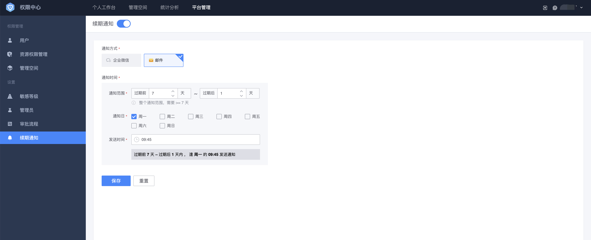

# 续期通知

管理续期通知设置目前是超级管理员（[如何成为超级管理员](../Feature/Manager.md##超级管理员设置)）的能力。

## 前置条件

> 1. 用户是超级管理员身份

蓝鲸权限中心支持超级管理员配置平台的续期通知方式。

## 管理续期通知方式

在**平台管理**中点击**续期通知**菜单，进入续期通知的设置页面。权限中心支持**企业微信、邮件**这两种续期通知的方式。超级管理员可以配置具体的通知方式和通知时间，在用户的权限到期前及时进行提醒。

