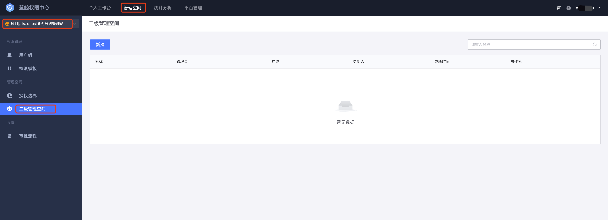
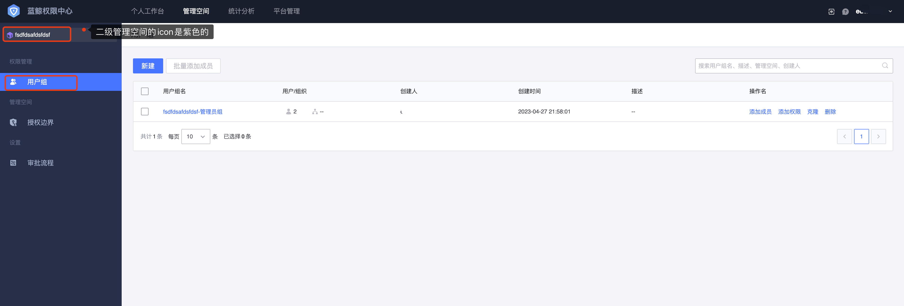

# 二级管理空间

权限中心为了支持 更细粒度的权限管理能力，提供了二级管理空间能力，即在管理空间下，可以创建子管理空间来实现进一步细化权限管理。

如需创建二级管理空间，我们需要先切换到某个管理空间，点击**新建**，填写基本信息和定义授权边界即可挖成二级管理空间的创建。

创建完成后，可以在管理空间下的**二级管理空间**菜单下，看到当前管理空间创建的二级管理空间，点击右侧**进入空间**即可切换到对应的二级管理空间内。

在二级管理空间下，我们可以同样创建用户组进行授权操作。

