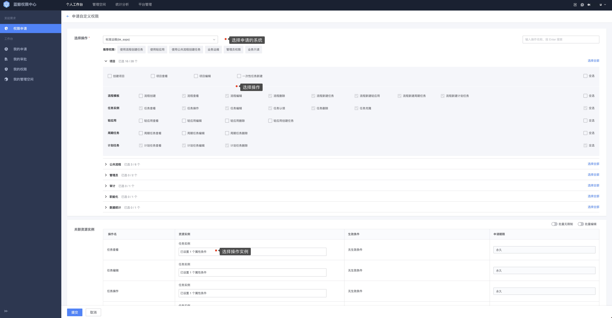

# 权限申请

用户可以通过三种方式主动申请需要的权限：**申请加入用户组**、**申请自定义权限**、**从接入系统侧无权限跳转**。

## 申请加入用户组

蓝鲸权限中心**推荐**的权限管理方式，用户进入权限申请页面 ，点击**申请加入用户组**按钮进行申请，在申请用户组列表页面，用户只需要通过关键词搜索到需要的用户组，申请加入即可。

## 申请自定义权限

自定义权限建议是在用户组权限无法满足的情况下才申请，自定义权限虽然灵活，但零散的权限带来的后果就是不方便后续权限的统一管理。

用户在**权限申请**界面，点击**申请自定义权限**按钮进行申请。

权限中心支持**拓扑实例选择**、**属性条件**两种实例选择方式，大部分接入系统只接入拓扑实例选择方式。

- 拓扑实例选择：如果接入系统提供了多种视图选择，用户在拓扑实例选择这里可以通过多种方式来选择想要的实例，拓扑实例除了叶子节点外，其他节点均为动态节点，即选择了当前节点，默认就包含了所有子级的节点，包括未来新加的子节点。拓扑实例选择能满足大部分用户的选择需求。

- 属性条件：属性条件是一种高级的实例筛选方式，属性条件是动态选择方式，对于那些经常有实例变动或者需要范围权限的用户来说，属性条件是更好的方式。

一组实例选择，可以通过**拓扑实例选择**或**属性条件**，也可以组合使用，组合使用时，拓扑实例和属性条件是**且**的关系。多组实例之间是`或`的关系。

