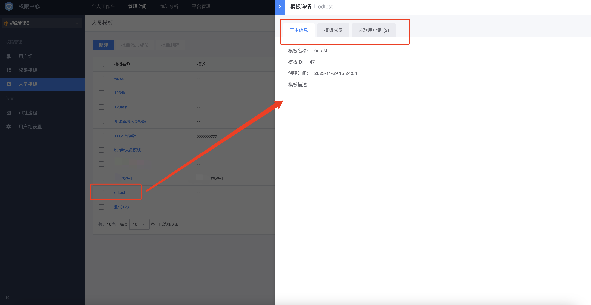

# 人员模板

创建人员模板是管理员（[如何成为超级管理员](../Feature/Manager.md##超级管理员设置)、[如何成为系统管理员](../Feature/Manager.md##系统管理员设置)、[如何成为分级管理员](../Feature/GradingManager.md)）的能力。

## 前置条件

> 1. 用户必须是分级管理员/超级管理员/系统管理员

和权限模板类似，人员模板是为了复用同一批相同特点的用户。分级管理员创建一个人员模板，可以关联到多个用户组中。同样，人员模板更新后可以同步给已关联授权的用户组。

## 新建人员模板

进入**管理空间**页面，切换到**人员模板**菜单下，点击**新建**按钮进行模板新建。

## 人员模板编辑

在**人员模板**页面，选择具体需要编辑的人员模板，点击**人员模板名称**进入人员模板的详情页面，点击详情页里的编辑按钮进行模板编辑。
在详情页中，可以查看每个人员模板绑定的模板人员，以及已经关联的用户组。

