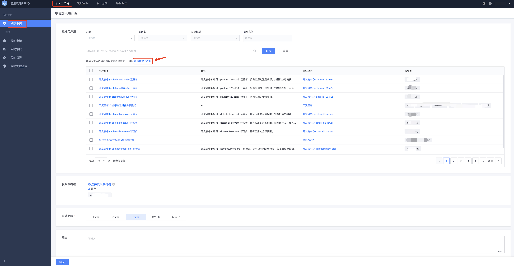
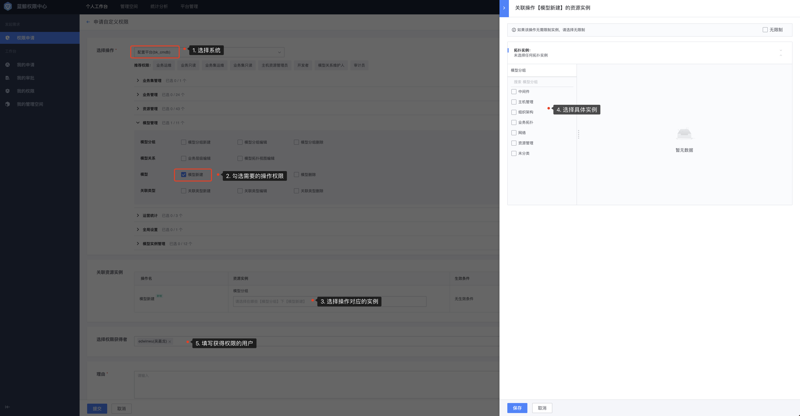

# 申请自定义权限

## 前置条件

> 无

蓝鲸权限中心**推荐**通过用户组来统一管理权限，当没有合适的已有用户组或者需要的权限比较单一时，可以通过申请自定义权限。本章节以**作业平台**权限为例讲解如何申请自定义权限。  

自定义权限申请入口，可以从**自定义权限申请**或者**从接入系统侧无权限跳转**。

## 自定义权限申请入口

### 操作步骤

1. 点击**权限申请**菜单，进入权限申请页面。

   

2. 点击**申请自定义权限-立即申请**按钮，进入自定义权限申请页面，依次选择**系统、操作、资源实例**，保存。

   

3. 点击**提交**，提交后等待审批人审批，在**我的申请**页面可以查看审批进度。

   

4. 审批通过后，在**我的权限**页面可以查看刚才申请的自定义权限。

   

## 从接入系统侧无权限跳转

### 操作步骤

1. 用户直接访问接入系统页面，接入系统会提示用户无权限并申请需要的操作权限。

   

2. 点击**去申请**自动跳转到权限中心，跳转时会自动带上用户需要的操作和实例权限，用户直接点击提交即可完成权限申请。

   

