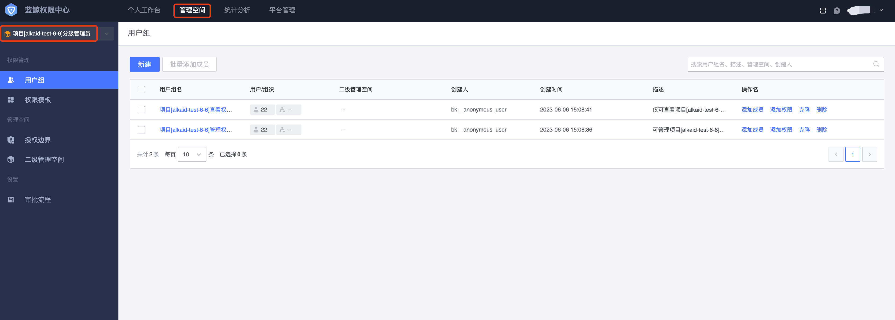
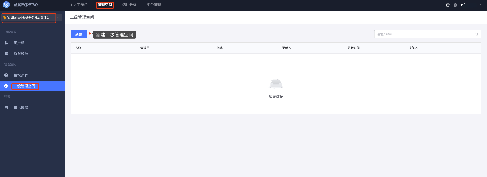

# 分级权限管理（管理空间）

## 场景描述

某企业拥有多款业务，每个业务都有专门的业务负责人来管理权限，比如A业务的业务负责人需要给开发人员、产品人员、测试人员分配相应的业务访问权限。

## 解决方案

蓝鲸权限中心提供了分级权限管理解决方案，分级管理员通过“管理空间”来表达，由超级管理员创建或者业务负责人自己申请创建[管理空间](../Feature/GradingManager.md)，成为对应管理空间的管理员后，就可以自主管理空间下的权限。

- 由[超级管理员创建](../Feature/ManagerCreate.md)，或者A业务负责人[申请创建管理空间](../Feature/UserApply.md)

  

  

- 创建好管理空间后，通过导航菜单切换到对应管理空间下进行权限管理。

  

- 点击**用户组**菜单，分别创建**运维**、**开发**、**测试**的用户组，给相应的用户组赋予不同的权限，同时添加对应的用户即可完成授权。

  

- 权限中心还支持二级管理空间，即在每个管理空间下，还可以创建自己的子管理空间来**实现权限的进一步细化管理**。

  

  

  

  
