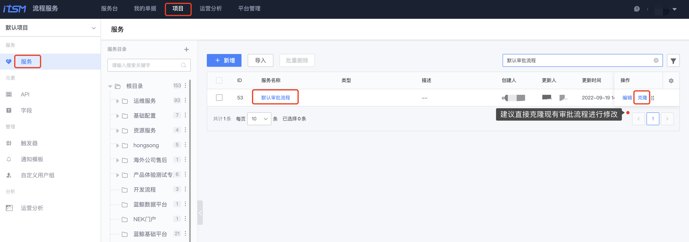
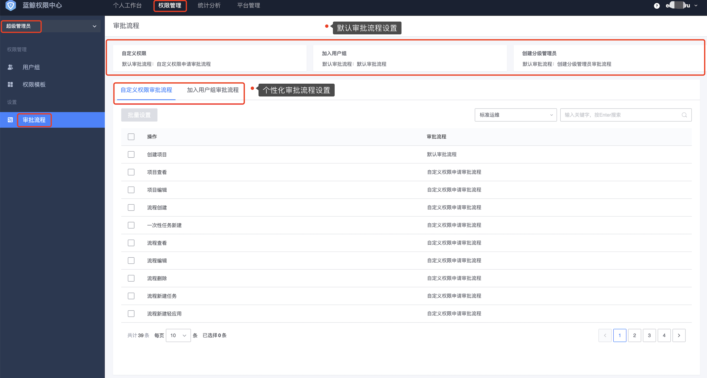

# 审批流程设置

审批流程设置分审批流程的`创建和关联`，审批流程`创建`将在[流程服务（ITSM）](../../../../ITSM/2.6/UserGuide/Introduce/README.md)实现，权限中心只需支持审批流程的`关联`配置。

## 审批流程创建

1. 进入[流程服务](../../../../ITSM/2.6/UserGuide/Introduce/README.md)系统，在**项目-服务**菜单下，查找**默认审批流程**，点击**克隆**，克隆现有审批流程进行编辑。

   

2. 进入流程编辑页面后，拖拽需要的节点进行编排。

   

3. 点击新节点进行编辑，填写**节点名称**、**节点处理人**，确认后保存，即完成审批流程的编排创建。

   

   

## 审批流程关联

审批流程在 ITSM 创建完成后，在权限中心可以进行审批流程的关联，审批流程的关联操作，不同角色可以关联的配置会有差异。

- 超级管理员：可以配置所有系统的`操作权限`、超级管理员成员创建的`用户组`的审批流程关联。
- 系统管理员：可以配置对应系统的`操作权限`、对应系统管理员成员创建的`用户组`的审批流程关联。
- 分级管理员：可以配置管辖范围内的`用户组`的审批流程关联。

不同的审批场景会自动过滤相应审批角色的审批流程：

自定义权限审批流程：能够关联**不包含**`分级管理员`的审批流程

加入用户组审批流程：能够关联**不包含**`系统管理员`的审批流程

创建分级管理员审批流程：能够关联**不包含**`系统管理员`、`分级管理员`的审批流程

### 超级管理员审批流程设置

超级管理员可以设置对应审批场景的全局的默认审批流程和个性化审批流程。

全局默认审批流程场景包括：自定义权限、加入用户组、创建分级管理员这几类审批场景。

个性化审批流程场景包括：自定义权限审批流程、加入用户组审批流程。

自定义权限审批流程：超级管理员能设置**所有的**自定义权限申请时的审批流程。

加入用户组审批流程：超级管理员能设置**所有的**用户组的审批流程。	

### 系统管理员审批流程设置

系统管理员可以设置对应审批场景的个性化审批流程。

个性化审批流程场景包括：自定义权限审批流程、加入用户组审批流程。

自定义权限审批流程：系统管理员只能设置属于**本系统**的自定义权限申请时的审批流程。

加入用户组审批流程：系统管理员只能设置属于**本系统**的用户组的审批流程。

### 分级管理员审批流程设置

分级管理员可以设置对应审批场景的个性化审批流程。

个性化审批流程场景包括：加入用户组审批流程。

加入用户组审批流程：分级管理员只能设置属于**本分级管理员**创建的用户组的审批流程。

