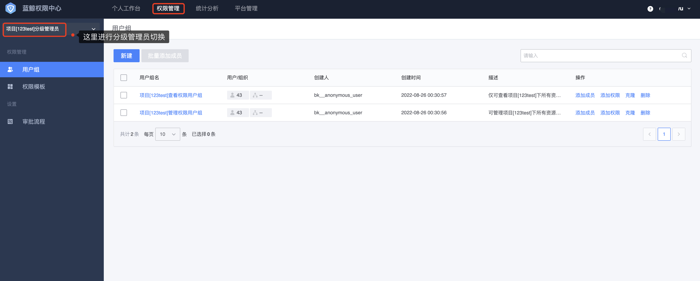

# 超级管理员创建分级管理员

以有超级管理员（[如何成为超级管理员](../Feature/Manager.md##超级管理员设置)）身份的账号登录到蓝鲸权限中心，进入**平台管理-分级管理员**页面，点击`新建`创建分级管理员。

## 基本信息

- 分级管理员名称：区分不同分级管理员，根据需求场景来命名，可以随时修改。
- 成员列表：分级管理员的成员都具备该分级管理员的相关权限，即具体某个分级管理员的管理成员。
- 描述：描述分级管理员的职能。

## 选择操作和资源实例范围

**操作和资源实例范围**代表该分级管理员能够`授权`的权限范围，可以**跨系统**选择多个操作。

选择操作后，需要针对每个操作进行对应的实例范围选择，实例选择可以选择具体实例，也可以通过属性条件来实现动态实例的选择。

> 比如，选择了 A 系统的 a 操作，对应的实例是 i1，i2，i3，则该分级管理员就只能给其他人授予 a 操作的 i1、i2、i3 这几个实例内的权限。

## 选择可授权人员范围

**可授权人员范围**代表该分级管理员能够`授权`的人员范围，反过来，也只有在可授权人员范围内的用户才能看到对应分级管理员所创建的用户组，双向的限制，避免了不必要的权限给用户带来的干扰，也避免敏感权限外泄，人员可以是组织，也可以是具体某个用户。

> 比如，选择了`组织：广东分公司、用户：user`，则该分级管理员只能给这两类人授权，也只有他们才能看到对应分级管理员创建的用户组，去申请加入。

选择完操作实例和人员范围，点击`提交`即完成分级管理员的创建。 

## 切换到分级管理员进行授权操作

成为了分级管理员，就可以切换到对应的分级管理员空间下进行授权操作。

如果需要添加更多的分级管理员成员，即多人一起授权，可以编辑分级管理员成员列表。

