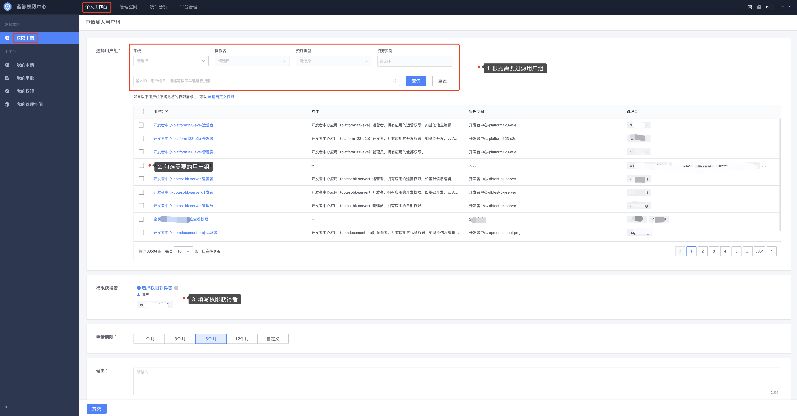

# 申请加入用户组

## 前置条件

> 存在已经创建好的用户组。

## 操作步骤

1. 进入**个人工作台**菜单下，进入**权限申请**页面，通过筛选条件查找需要的用户组，填写申请期限和理由进行用户组权限申请。

   

2. 点击**提交**，提交后等待审批人审批，在**我的申请**页面，查看具体的审批进度。

   

3. 审批通过后，在**我的权限**页面可以查看刚才申请的用户组。

   

