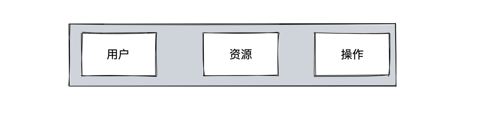

# 权限模型

> 本文重点阐述常见的权限模型, 方便大家理解和接入权限中心

## ACL(Access Control List) 访问控制表

- [wiki: ACL](https://en.wikipedia.org/wiki/Access-control_list)
- 最简单的权限模型;

示例: 小明有 仓库 1 的 commit 权限
- 策略数据: `小明, 仓库1, commit`
- 结果: 小李没有仓库 1 的提交权限

## RBAC(Role Base Access Control) 基于角色的访问控制

- [wiki: RBAC](https://en.wikipedia.org/wiki/Role-based_access_control)
- 最常见的权限模型

示例: 管理员有仓库 1 的 commit 权限
- 策略数据: `admin, 仓库1, commit`
- 小明是管理员 `小明, admin`
- 小李不是管理员
- 结果: 小明有仓库 1 的提交权限, 小李没有仓库 1 的提交权限

## ABAC(Attribute Base Access Control) 基于属性的访问控制

- [wiki: ABAC](https://en.wikipedia.org/wiki/Attribute-based_access_control)
- 最强大灵活的权限模型

示例: `管理员有 公开仓库的 提交权限`
- 策略数据: `subject.role=admin, repo.type=public, action=commit`
- 小明是管理员(subject.role=admin), 小李不是管理员
- 仓库 1 是公开的(repo.type=public), 仓库 2 是私有的(repo.type=private)
- 结果: 小明有仓库 1 的提交权限, 没有仓库 2 的提交权限; 小李没有仓库 1 的提交权限, 也没有仓库 2 的提交权限

## 三种模型的简单对比

|      | ACL                 | RBAC                     | ABAC                          |
|------|---------------------|--------------------------|-------------------------------|
|  全称    | Access Control List | Role Base Access Control | Attribute Base Access Control |
| 模型   | 用户 - 资源 - 操作        | 用户 - 角色 - 资源 - 操作        | 用户/属性 - 资源/属性 - 操作/属性 - 环境属性       |
| 优点   | 简单                  | 简单/管理方便                  | 动态灵活                          |
| 问题   | 策略多时难以管理            | Role explosions          | 实现复杂                          |
| 适用场景 | 小型系统(组织架构)          | 中小型系统(组织架构)              | 大型系统/大型组织                     |

ABAC 是包含 ACL 及 RBAC 的

- ACL = 用户 - 资源 - 操作
- RBAC = 用户属性(角色) - 资源 - 操作

## 蓝鲸权限中心使用的模型

权限中心将支持完备的 ABAC 模型, 目前根据需求及优先级, 策略表达式 v1 版本优先支持了资源属性

### policy v1(已发布)

> 支持资源属性

- Subject: id/type
- Resource: id/type/attribute
- Action: id
- Environment: -

### policy v2(开发中)

> 支持用户属性

- Subject: id/type/attribute
- Resource: id/type/attribute
- Action: id
- Environment: -

### policy v3(规划中)

> 支持环境属性

- Subject: id/type/attribute
- Resource: id/type/attribute
- Action: id
- Environment: attribute
