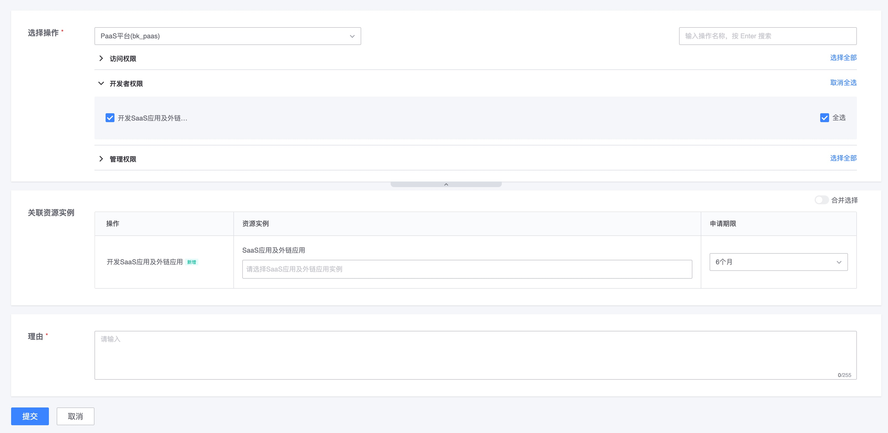

# 样例 2: 关联简单实例权限

## 1. 场景描述

这类权限关联简单的`实例`, 例如:
- 有没有某个应用的管理权限
- 有没有某个项目的查看权限

通常
- 适用于`个人-实例`数量不会太过的场景, 例如开发者中心的应用数量, 10 年大概是 2000 个
- 不适用于`个人-实例`数量很大的场景, 例如一个人拥有 100000 台主机的编辑权限, 此时不应该直接套用这个权限模型, 应该以更高维度来管理权限, 例如`业务-模块-主机`, 授予用户`业务下的所有主机权限`(只需要 1 条业务权限策略, 而不是 100000 条主机权限策略)  [大规模实例级权限限制](../../Explanation/06-LargeScaleInstances.md)
- 如果`实例`数量是随着时间增长的, 做好数量评估, 例如作业平台的作业数量, 1 个人 10 年大概是 1000 个, 那么可以使用这个模型; 例如标准运维 task 执行, 每执行一次生成一个, 这个就不适用; 
- 原则: 尽量使用范围授权

## 2. 权限分析

- 关联简单实例
- 注册一个`action`及对应的实例类型`resourceType`
- 同时需要注册, 配置权限时如何勾选到实例的`实例视图`(`instanceSelections`)

相关阅读:
- [说明: 实例视图](../../Explanation/01-instanceSelection.md)

## 3. 权限模型

- 注册实例类型`resourceType`

```json
{
  "id": "app",
  "name": "SaaS应用及外链应用",
  "name_en": "application",
  "description": "SaaS应用及外链应用",
  "description_en": "SaaS application and ext-lint application",
  "provider_config": {
    "path": "/iam/api/v1/resources/"
  },
  "version": 1
}
```

- 注册实例视图`instanceSelections`

```json
{
  "id": "app_view",
  "name": "应用视图",
  "name_en": "app_view",
  "resource_type_chain": [
    {
      "system_id": "bk_paas",
      "id": "app"
    }
  ]
}
```

- 注册操作, 关联实例类型及实例视图

```json
{
  "id": "develop_app",
  "name": "开发SaaS应用及外链应用",
  "name_en": "develop app",
  "description": "一个用户是否能够开发SaaS 及外链应用",
  "description_en": "Is allowed to develop SaaS app and ext-link app",
  "type": "",
  "related_actions": [
    "access_developer_center"
  ],
  "related_resource_types": [
    {
      "system_id": "bk_paas",
      "id": "app",
      "name_alias": "",
      "name_alias_en": "",
      "related_instance_selections": [
        {
          "system_id": "bk_paas",
          "id": "app_view"
        }
      ]
    }
  ],
  "version": 1
}
```

- 注册之后的权限配置页面




## 4. 鉴权

### 4.1 使用 sdk 进行鉴权

```python
from iam import IAM, Request, Subject, Action, Resource


SYSTEM_ID = "demo"
APP_CODE = "demo"
APP_SECRET = "c2cfbc92-28a2-420c-b567-cf7dc33cf29f"
BK_IAM_HOST = "http://{IAM_HOST}"
BK_PAAS_HOST = ''


class Permission(object):
    def __init__(self):
        self._iam = IAM(APP_CODE, APP_SECRET, BK_IAM_HOST, BK_PAAS_HOST)

    def _make_request_with_resources(self, username, action_id, resources):
        request = Request(
            SYSTEM_ID,
            Subject("user", username),
            Action(action_id),
            resources,
            None,
        )
        return request

    def allowed_develop_app(self, username, app_code):
        """
        app开发权限
        """
        r = Resource(SYSTEM_ID, 'app', app_code, {})
        resources = [r]
        request = self._make_request_with_resources(username, "develop_app", resources)
        return self._iam.is_allowed(request)
        
# 使用
# Permission().allowed_develop_app(request.user.username, app_code)
```

### 4.2 使用直接鉴权 API 进行鉴权

- [直接鉴权 API: policy auth](../../Reference/API/04-Auth/02-DirectAPI.md)

```bash
curl -XPOST 'http://{IAM_HOST}/api/v1/policy/auth' \
-H 'X-Bk-App-Code: demo' \
-H 'X-Bk-App-Secret: c2cfbc92-28a2-420c-b567-cf7dc33cf29f' \
-H 'Content-Type: application/json' \
-d '{
  "action": {
    "id": "access_developer_center"
  },
  "system": "demo",
  "resources": [
    {
      "system": "demo",
      "type": "app",
      "id": "test",
      "attribute": {}
    }
  ],
  "subject": {
    "type": "user",
    "id": "testuser1"
  }
}'


{
  "code": 0,
  "message": "ok",
  "data": {
    "allowed": false
  }
}
```

## 5. 无权限申请

在前端展示用户无权限的相关列表, 当用户点击`去申请`按钮时, 需要跳转到权限中心申请对应权限.

接入系统需要提前将相关数据到权限中心生成一个`权限申请URL`, 引导用户跳转过去申请对应权限. [生成无权限申请 URL](../../Reference/API/05-Application/01-GenerateURL.md)

具体的 [无权限交互方案](../Solutions/NoPermissionApply.md)


```python
from iam.apply.models import ActionWithoutResources, ActionWithResources, Application, RelatedResourceType
from iam.apply.models import ResourceInstance, ResourceNode

class Permission(object):
    def __init__(self):
        self._iam = IAM(APP_CODE, APP_SECRET, BK_IAM_HOST, BK_PAAS_HOST)

    def make_resource_application(self, action_id, resource_type, resource_id, resource_name):
        # 1. make application
        # 这里支持带层级的资源, 例如 biz: 1/set: 2/host: 3
        # 如果不带层级, list中只有对应资源实例
        instance = ResourceInstance([ResourceNode(resource_type, resource_id, resource_name)])
        # 同一个资源类型可以包含多个资源
        related_resource_type = RelatedResourceType(SYSTEM_ID, resource_type, [instance])
        action = ActionWithResources(action_id, [related_resource_type])

        actions = [action, ]
        application = Application(SYSTEM_ID, actions)
        return application

    def generate_apply_url(self, bk_token, application):
        """
        处理无权限 - 跳转申请列表
        """
        # 2. get url
        ok, message, url = self._iam.get_apply_url(application, bk_token)
        if not ok:
            logger.error("iam generate apply url fail: %s", message)
            return IAM_APP_URL
        return url
        
# 开发app权限
# app_application = Permission().make_resource_application("develop_app", "app", "saas_test", "saas_test")
# url = Permission().generate_apply_url(bk_token, app_application)
```
