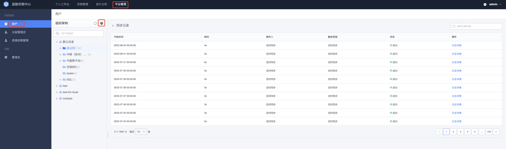
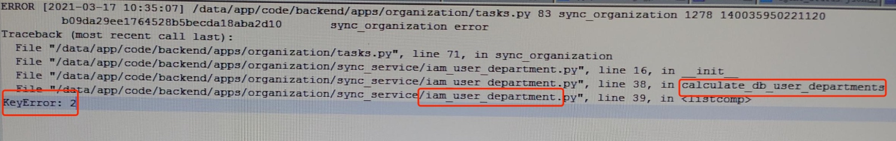

# 组织架构同步异常

## 1. 背景

权限中心支持权限授权给组织架构和用户. 

组织架构和用户信息从用户管理同步过来:
- 每天凌晨全量同步
- 新用户自动 1 分钟内同步

由于用户管理接口和网络等问题导致同步组织架构失败，进而可能出现用户不存在或新用户无法同步过来等问题，所以需要根据错误码和日志进行排查解决

相关[错误码](../ErrorCode.md):
- 19023xx：通过 ESB 请求用户管理错误
- 19020xx：调用 ESB 等第三方请求的通用错误，比如网络不通等
- 19021xx：IAM 后台请求错误

## 2. 组织架构同步依赖服务

1. MySQL
2. Redis，主要用于分布式锁的实现，避免同步任务并发执行
3. RabbitMQ，用于异步任务 Celery
4. IAM Backend，同步时需要变更 IAM 后台相关用户信息
5. Component - UserManager, 通过 ESB 调用用户管理提供的 API 进行组织架构同步

## 3. 问题排查

注意, 如果需要相关开发协助排查问题, 请按下面步骤先获取报错日志再进行咨询.

### 3.1 有超级管理员权限

如果有`超级管理员`权限, 可以使用超级管理员登录后, 到权限中心首页, 直接通过页面查看同步记录/报错日志

路径: `切换角色为超级管理员 - 用户 - 组织架构`



点击`同步`按钮旁边的`历史记录`, 可以查看到历史同步的记录, 如果状态是`失败`, 点击`日志详情`可以看到详细报错日志

### 3.2 无超级管理员权限

需要结合错误码与日志排查

1. 确认 SaaS 服务健康`curl -vv http://{PAAS_HOST}/o/bk_iam/healthz`, 正常应该返回`ok` (MySQL、Redis、Celery、IAM 后台、用户管理 ESB 接口)
2. 确认错误码，若有错误码，则根据错误码类型进行 [查询](../ErrorCode.md)
3. 若是后台异步任务等失败，可以依次查询权限中心 SaaS 日志 `celery.log / component.log / bk_iam.log`，根据查询到的日志信息进行错误分析即可

## 4. 常见同步异常场景

### 4.1 部门查询不到


* 排查思路与步骤

1. 查询出不存在的部门

```bash
1). 进入IAM 容器，python shell命令行

ssh $BK_APPO_IP
docker exec -it $(docker ps | grep -w bk_iam | awk '{print $1}') bash 
/cache/.bk/env/bin/python /data/app/code/manage.py shell

2). 执行python相关语句

from backend.components import usermgr
from backend.apps.organization.models import Department
from backend.apps.organization.sync_service.utils import convert_list_for_mptt
new_departments = usermgr.list_department()
old_departments = [d for d in Department.objects.all()]
old_department_id_set = set([i.id for i in old_departments])
created_departments = [Department(id=dept["id"], parent_id=dept["parent"], name=dept["name"], category_id=dept["category_id"], order=dept["order"]) for dept in new_departments if dept["id"] not in old_department_id_set]
id_parent_ids = [(i.id, i.parent_id) for i in created_departments]
sorted_departments = convert_list_for_mptt(id_parent_ids)
created_department_dict = {i.id: i for i in created_departments}
data = []
for dept_id in sorted_departments:
    dept = created_department_dict[dept_id]
    data.append((dept_id, dept.parent_id))

not_exist_parent = set()
exist_dept = set()
for dept_id, dept_parent_id in data:
    exist_dept.add(dept_id)
    if dept_parent_id is None:
        continue
    if dept_parent_id not in exist_dept:
        not_exist_parent.add(dept_parent_id)

print(not_exist_parent)
```

2. 用步骤 1 中查询到的”不存在“的部门 ID，到用户管理 DB 里查询对应部门 ID 的信息，看看是否被删除或者软删除了

```bash
若在用户管理里已经删除或软删除，那说明用户管理删除后，没有一并删除其下属部门等导致的，可联系用户管理相关同事排查解决
若存在，则需要让用户管理排查是否usermgr.list_department有问题，导致没有返回对应部门
```

### 4.2 节点无法指定自己成为子节点的子节点


* 原因
手动修改删除用户管理数据库中部门表导致的

* 解决方式

```bash
1). 进入IAM 容器，python shell命令行

ssh $BK_APPO_IP
docker exec -it $(docker ps | grep -w bk_iam | awk '{print $1}') bash 
/cache/.bk/env/bin/python /data/app/code/manage.py shell

2). 执行python相关语句
from backend.apps.organization.models import Department
Department.tree_objects.rebuild()
```

### 4.3 存在用户与部门关系，但是其用户不存在



* 原因
  用户被删除了，但是其与部门之间的关系没有删除
  
* 解决方式

```bash
1. 确认用户id=xxxx是否被删除
进入“用户管理”DB，查询profile_profiles表，查询id为xxxx的用户
用户表是软删除的，得看是否被标记为删除

2. 如果确认被删除了，则删除掉其部门
```

