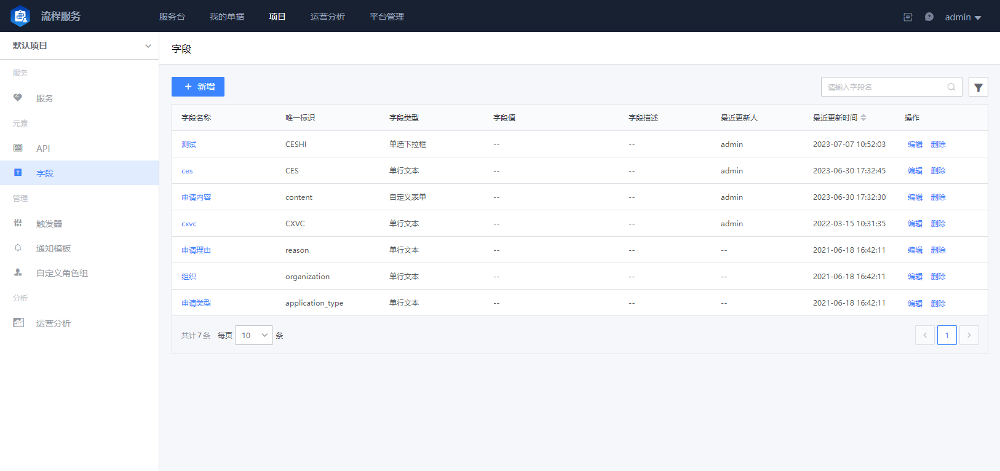

## 字段管理

项目团队下对某一个表单字段的定义相同的情况下，可以通过字段管理功能沉淀下来，在后续其他服务表单中就可以引用的方式进行应用，达到统一应用和管理的效果！

点击 `新增` 或 `编辑` 已有的字段：

- 字段名

  字段在服务表单中显示的名称

- 唯一标识

  用于字段的全局唯一性标识

- 字段类型

  表单中字段的输入交互方式空间，种类有很多，用户可以按需选择配置

  - 单行文本
  - 多行文本
  - 数字
  - 日期
  - 时间
  - 表格
  - 单选下拉框
  - 可输入单选下拉框
  - 多选下拉框
  - 复选框
  - 单选框
  - 人员选择器（单选）
  - 人员选择器（多选）
  - 富文本
  - 附件上传
  - 自定义表格
  - 树形选择
  - 链接
  - 自定义表单

- 校验方式

  用于校验用户输入的值

- 数据源

  配置用户可选数据的来源，如单选下拉框，需要配置下拉框中的选项数据来源

- 默认值

  默认填充的字段值

- 填写说明

  字段为空时的说明文案
