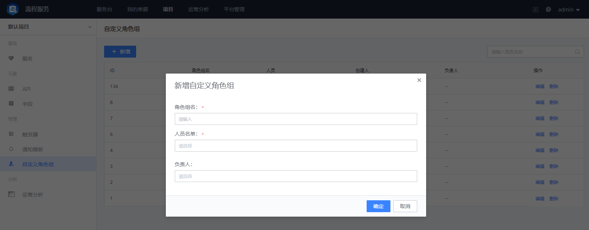

## 自定义角色组

主要指承接不同服务的专职角色，例如安全网络类的基础实施人员，审核账号开通的负责人，开通账号远程准入的实施人员等等，根据实际场景来进行角色和人员的增删改日常管理；项目团队可以按服务场景需求进行通用“用户组”的管理，便于在不同服务中可以统一应用和管理。

点击 `新增` 可以创建新的用户组：

- 角色组名

  角色组的名称，如研发人员、一线客服、后勤人员等等，代表具体职能的名称

- 人员名单

  该用户组的人员列表

- 负责人

  负责管理该用户组的用户
