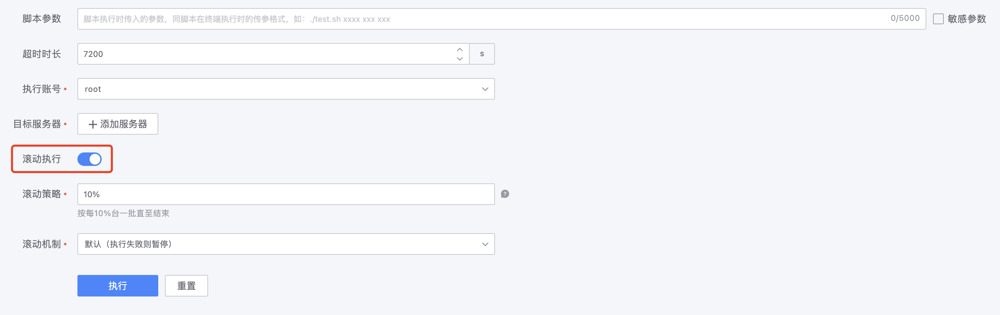
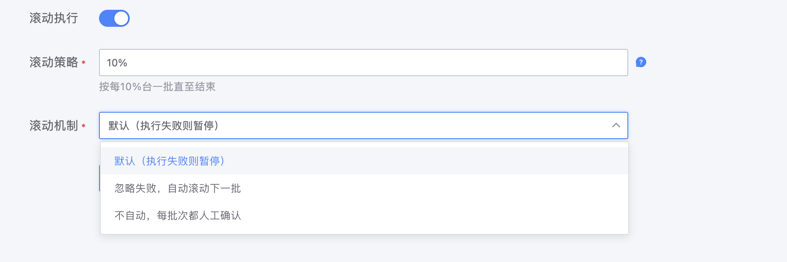

# 如何利用滚动执行实现灰度更新？

作业平台的“滚动执行”特性支持将指定的一批机器按约定的规则分批次执行，并且可以设定批次之间的交互方式；如此，用户便可以利用这个特性做类似于“灰度发布”的场景。

## 操作示例

1. 打开 “滚动执行”
    

2. 按表达式的约定规则制定符合自己需求的表达式
如图中的 `10%` 意指每批次取所有执行目标总数量的10%来执行

3. 设定 “滚动机制”
  - 默认（执行失败则暂停）
    当批次中出现执行失败的，任务就会自动暂停，待用户确认后方可继续执行
  - 忽略失败，自动滚动下一批
    不论执行成功与否，只要执行完毕就会自动进入下一批
  - 不自动，每批次都人工确认
    不论执行成功与否，每批次执行完就会进入“人工确认”步骤，待用户确认后才继续执行
    

4. 开始滚动执行
滚动任务详情页中会显示本次任务切分的所有批次，并且提供了“全部批次”入口帮助用户从全局视角查看整体执行情况；

