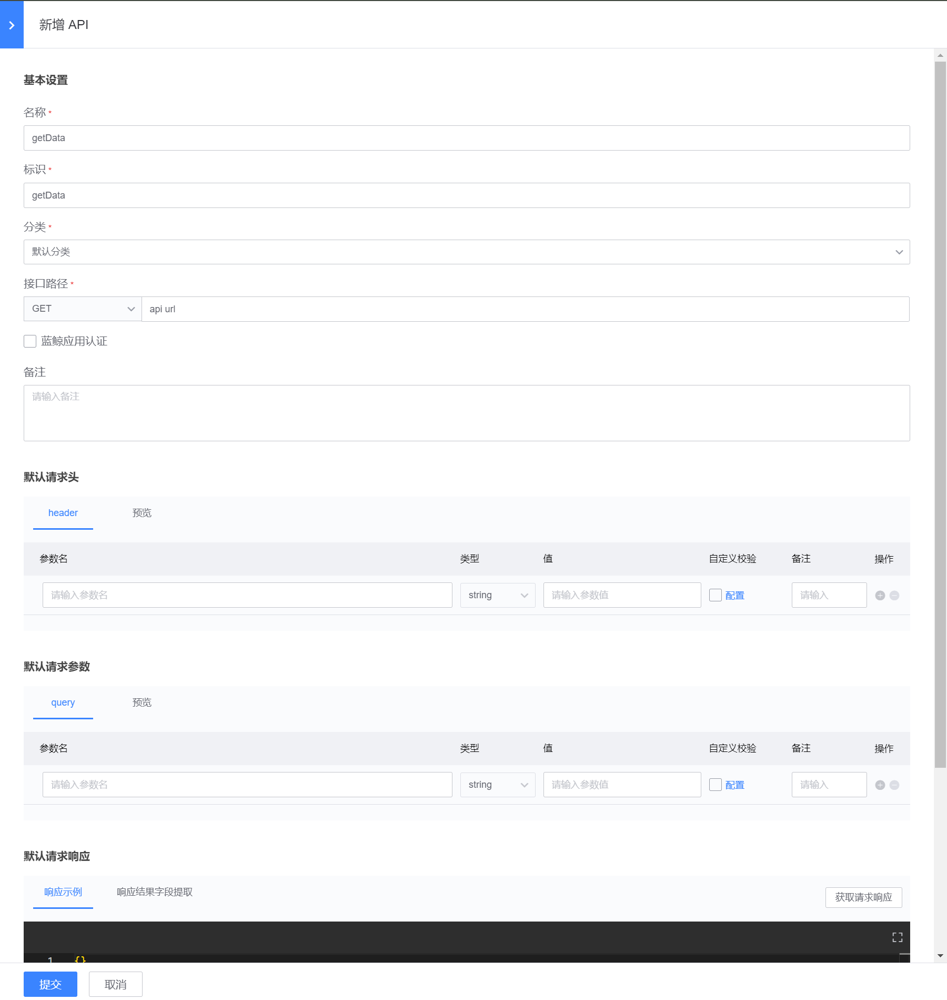
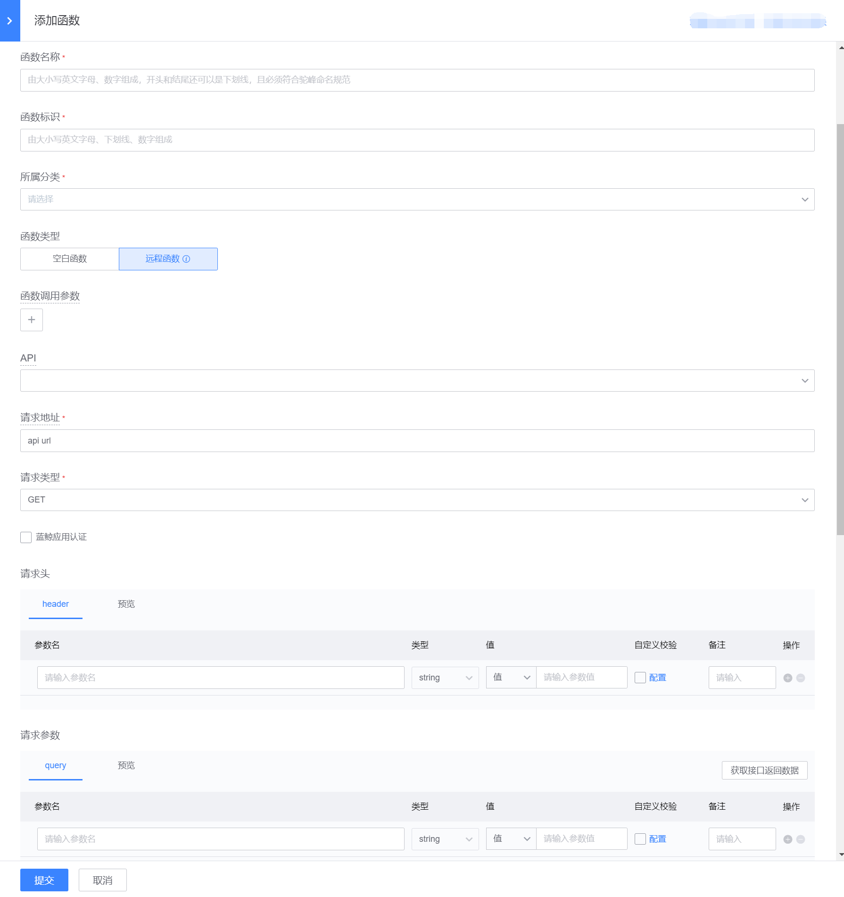
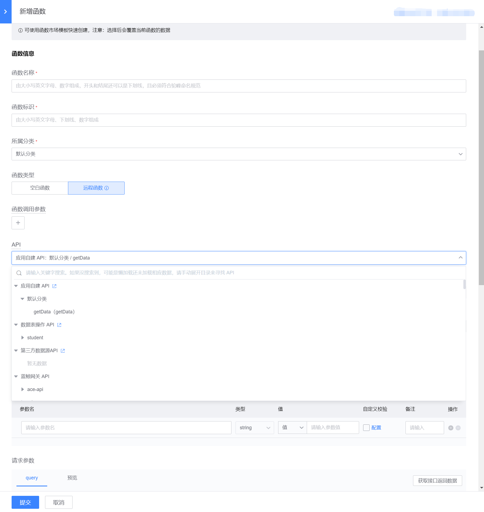

# API 管理

蓝鲸运维开发平台(LessCode)中，可以由用户创建 API，并且 API 已和蓝鲸API Gateway服务打通，方便对接口进行管理。可以在函数中选择 API，来快速使用接口。

## 创建 API

在应用开发 -》资源管理 -》API 管理页面下，点击新建，填写对应的参数。填写完成以后点击提交即可新增 API。
注意：

- 勾选了蓝鲸应用认证会在请求中携带 Api gateway 所需的认证信息，该认证信息根据发送请求用户和绑定应用生成
- 默认请求响应右侧有`获取请求响应`按钮，点击可以获取 API 响应来进行 API 测试

## 使用 API

### 在 API 管理页生成函数

在应用开发 -》资源管理 -》API 管理页面下。在已有 API 列表的操作列中，点击生成函数，会自动携带 API 信息，用户继续填写相关参数即可生成函数

### 在新增函数中选择 API

在应用开发 -》 JS 函数开发，或者 页面编辑 -》 函数管理中，点击新建函数，函数类型选择远程函数，即可在 API 下拉选项中选择我们创建的 API

