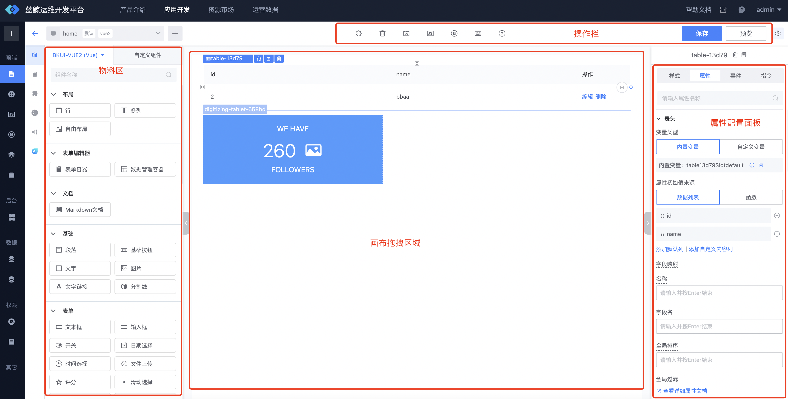
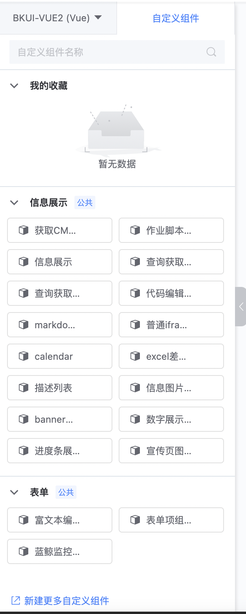
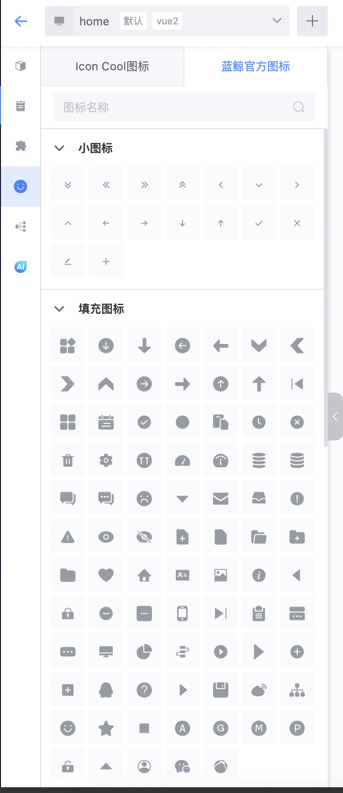
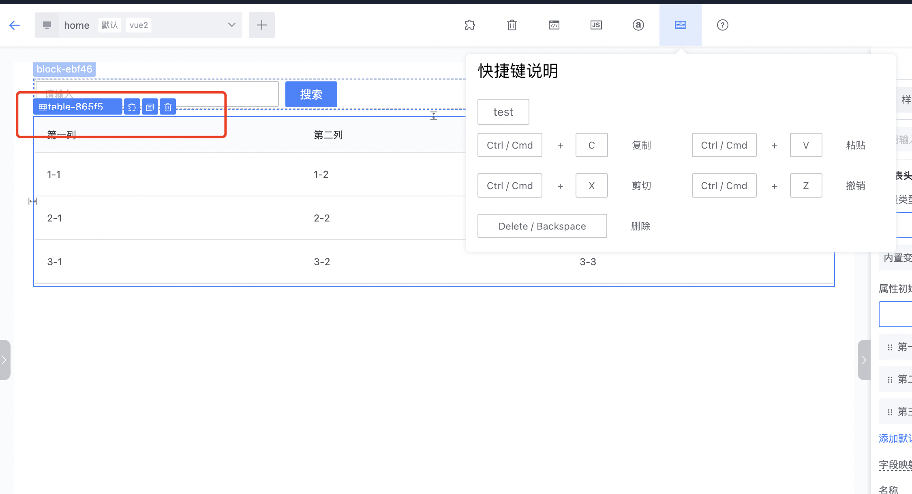
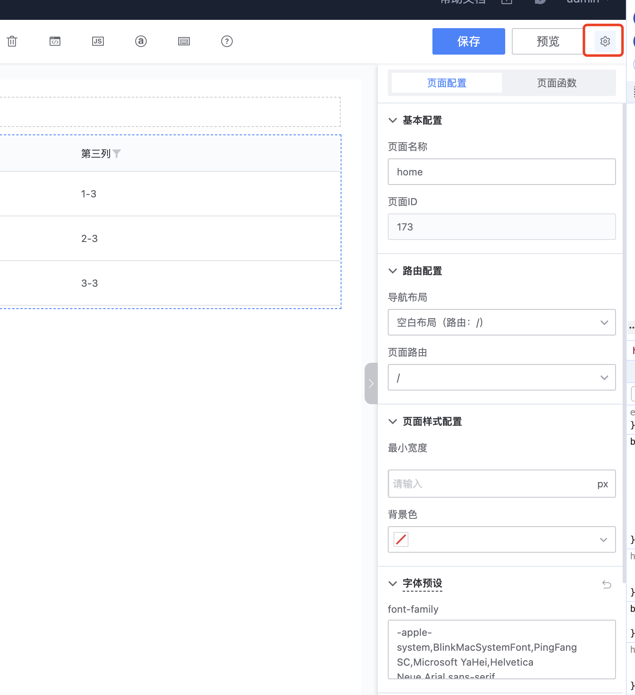
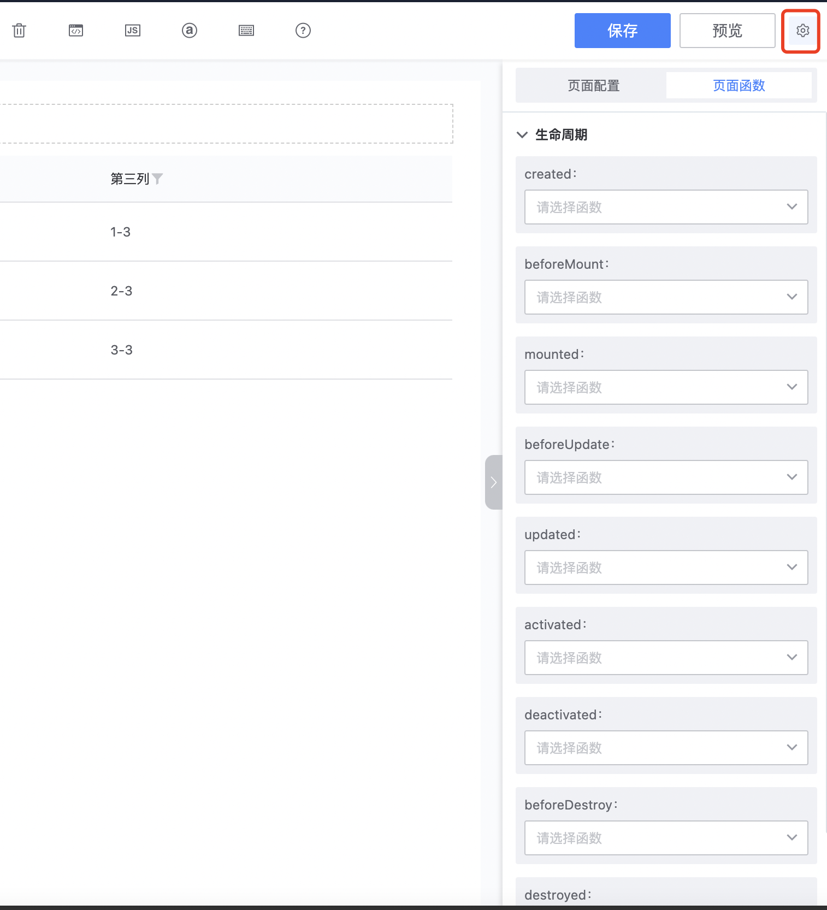

# 画布编辑

画布编辑页，画布编辑页大致可分为4个区域： 物料区、拖拽区、操作栏、属性/样式/事件配置面板

## 物料区
可以使用的物料包括， 布局、基础组件、自定义组件、模板、icon图标

### 布局
蓝鲸运维开发平台(LessCode)提供了3种布局： 行布局、多列布局、自由布局

### 基础组件
根据不同的应用类型跟页面类型， 蓝鲸运维开发平台(LessCode)提供了不同的基础组件
- Vue2 PC： 蓝鲸MagicBox组件库、element组件库
- Vue3 PC： 蓝鲸MagicBox组件库
- Vue2 移动端页面： Vant UI组件库
- Vue3 移动端页面： Vant UI组件库

### 自定义组件
来源包括
- 官方内置自定义组件
- 其它应用公开的自定义组件
- 本应用自己上传的自定义组件

### icon图标
可拖拽内置的蓝鲸图标库的图标到页面中使用 (上云版可绑定使用icon-cool项目中的图标)

## 画布拖拽区域

- 根据设计稿或原型图， 把物料区的物料区域拖拽到画布拖拽区域进行编排
- 选中组件后， 可通过组件上方蓝色图标或快捷键对组件进行复制、粘贴、删除、存为模板等快捷操作

## 属性/样式/事件配置面板
选中某个组件后， 即可配置当前组件的属性/样式/事件/指令

在配置的过程中， 如果需要使用到变量或者函数、可先通过操作栏的入口配置好所需的变量或函数， 具体使用可参考函数跟变量在画布中的使用指引文档

## 操作栏
 包含将页面存为模板、清空页面、查看页面源码/JSON、设置函数、设置变量、快捷键使用指引、画布指引、保存、预览画布等操作入口

## 除此以外， 当页面未选中任意组件时（或点击预览按钮旁边的设置icon）， 此时右侧区域会展示页面整体的配置
可以修改页面的基本配置、路由配置、样式配置
  
以及可以设置页面的生命周期函数  

