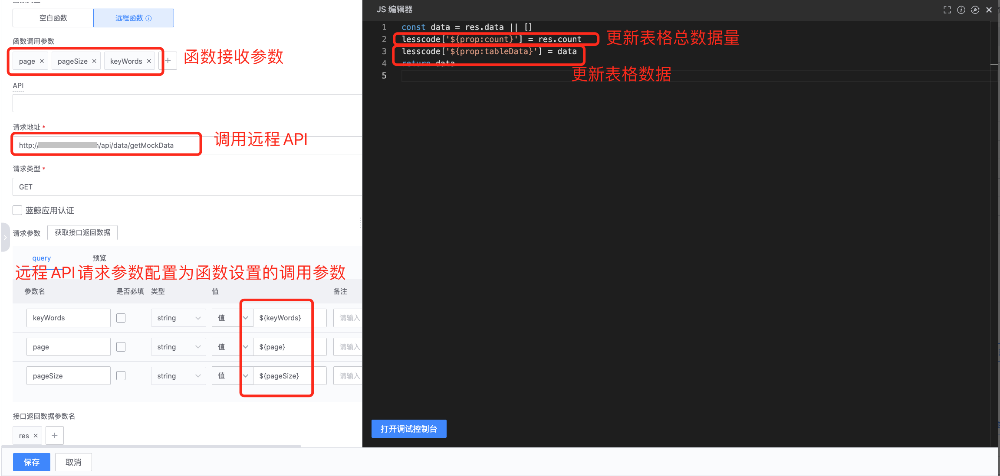
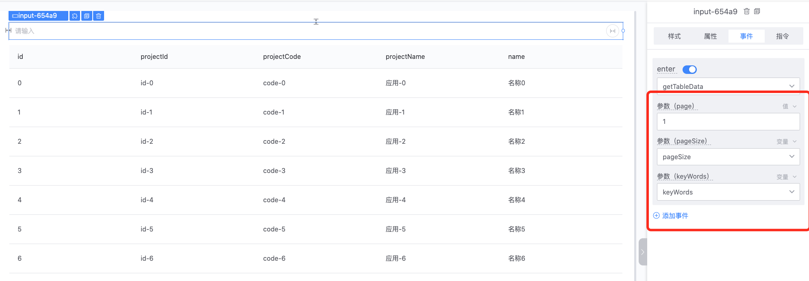
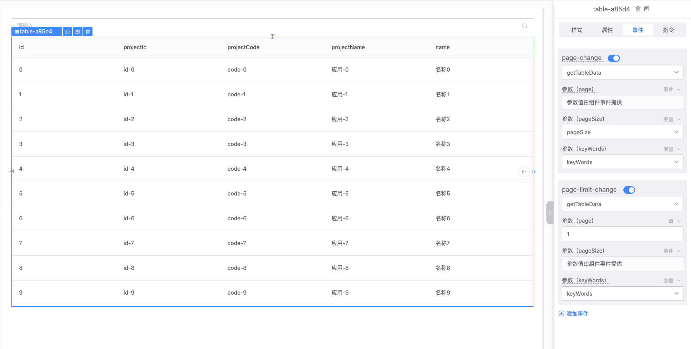
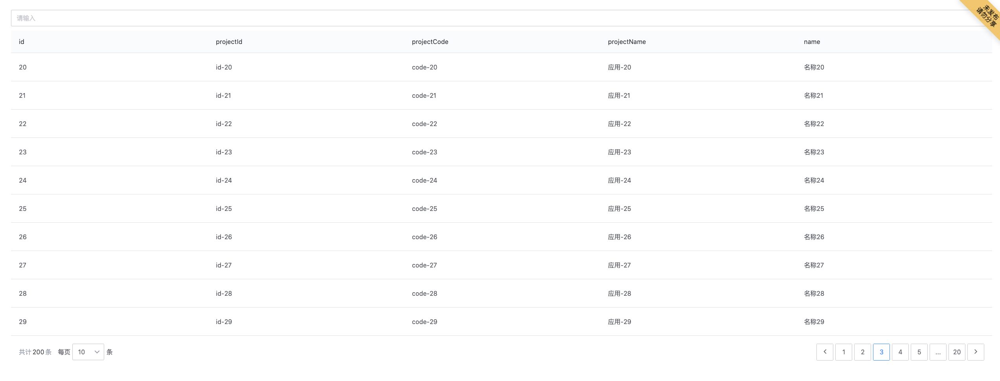

# 如何开发一个表格查询页面
### 第一步：拖拽“输入框”、“表格”组件到画布

### 第二步：配置组件属性和指令

- 设置表格数据来源：新建变量 “tableData”，配置 “表格” 组件属性 “data”，绑定自定义变量 “tableData”

- 获取输入框关键字：新建变量 “keyWords”，“输入框”组件属性指令 “v-model” 绑定变量 “keyWords”
- 设置表格分页：属性 pagination 选择“远程分页”
    
    1. 新建变量 “count”，分页 ”count“ 属性绑定变量 “count”
    2. 新建变量 “pageSize”，分页 ”limit“ 属性绑定变量 “pageSize”

### 第三步：新建函数 “getTableData” 查询并获取表格数据

**注意：**

编辑函数时

1、可以使用 lesscode.指令值，必须通过编辑器自动补全功能选择对应属性指令值，来获取或者修改当前页面中配置了指令的组件属性值。

2、可以使用 lesscode.函数名，必须通过编辑器自动补全功能选择需要调用的函数。

### 第四步：“表格”组件 “data” 属性及事件配置

1、 配置表格 “data” 属性数据初始值来源为函数，并绑定函数 “getTableData”

2、 点击”刷新表头“

### 第五步：输入框 “enter” 事件绑定表格查询函数 “getTableData”

### 第六步：表格分页事件绑定事件函数

分别给 “page-change” 和 “page-limit-change” 事件绑定表格查询函数 “getTableData”，并配置对应函数调用参数。

### 第七步：预览效果

