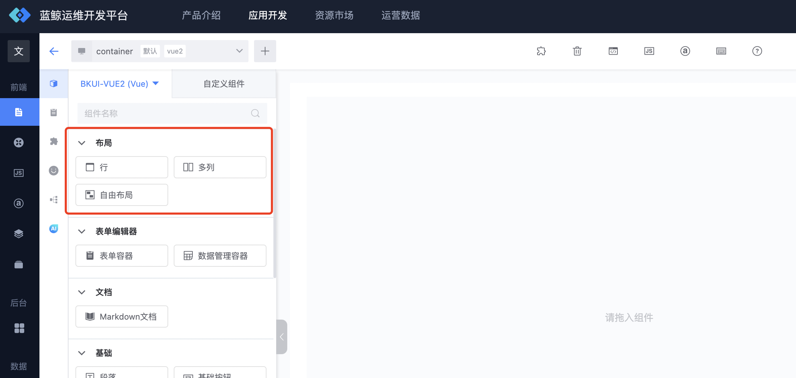
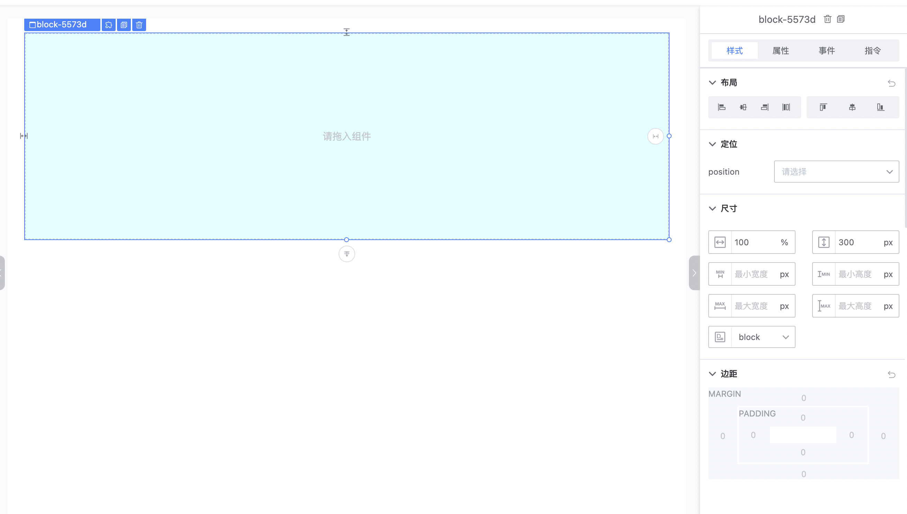
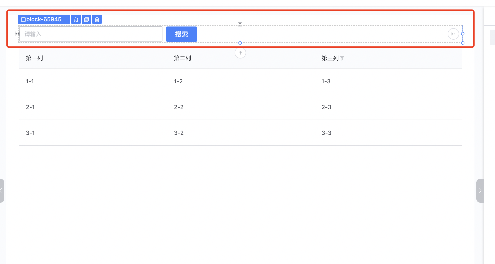
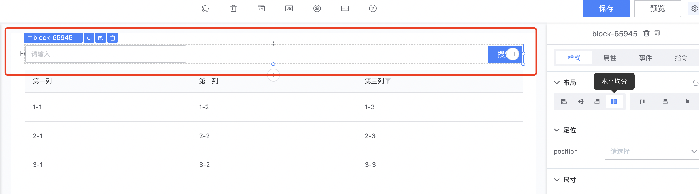
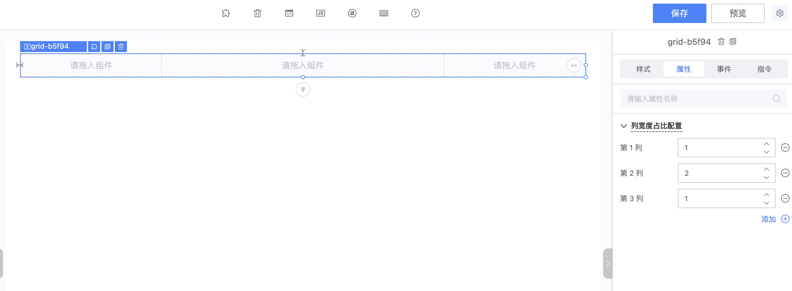
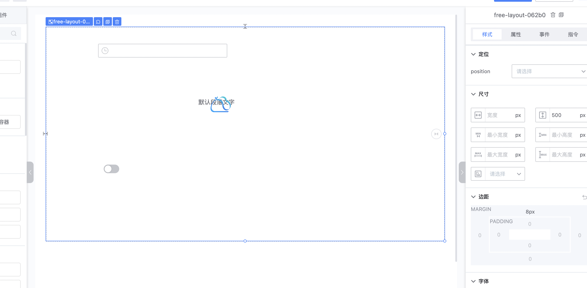

# 画布布局容器

蓝鲸运维开发平台(LessCode)提供行布局、多列布局、自由布局三种布局容器， 以便用户能便捷的编排出所需的页面

## 通用样式设置
每一种布局的通用样式， 如宽度、高度、背景颜色等等， 都可以在选中布局容器后， 在右侧的样式属性面板进行配置（以行布局为例, 将行布局容器设置成了高度为300px，宽度100%、背景色为淡蓝色）

## 行布局
行布局可以理解为一个普通的div，
如常见的把搜索框跟搜索按钮放到了一个行布局容器中

除通用的样式设置外， 行布局还可以设置布局内组件的对齐方式：
水平居左、水平居右、水平居中、水平均分、顶部对齐、垂直居中、底部对齐

## 多列布局
多列布局将容器分为n列， 可以在设置面板设置把容器分成多少列、以及每一列宽度所占的比例
如将容器分成1:2:1的三列

PS: 选中多列布局的某一列， 同样可以设置该列内部的组件对齐方式

## 自由布局
自由布局是默认高度为 500px，背景透明的一块区域， 自由布局里面， 每个组件的位置可以随意的拖动，组件也可以叠加到其它组件上方

## 布局跟组件的关系 （行布局跟多列布局统称为栅格布局）
- 自由布局中只能放入普通组件，不能放入栅格布局和自由布局
- 自由布局里的普通组件不能拖入到栅格布局中，也不能拖到另外的自由布局中
- 栅格布局中可以放入栅格布局、自由布局和普通组件
- 栅格布局里的普通组件可以拖入到另外的自由布局以及另外的栅格布局中

