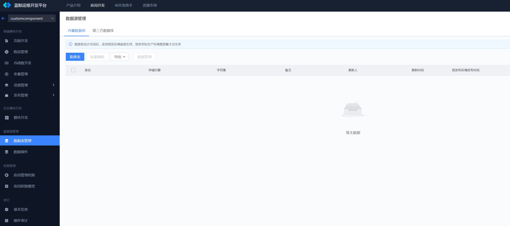
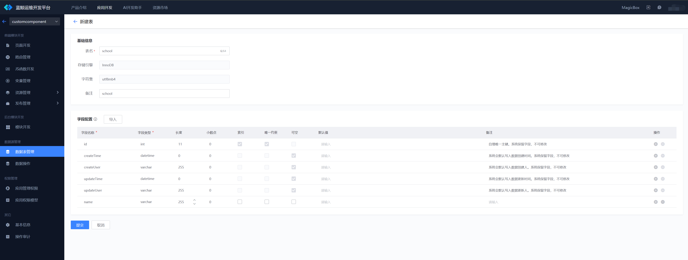
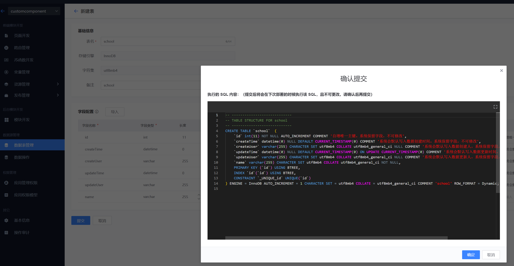
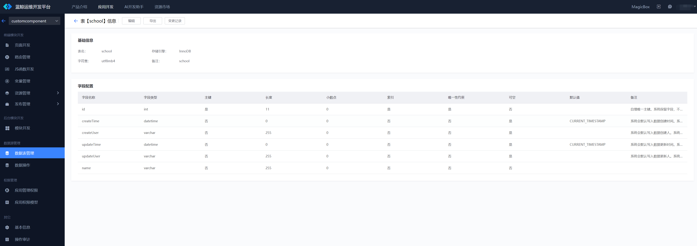
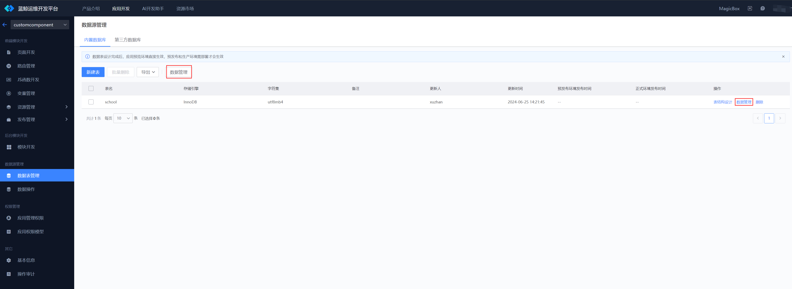
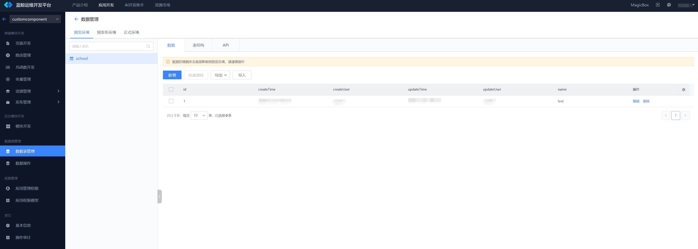
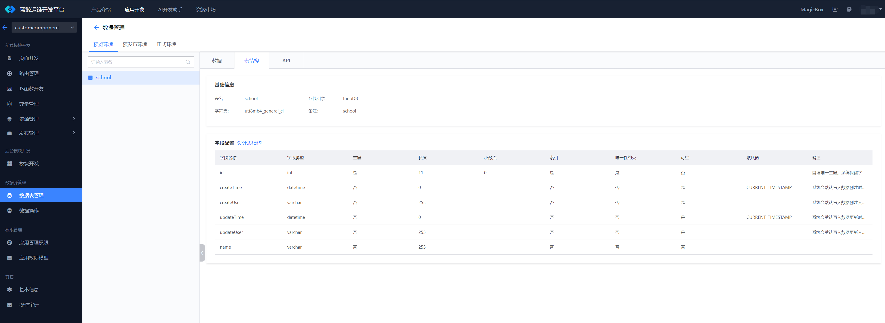
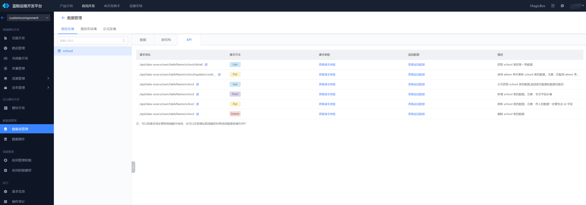
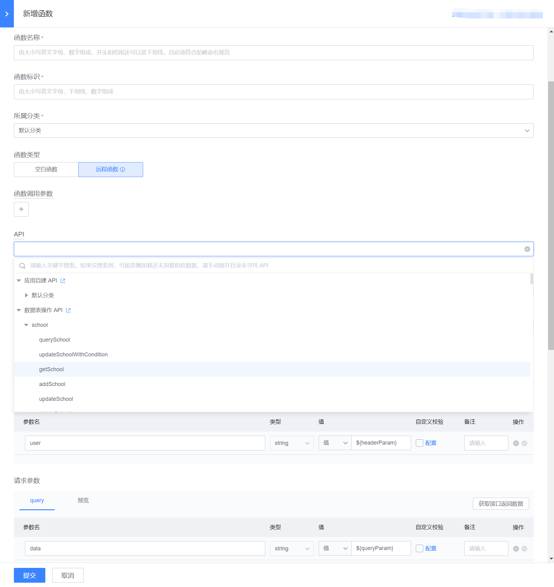
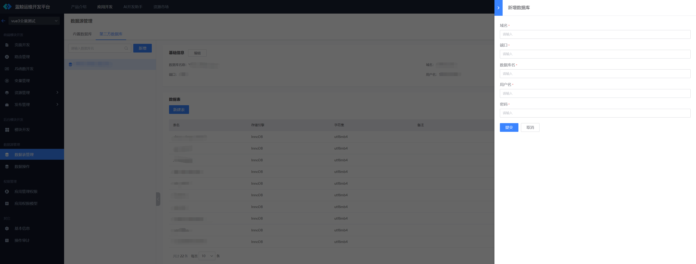

# 数据表管理

蓝鲸运维开发平台(LessCode)中：用户可以创建数据表。可以查看`预览环境`、`预发布环境`、`生产环境`的表数据，也可以修改不同环境的表数据。每个表都有相应的增删改查 API，可以在创建函数的时候选择该 API，从而在页面中使用表数据。蓝鲸运维开发平台(LessCode)也支持第三方数据库，可以直接链接已有的数据库，在打开第三方数据的时候会自动拉取数据库的表结构，用户可以继续对表结构进行增删改查操作。

## 内置数据库

### 新建表

在 应用开发 -》 数据表管理 页面中，点击新建表按钮，即可进入新建表页面

在新建表页面中，用户可以根据提示信息填写表相关字段

填写完毕后，用户点击提交按钮，会展示执行的 sql 内容。提交后该 sql 会在下次部署时生效，且不可更改，所以一定需要仔细检测 sql 内容，确认影响范围。

### 修改表结构、查看表结构变更记录、导出表结构

在列表页面可以通过`表结构设计`操作进入表信息页面。这个页面可以查看表的具体结构。可以通过点击`编辑`按钮对表结构进行编辑。也可以点击`变更记录`按钮查看表结构的变更记录。也可以点击`导出`按钮导出表结构

### 数据管理

可以通过`数据管理`按钮，或者操作列表的`数据管理`进入数据管理页面

#### 数据管理页面可以通过页签切换`预览环境`、`预发布环境`和`正式环境`，其中`预发布环境`和`正式环境`需要应用部署后才会有数据。在列表中选择表以后，在页面的右侧可以看到`数据`、`表结构`、`API`3 个 页签，分别可以看到表数据、表结构和该表的 API。

可以在数据页签下，对表数据进行`导入`、`导出`、`新增`、`修改`等操作

可以在表结构页签下，查看线上该表具体的表信息，也可以点击设计表结构跳转到编辑页面对其进行修改

可以在 API 页签下，查看操作该表的接口

在新建函数的时候，将函数类型切换到远程函数。API 可以选择`数据表操作API`，然后选择想操作的表和 API 即可

## 第三方数据库

切换到`第三方数据库`页签，点击新增，在侧滑框填写表单提交即可新增第三方数据库。每次选择第三方数据库的时候，系统会自动拉取第三方数据库下的表结构。注意：要求表具有唯一自增`id`字段，否则系统会给该表添加该字段

### 新增、修改第三方数据库表结构和表数据

选择第三方数据库以后，在右侧可以看到已有表结构，也可以通过`新建表`按钮来新建表，`表结构设计`操作来修改表结构，`数据管理`操作来操作数据。具体操作和内置数据库一致，唯一区别是数据管理只有一个环境。

