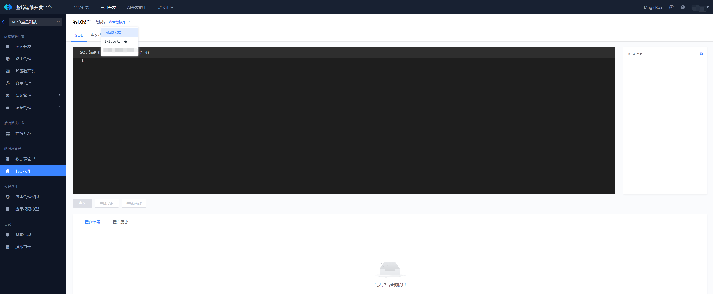
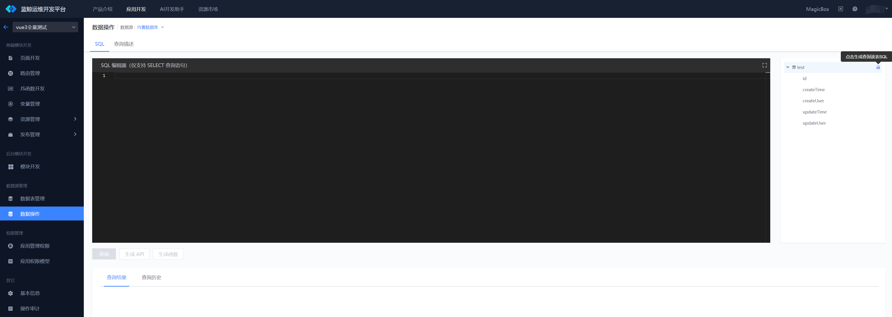
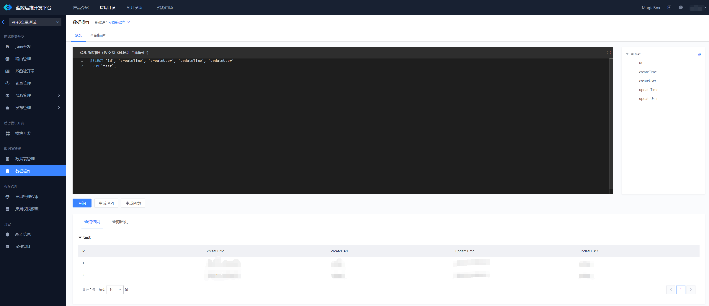
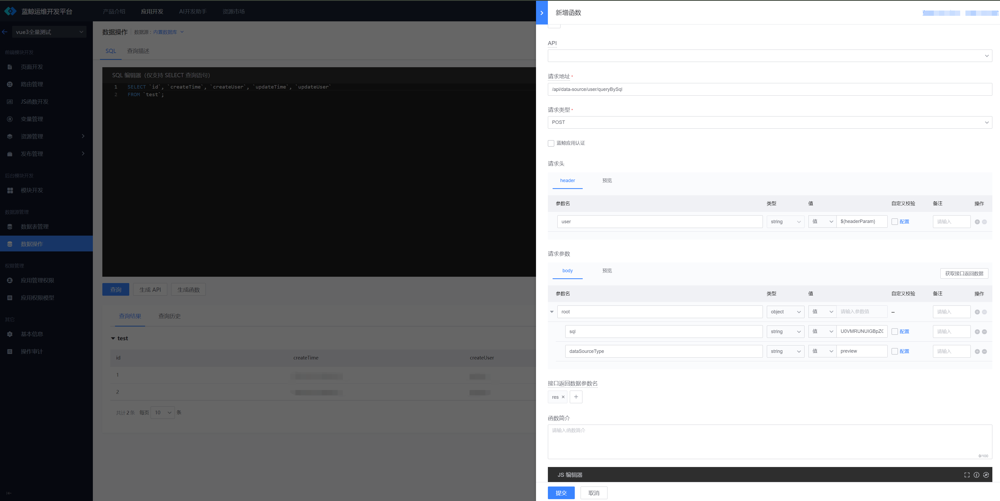
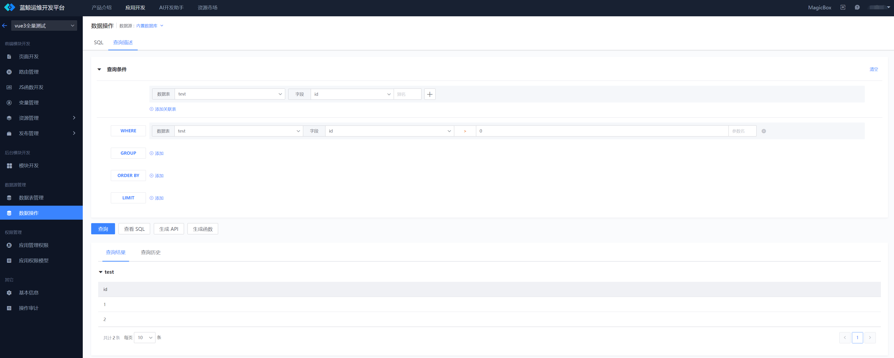
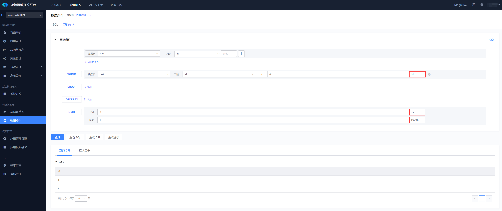
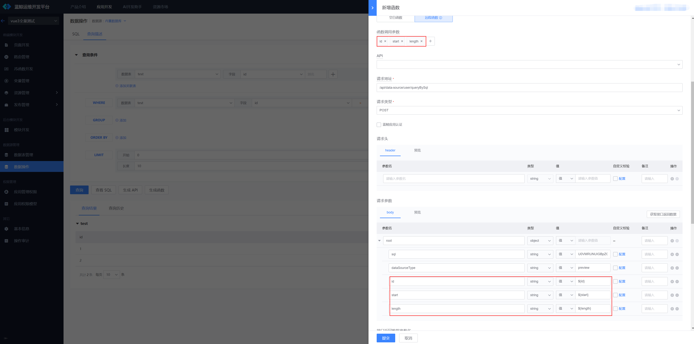

# 数据操作

蓝鲸运维开发平台(LessCode)提供了数据操作页面来解决复杂的数据查询。支持直接编写 SQL，或者通过查询描述的方式来进行数据查询

## 切换`内置数据库`、`BkBase结果表`、`第三方数据库`

在 应用开发 -》数据操作 页面中，可以在页面顶部切换数据库，后面将在这个数据库中进行数据查询

## 编写 SQL 查询数据

切换到 SQL 页签，即可直接编写 SQL 语句。可以在右侧的树结构查看当前数据库的所有表结构，可以点击树右侧的按钮快速生成 SQL。注意：只支持查询 SQL

编写完 SQL 以后，点击查询按钮，可以在下方的`查询结果`页查看查询结果。`查询历史`页签可以查看查询历史，并在鼠标 hover 到行数据上的时候，可以点击`重新加载`按钮来恢复当时查询的场景。

查询成功以后，可以点击`生成API`来生成 API、`生成函数`按钮来生成函数。生成函数和 API 的时候，sql 参数会被加密处理，生成完以后，请不要更改参数里的 sql 字段。

## 查询描述

切换到查询描述页签，可以通过配置的方式来生成查询语句。查询条件里面有`SELECT`、`WHERE`、`GROUP`、`ORDER BY`、`LIMIT`，分别配置查询哪些表的哪些字段、过滤条件、分组、排序、数据截取。具体含义可以参考 MYSQL 语法。编写完成以后，可以执行查询，查询通过以后可以执行`查看SQL`、`生成API`、`生成函数`。

`WHERE`和`LIMIT`可以配置参数，在生成 API 和生成函数的时候，会自动生成参数。只用在函数调用的时候传入对应的参数即可。注意：如果配置了参数，在查询描述这里查询的时候，是使用的值进行查询，参数只在函数生效。

如果配置了参数，在生成函数的时候，会自动生成函数参数。注意：不要删除自动生成的参数，也不要修改加密后的 sql。

