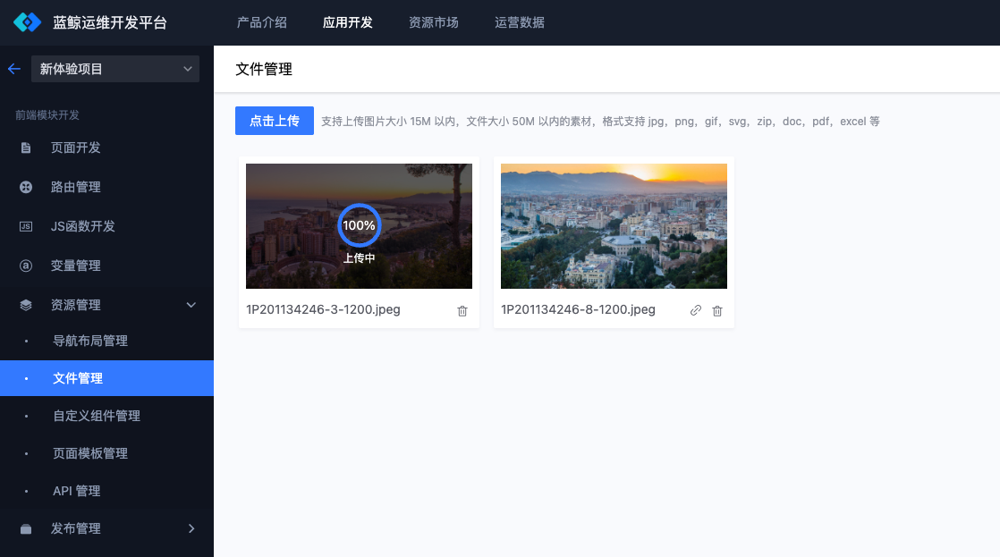
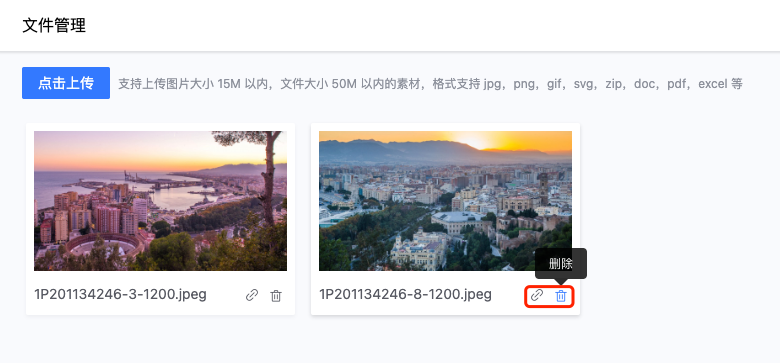
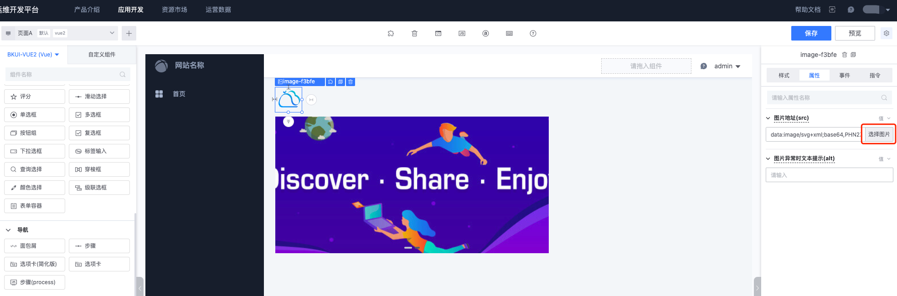
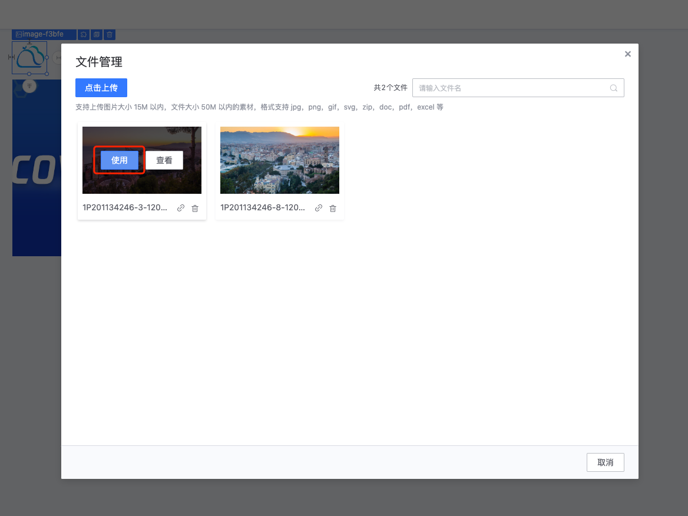
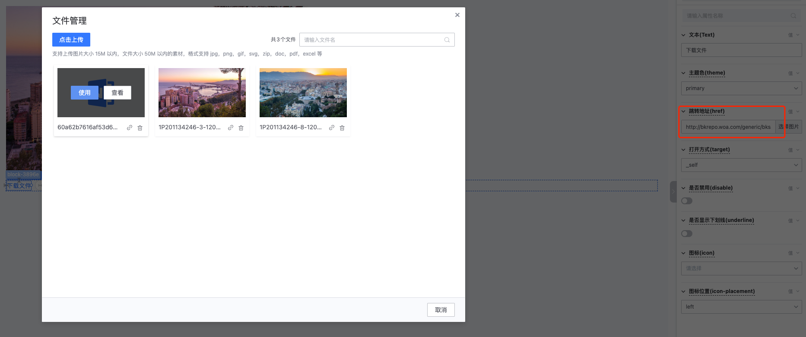

# 文件管理的使用指引

文件管理用于上传应用中需要用到的文件资源，如图片、文档。文件上传后即可得到一个访问地址，在页面中可以引用展示或者下载。

## 文件上传

进入到“资源管理-文件管理”功能页面，通过“点击上传”按钮，选择想要上传的文件。

> 支持常用的图片和文档格式：jpg，png，gif，svg，zip，doc，pdf，excel

文件上传成功后，可以“复制链接”和“删除”。

## 在页面中使用文件

进入到页面编辑中，常用的图片或轮播图组件，可以很方便的使用图片，将组件拖入到画布中，通过右侧属性面板，点击“选择图片”打开文件管理弹窗。

点击“使用”按钮选择图片。通过“点击上传”按钮，可以即时上传新的文件并使用。

也可以通过链接的方式，引用一个文件地址，实现打开或下载文件。

此外，样式背景图片等能够引用资源的组件均可以选择文件，如果想要手动填写的话可以通过“复制链接”得到文件地址。