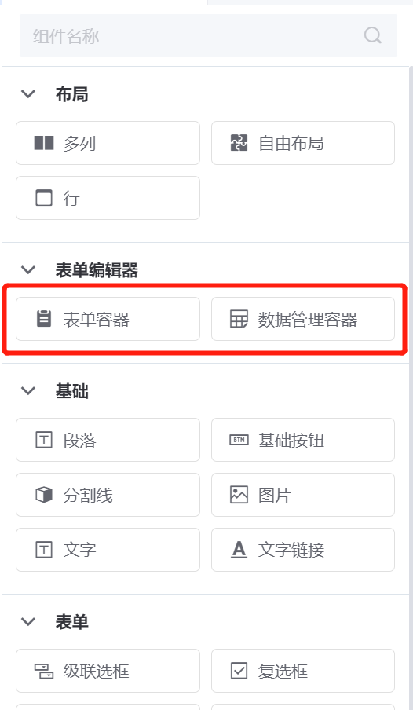
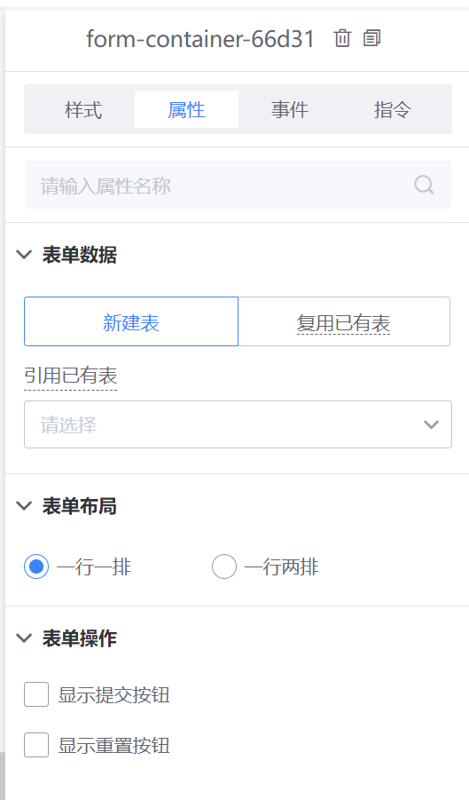
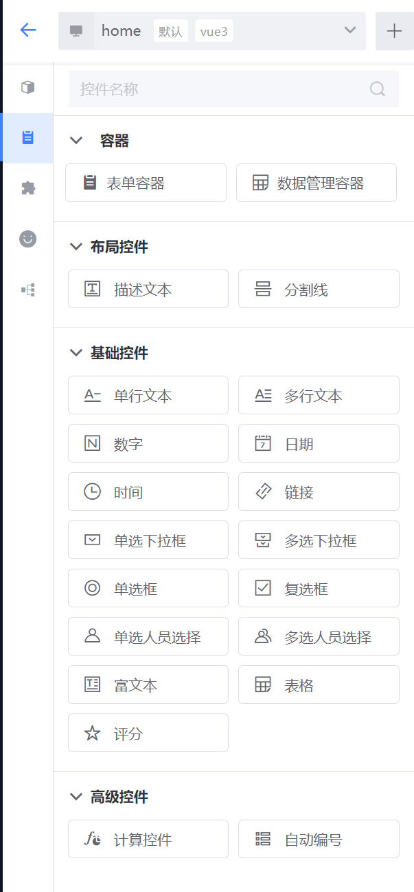
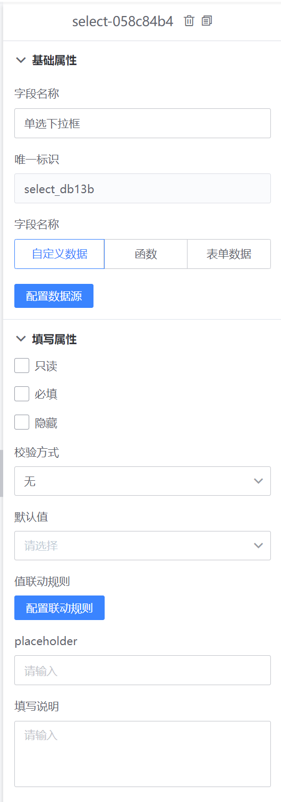
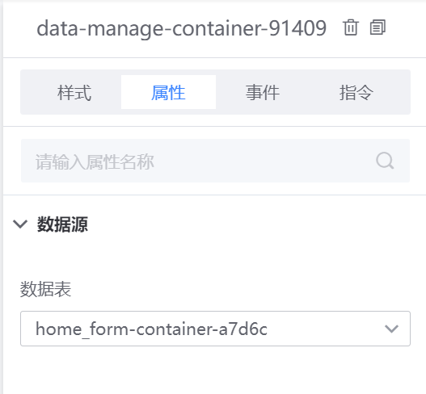
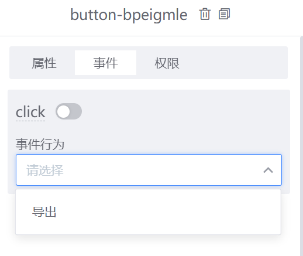
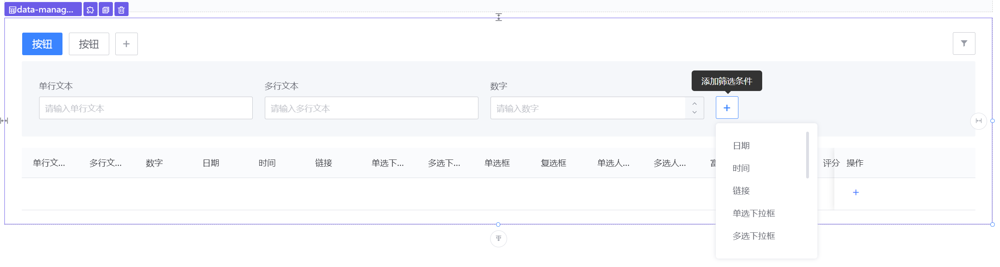
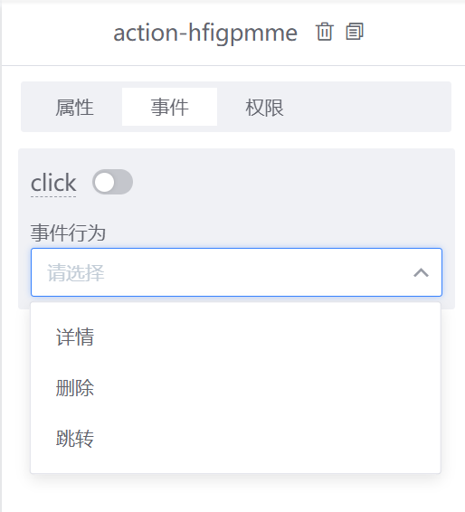

# 表单容器和数据管理容器

有些应用通常会有使用表单收集数据，并管理数据的需求，针对这种使用场景，平台内置了两种表单编辑器类型的容器：表单容器、数据管理容器，在简化表单控件配置的复杂度同时，也增强了一部分功能，例如表单控件之间的默认值联动，动态设置只读、必填、隐藏属性，数据导出等。

表单容器和数据管理容器控件，可以在画布编辑页左侧的菜单栏中找到，将控件元素拖入画布即可创建对应的容器：

## 表单容器

### 配置表单属性

表单容器创建并保存后，默认情况下，应用会在DB中自动创建一张数据表与该容器绑定，表单容器中的表单项与数据表中的字段一一对应。另外表单容器也支持引用和复用应用中其他表单容器创建的表。引用数据表的方式支持从其他表中克隆表单字段到当前容器，保存后会创建一张新的数据表；复用数据表的方式则是将数据表绑定到当前容器，多个表单容器对应统一张表。

表单容器提供两种布局方式，一行一排和一行两排可以按需选择。表单容器内置了【提交】和【重置】按钮，默认没有勾选，如果用户填写数据后需要提交到绑定的数据表可以打开该配置。

### 内置的表单控件

根据使用场景，表单容器中所支持的表单元素划分了三类控件，可以根据不同的使用场景按需添加到画布中。

- 布局控件：包括描述文本控件和分割线控件，主要用来增加表单填写说明或者多个表单分块的用途。
- 基础控件：主要一些常见的表单元素控件，例如输入框、文本框、时间选择、人员选择、表格等，不同类型的表单可能会有不同的属性配置。
- 高级控件：计算控件的作用是根据表单中表单项或者内置的部分时间属性，通过指定一定的计算规则来得到一个计算后的值，比如多个表单项值求和，目前主要支持数值计算和日期计算，计算控件计算的值不会实际写入DB数据表。容器中添加一个自动编号控件，则会在DB数据表中增加一个对应的字段，当表单数据提交时，该字段的值会根据设定好的编号规则自动生成一条数据并写入数据表。

一个包含多种表单元素控件的使用示例：

### 配置表单字段属性

如同画布中的其他控件一样，选中表单元素控件时，画布的右侧区域会出现该控件的属性配置面板。表单元素控件类型不同，可能会有不同的属性配置。

## 数据管理容器

数据管理容器是一种特殊用途的容器，用来管理所绑定表单容器对应数据表数据的，它内置了数据导出、筛选、删除等功能，简化了开发者来实现这些功能的步骤。

### 绑定数据源

将数据管理容器添加到画布中后，需要为容器绑定一个表单数据源，所绑定的数据源即为表格展示数据的来源。

### 数据操作

数据管理容器可以在头部添加按钮，和普通的按钮控件一样，可以配置属性、事件、权限等，目前内置的事件暂时只有导出操作，后续会根据使用场景扩充操作类型。

### 数据筛选

表格数据也支持配置筛选字段，通过定义筛选字段可以实现数据的过滤。

 
### 表格数据操作

表格支持配置操作列，目前内置了详情、删除、跳转三种操作类型，另外操作按钮也可按需绑定权限规则。添加操作按钮后，表格中的每一条数据都会有对应的操作选项。

