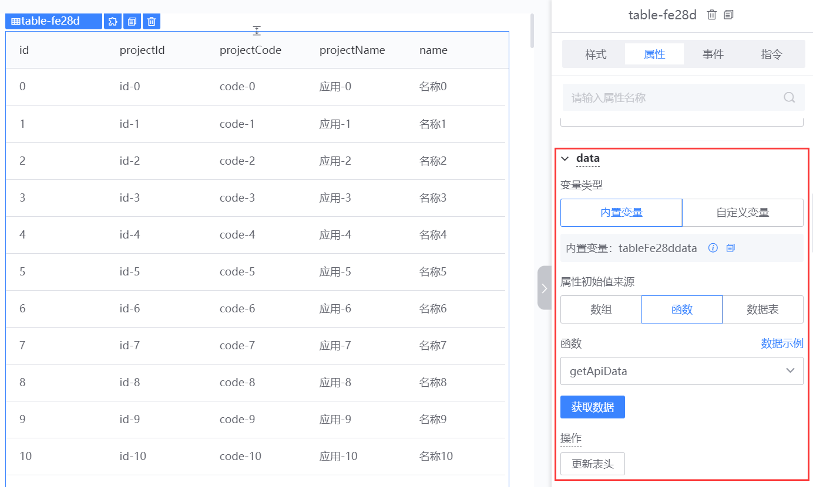
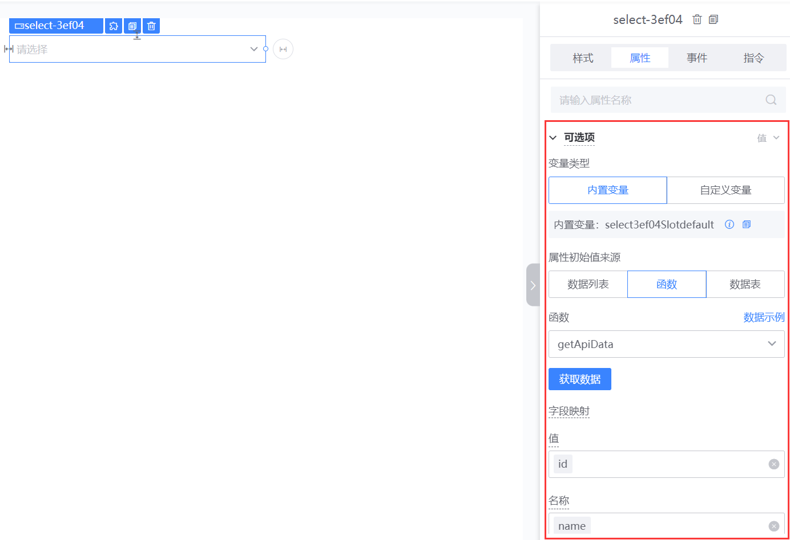
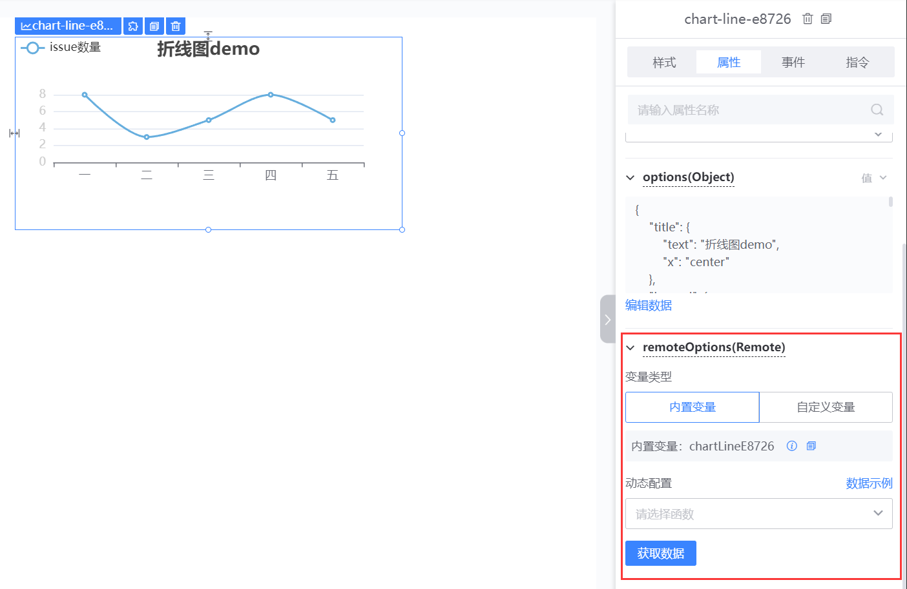
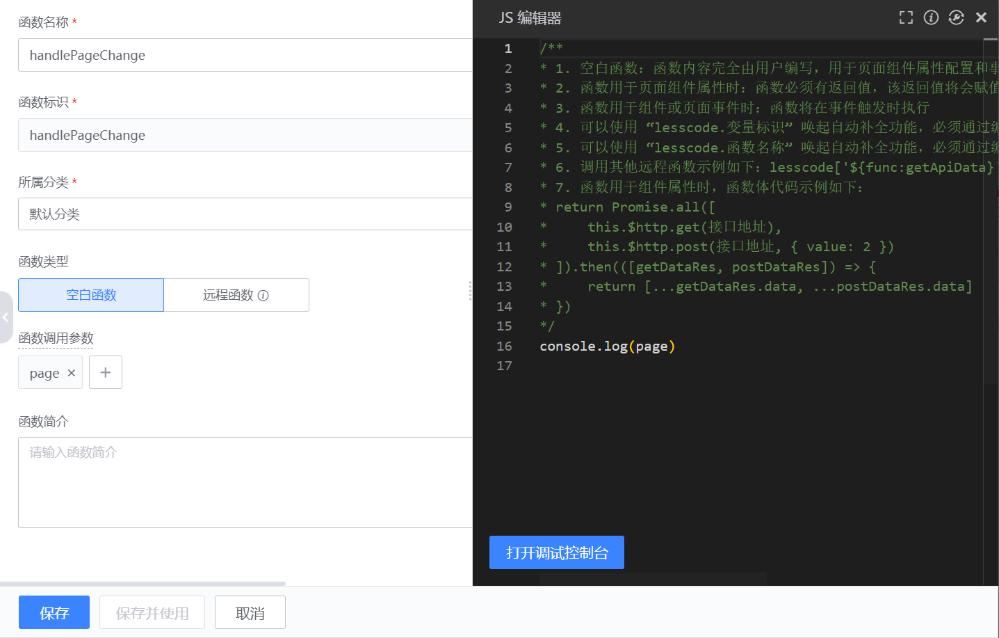
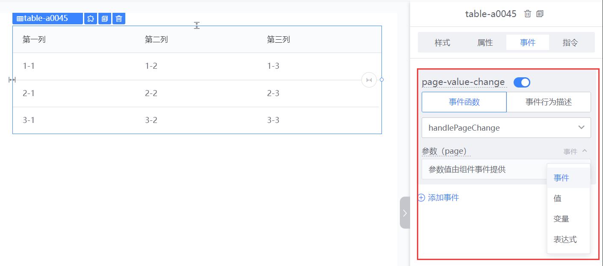
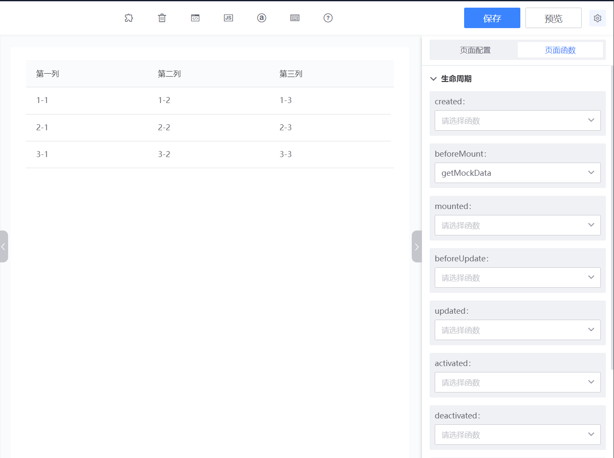

# 画布中函数使用

在前端页面中，函数通常用于组件获取数据和处理页面交互。在蓝鲸运维开发平台(LessCode)，我们根据不同场景，提供了函数来实现这 2 个能力

## 用于组件获取数据

### 表格组件

表格组件可以通过函数来获取需要展示的数据，并通过`更新表头`操作来展示函数返回的所有字段

### 下拉选框组件

下拉选框组件可以通过函数来获取下拉列表的数据，并通过字段映射来设置`值`和`名称`

### 图表组件

图表组件可以使用函数来动态获取图表的配置

## 用于处理页面交互

### 组件事件使用函数

组件会在特定的时机抛出事件，开发者可以在这个事件中通过执行函数来完成页面的交互操作，下面使用表格组件来介绍在事件中使用函数: 

新建函数`handlePageChange`，设置`page`参数，函数内容为打印`page`参数

选中表格组件，切换到事件面板。选择`page-value-change`（切换页面）事件，选择我们的函数`handlePageChange`，于是在表格组件页码发生变化的时候，会打印当前页码的值。

这里的参数有 4 种选择：

1. 事件：有的组件在抛出事件的时候，会传值出来。我们可以用这个选项将事件参数透传给函数
2. 值：开发者可以自由输入任意值
3. 变量：选择变量来做为事件参数
4. 表达式：可以结合变量来写 js 表达式

### 页面生命周期使用函数

选择页面空白区域，切换到页面函数面板，即可配置生命周期函数。开发者可以在页面生命周期函数中，处理页面交互

