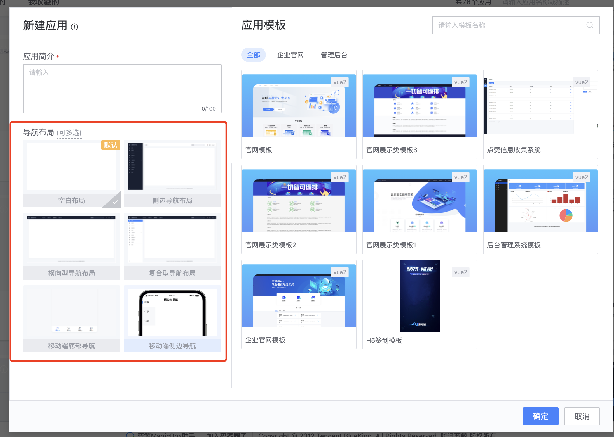
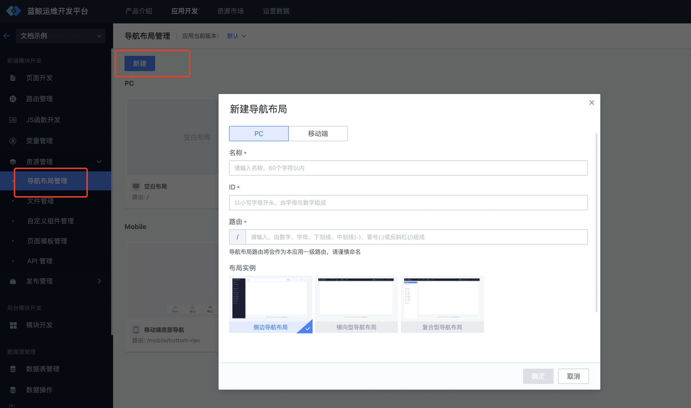
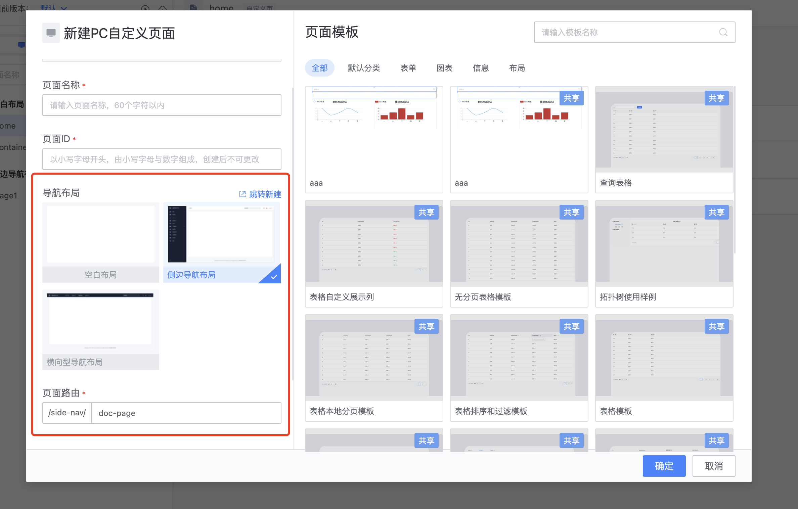
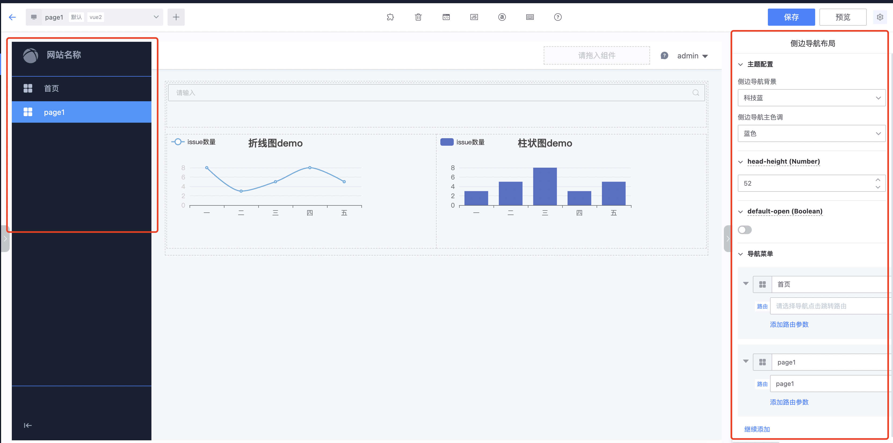
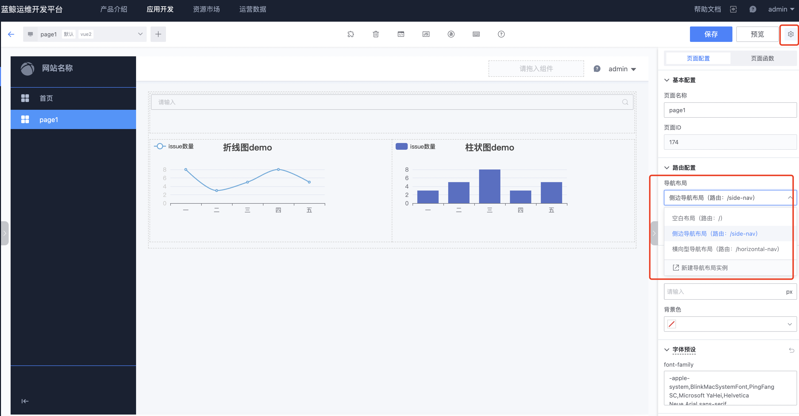

# 导航布局管理

导航布局是用来将具有相同布局（导航）的页面收纳在一起的方式，这样页面间就可以复用同一个布局，同时布局的路由也将成为页面的共同父路由。

## 导航布局分类
平台目前共提供了 6 种布局，分别是
- 空白布局
- 侧边导航布局
- 横向型导航布局
- 复合型导航布局
- 移动端底部导航布局
- 移动端侧边导航布局

## 导航布局管理
### 1 在新建应用时添加导航布局

- 其中，“空白布局”为系统默认布局，自动勾选且不能取消。
- 如果添加时未选择其它导航布局，可创建应用后，到“资源管理 --> 导航布局管理”模块中添加。

### 2 在资源管理 --> 导航布局管理中添加导航布局

### 3 在资源管理 --> 导航布局管理中修改导航布局配置

在导航布局管理模块中， 可以看到当前应用下所有已添加的导航布局， 还可以编辑、删除导航布局信息、设置PC端跟移动端页面的默认导航布局

### 4 页面使用导航布局
新建页面时， 可以选择对应类型页面在应用下的导航布局，并填写页面路由， 最终所属布局的页面访问路由为 **“布局路由/页面路由”**

### 5 页面使用导航布局
页面选择了导航布局后，进入到页面编辑页，在画布中可看见导航布局内容，同时点击选中对应区域可以修改相应配置
。目前可提供修改的配置包括：站点名称、Logo、导航菜单、主题配置（vue2）等

- 示例图中使用的是“侧边导航布局”，正在对布局导航进入设置。其中，中间区域为页面内容编辑区。
- 如使用的空白布局则无导航布局模板内容可见，画布中可视的即为页面内容

在页面配置的路由配置处、可以修改页面对应的导航布局
