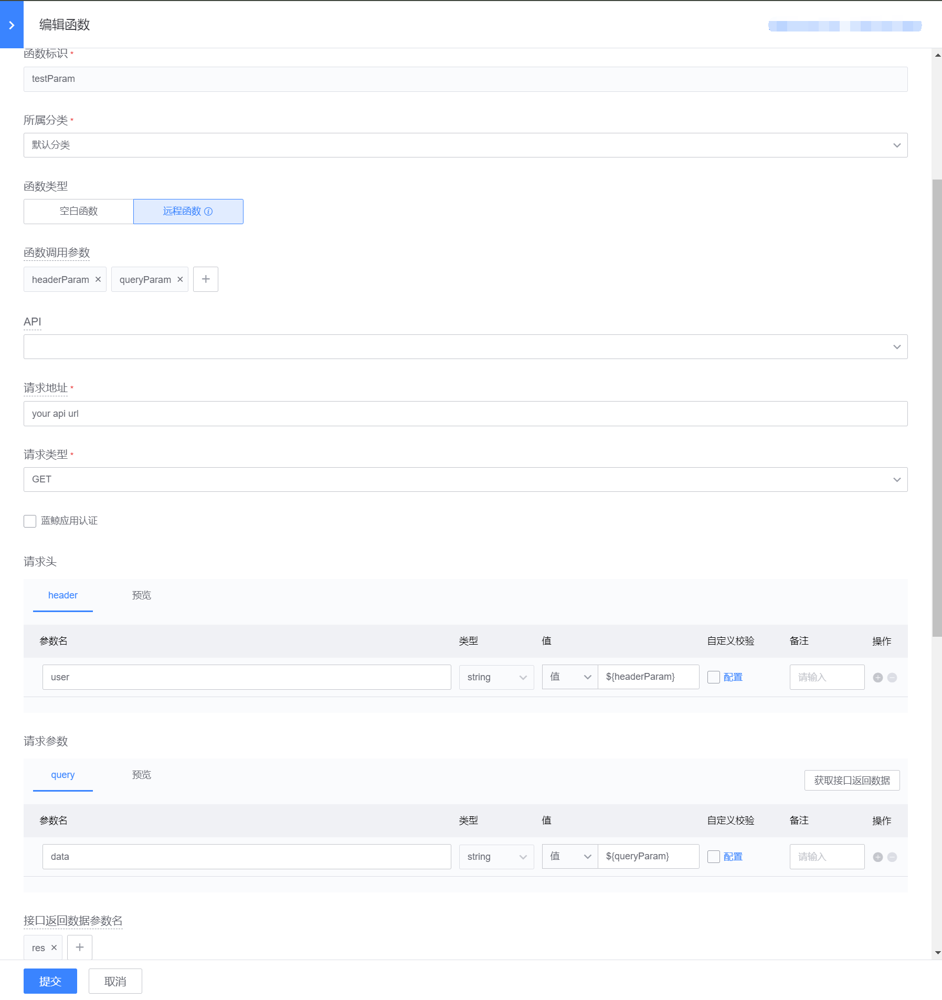

# JS 函数开发

蓝鲸运维开发平台(LessCode)中：可以由用户自行编写函数，并在页面中使用函数。通过使用函数，可以完成以下需求：

- 编写空白函数：使用 js 语法编写代码，可以发起 ajax 请求，获取接口数据，然后进行功能逻辑处理
- 编写远程函数：通过后台转发的形式，发起 ajax 请求，转发的请求可以通过配置的方式来携带更多的数据
- 函数配合组件事件：在组件事件触发的时候，执行相应的函数，来完成相关应用功能
- 函数配合页面生命周期：在页面函数面板，配置生命周期用到的函数，在函数中进行相关功能逻辑处理
- 函数配合指令：组件的指令配置页面，可以配置属性的指令变量名，然后在函数中，使用或者修改属性值
- 函数绑定组件数据源：在组件的部分属性中，可以通过绑定远程数据源来设置初始化数据
- 函数中调用函数，调用其他组件：编写函数时，可以通过编辑器自动补全功能使用函数，也可以通过 js 调用组件库组件

## JS 函数开发入口

### JS 函数开发页面路径：

应用开发（选择应用）-> JS 函数开发

### JS 函数开发页使用：

- 搜索和选择函数分类。函数分类主要用于将应用中的函数进行归类，方便后续查找和管理函数
- 可以通过拖拽的方式对函数分类排序，方便管理函数
- 可以新增、搜索、修改、删除和复制函数，管理当前应用下的所有函数

## 函数管理弹窗

### 函数管理弹窗打开方式：

应用页面 -> 画布编辑 -> 函数管理弹窗

### 函数管理弹窗使用：

- 可以对函数进行删除、新增和复制操作
- 编辑相关函数内容

## 函数类型介绍

蓝鲸运维开发平台(LessCode)目前提供了空白函数和远程函数两种函数类型，以便应用开发使用。后续将会添加更多的函数类型，敬请期待

### 空白函数：

- 空白函数：函数内容完全由用户编写，用于页面组件属性配置和事件绑定
- 函数用于页面组件属性时：函数必须有返回值，该返回值将会赋值给组件属性
- 函数用于组件或页面事件时：函数将在事件触发时执行
- 可以使用 “lesscode.变量标识” 唤起自动补全功能，必须通过编辑器自动补全功能选择对应变量，来获取或者修改变量值
- 可以使用 “lesscode.函数名称” 唤起自动补全功能，必须通过编辑器自动补全功能选择对应函数，来调用应用中的其它函数
- 调用其他远程函数示例如下：lesscode[\'\${func:getApiData}\']().then((res) => do(res))
- 函数用于组件属性时，函数体代码示例如下：

```bash
return Promise.all([
    this.$http.get('接口地址'),
    this.$http.post('接口地址', { value: 2 })
]).then(([getDataRes, postDataRes]) => {
    return [...getDataRes.data, ...postDataRes.data]
})
```

### 远程函数：

- 远程函数：系统将会根据参数组成 Ajax 请求，由用户在这里编写 Ajax 回调函数，函数用于页面组件属性配置和事件绑定
- 远程函数是异步函数，函数返回 promise。可以使用 then 回调在远程函数异步执行完执行下一个函数
- 调用其他远程函数示例如下：lesscode[\'\${func:getApiData}\']().then((res) => do(res))
- 函数用于页面组件属性时：函数必须有返回值，该返回值将会赋值给组件属性
- 函数用于组件或页面事件时：函数将在事件触发时发起 Ajax 请求，并执行该回调函数
- 可以使用 “lesscode.变量标识” 唤起自动补全功能，必须通过编辑器自动补全功能选择对应变量，来获取或者修改变量值
- 可以使用 “lesscode.函数名称” 唤起自动补全功能，必须通过编辑器自动补全功能选择对应函数，来调用应用中的其它函数
- 例如 Api 返回数据使用参数 res 接收，则代码示例如下：return res.data
- 远程函数请求 API 可选择应用数据表操作 API、蓝鲸网关 API 及自建 API，注意若请求`蓝鲸网关API`，需自行`申请网关API权限`并`勾选蓝鲸应用认证`

## 函数中调用函数

函数中调用函数：编写函数时，使用`lesscode`这样的字符串，引出编辑器自动补全功能，然后选择函数，即可在函数中使用函数。


## 函数请求头、请求参数中使用函数调用参数

在函数开发中，请求头、请求参数的数据经常会来自于函数的调用参数，我们提供`${函数参数}`的写法来让他们使用函数调用参数


