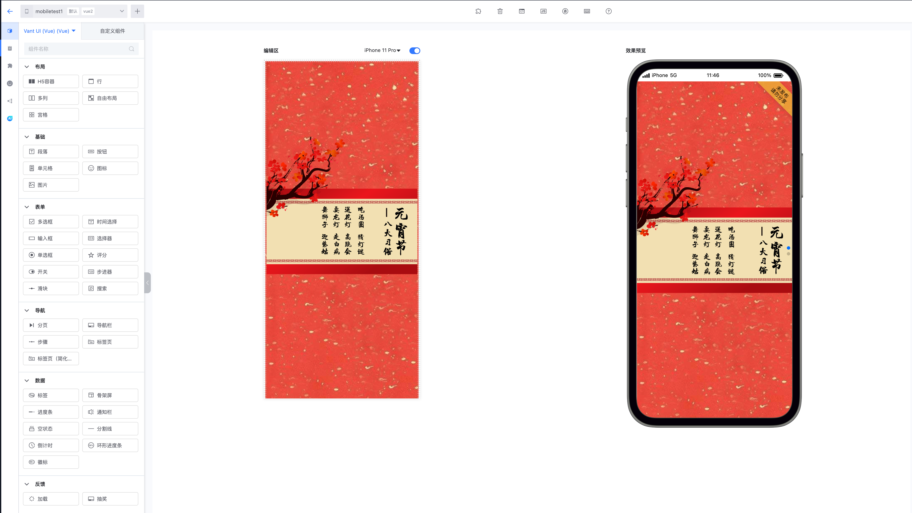
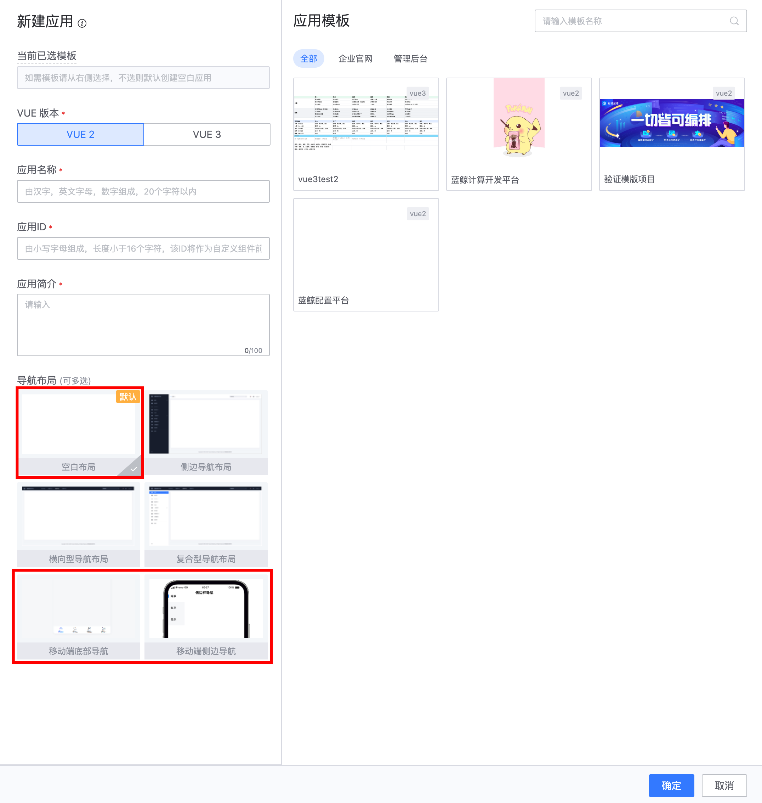
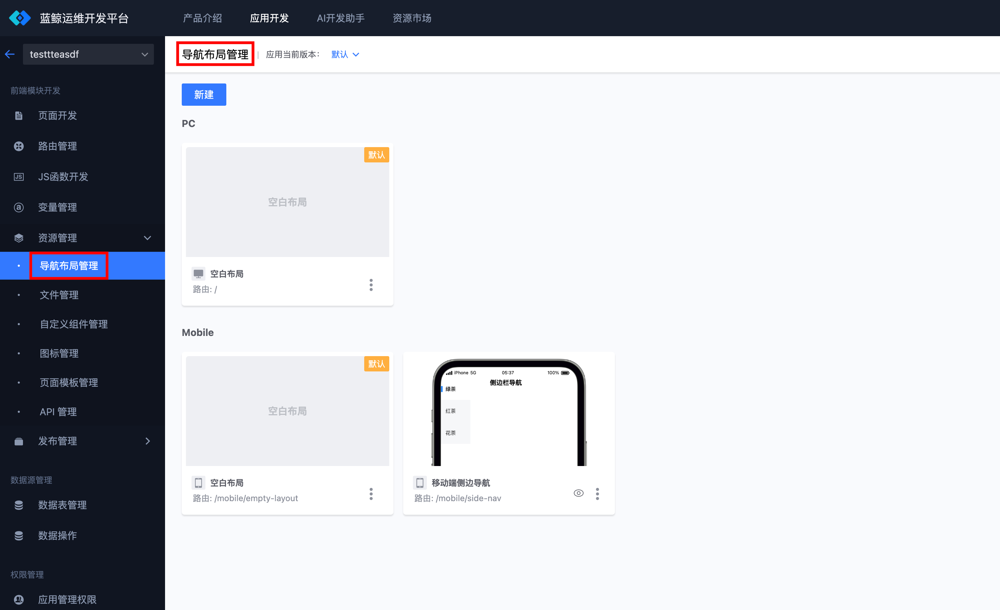
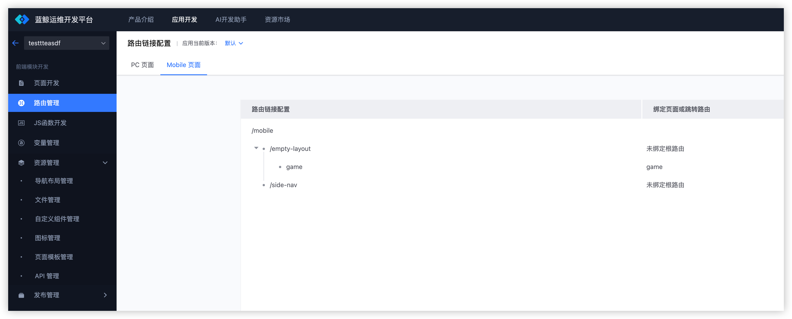
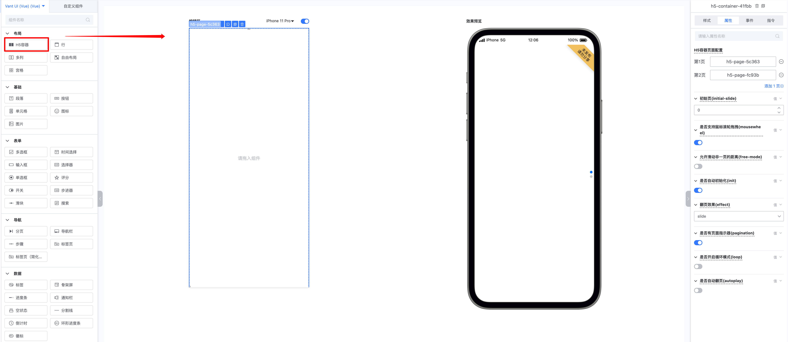
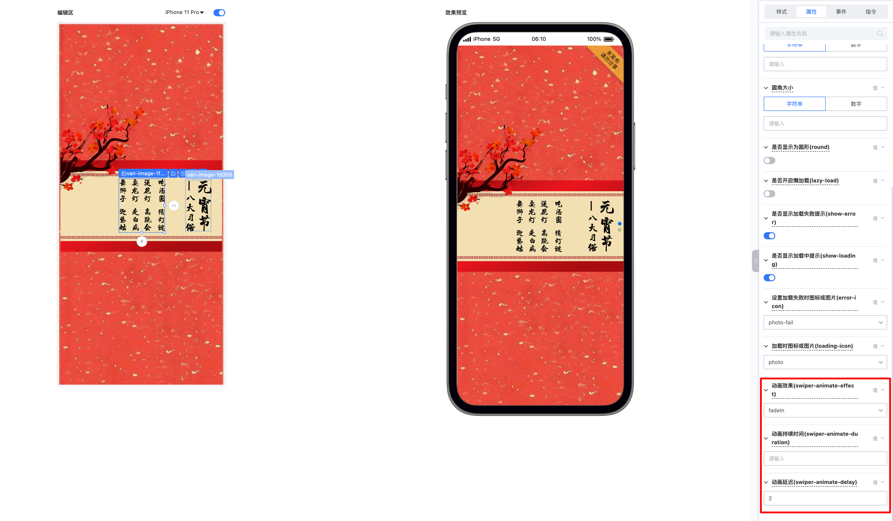
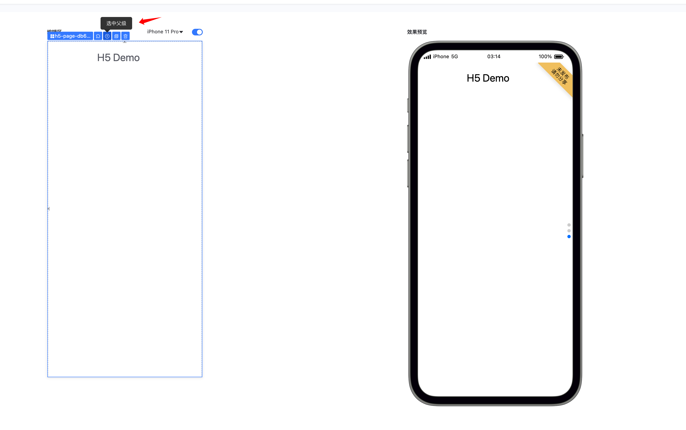
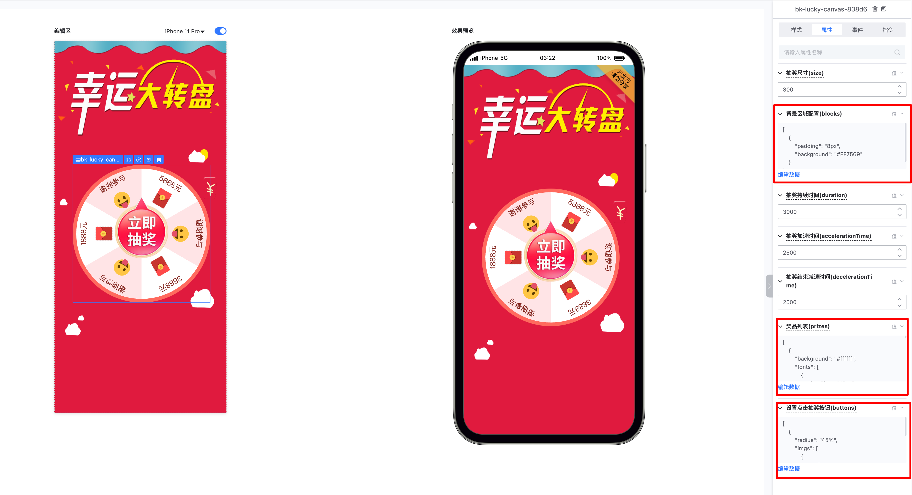

# 移动端页面

蓝鲸运维开发平台(LessCode) 是一个可视化拖拽一体开发平台，帮助开发者简化和加速应用程序的开发过程。本文档将详细介绍 LessCode 移动端开发的相关内容，包括组件库、布局管理、路由规则以及响应式单位的使用。

## 组件库

### Vant UI 组件库
在移动端开发中，LessCode 使用 [Vant UI](https://youzan.github.io/vant/#/zh-CN/) 组件库。Vant UI 专为移动端设计，提供了丰富的组件和功能，能够满足各种移动端开发需求，除此外，LessCode 还封装了一系列高阶组件，比如 【抽奖】组件、【H5容器】组件等，可以帮助用户更高效的完成应用搭建，实现业务需求。LessCode 移动端提供能能力包括：
- **响应式布局**：支持不同屏幕尺寸的自动适配。
- **适配移动端特性**：提供了许多适合移动端使用的特性，如手势操作以及移动端实时渲染模拟等。

## 布局管理

### 支持的布局类型
LessCode 移动端支持以下几种布局类型：
1. **空白布局**：无固定布局，开发者可以自由拖拽和放置组件。
2. **侧边栏布局**：包含一个侧边栏，适用于需要侧边导航的应用。
3. **底部导航布局**：包含一个底部导航栏，适用于多页面切换的应用。

### 添加和管理布局
- **新建应用时添加布局**：在创建新应用时，可以选择所需的布局类型。
- **已有应用中添加布局**：在已有应用中，可以通过“资源管理” => “导航布局管理”进行添加和管理。

## 路由管理

### 路由规则
为了区分 PC 端和移动端的路由，LessCode 规定移动端的路由均以 `/mobile` 开头。例如：
- PC 端路由：`/page-1`
- 移动端路由：`/mobile/page-1`

### 查看路由
在路由管理中，可以查看和管理 PC 端和移动端的路由。确保移动端路由以 `/mobile` 开头，以便正确区分和管理。

## 响应式单位

### rpx 单位
在移动端开发中，LessCode 支持使用 `rpx` 响应式单位。`rpx` 是响应像素单位，能够根据屏幕宽度进行自动缩放。具体解释如下：
- `rpx` 单位的设计基准是 750，即 750rpx 正好是满屏宽度。
- 不推荐使用 `px` 这样的绝对单位，以避免在不同设备上出现不一致的显示效果。

因移动端的屏幕尺寸多样，因此在移动端页面中，建议使用`rpx`或百分比等相对单位。

## 高阶组件介绍

为了进一步提高开发者的开发效率，LessCode 提供了一系列高阶组件。这些组件在常见的业务场景中具有较高的复用性，能够帮助开发者快速构建高质量的应用。

### 快速搭建 H5 的利器：LessCode-H5 容器组件

LessCode-H5 容器组件是专为快速搭建 H5 页面而设计的高阶组件。它提供了灵活的布局和丰富的功能，能够适应各种 H5 项目的需求。

**使用示例：**

1. 在左侧组件库中选择【H5容器】组件拖入画布

H5容器包含两个部分：
  - h5-container,H5外部容器，可配置整体属性
  - h5-page, H5的页面示例，每个容器包含多个页面

在 h5-container 中可以配置【H5容器】的整体属性，包括翻页效果、是否显示指示器、是否自动翻页等等，也可以这这里快速添加和删除页面；

h5-page 是容器的子元素，每个 page 都是 H5 独立的页面，相当于一个自由布局。因此，可以拖拽任意元素到 h5-page，并配置的位置、属性实现动画效果等。

2. 拖入组件至 H5 容器并配置动画

H5 容器的每个页面都相当于一个自由布局，可以将任意元素拖入并自由摆放位置。比如拖入一个段落组件，并将其放置在顶部，点击段落元素，在右侧有三个动画相关的属性：

- swiper-animate-effect 选择动画效果
- swiper-animate-duration 选择动画的持续时间
- swiper-animate-delay 选择动画的延迟

配置和组合三个属性，即可在预览界面实时查看动画效果

注意事项： 因为 `h5-page` 是占满全屏的，因此当选中了`h5-page`时可能不太容易选中其父级`h5-container`。 为了能再次选中配置相关属性，在选中`h5-page`后，可以点击浮窗的 icon 选中父级，如下图：

### 抽奖组件

抽奖组件可以帮助我们快速实现抽奖页面，可以结合 H5 容器 简单、高效的制作一个 H5 抽奖程序。

**使用示例：**

1. 在左侧组件库中选择【抽奖】组件拖入画布，并根据需求设置组件的大小。

2. 抽奖组件默认配置了抽奖案例和样式，其中奖品、抽奖背景、抽奖指针等均可以自定义，支持网络图片，其配置项是`json`，可以根据样例来修改`json`实现修改样式的效果。

除此外，抽奖的持续时间、抽奖加速时间等动画效果属性，可以快速通过右侧属性面板配置。

## 总结
LessCode 移动端开发平台为开发者提供了强大而灵活的工具,使移动应用开发变得更加高效和便捷。通过本文档,我们详细介绍了以下几个关键方面:

1. **组件库**: LessCode 采用 Vant UI 组件库,并提供了一系列高阶组件,如 H5 容器和抽奖组件,大大提升了开发效率。

2. **布局管理**: 支持多种布局类型,包括空白布局、侧边栏布局和底部导航布局,满足不同应用场景的需求。

3. **路由管理**: 采用 `/mobile` 前缀区分移动端路由,便于管理和维护。

4. **响应式单位**: 推荐使用 `rpx` 单位,确保应用在不同屏幕尺寸上的一致性表现。

5. **高阶组件**: 详细介绍了 H5 容器和抽奖组件的使用方法,这些组件能够帮助开发者快速构建复杂的功能页面。

通过合理运用这些特性和工具,开发者可以在 LessCode 平台上轻松创建出功能丰富、体验出色的移动应用。随着对平台的深入了解和熟练使用,您将能够更加高效地实现各种移动端开发需求,打造出令人印象深刻的应用程序。

我们鼓励开发者充分探索 LessCode 平台的各项功能,并结合实际项目需求,不断优化和改进开发流程。如果在使用过程中遇到任何问题或有任何建议,欢迎随时与我们的支持团队联系。祝您在 LessCode 平台上开发愉快,创造出更多优秀的移动应用!