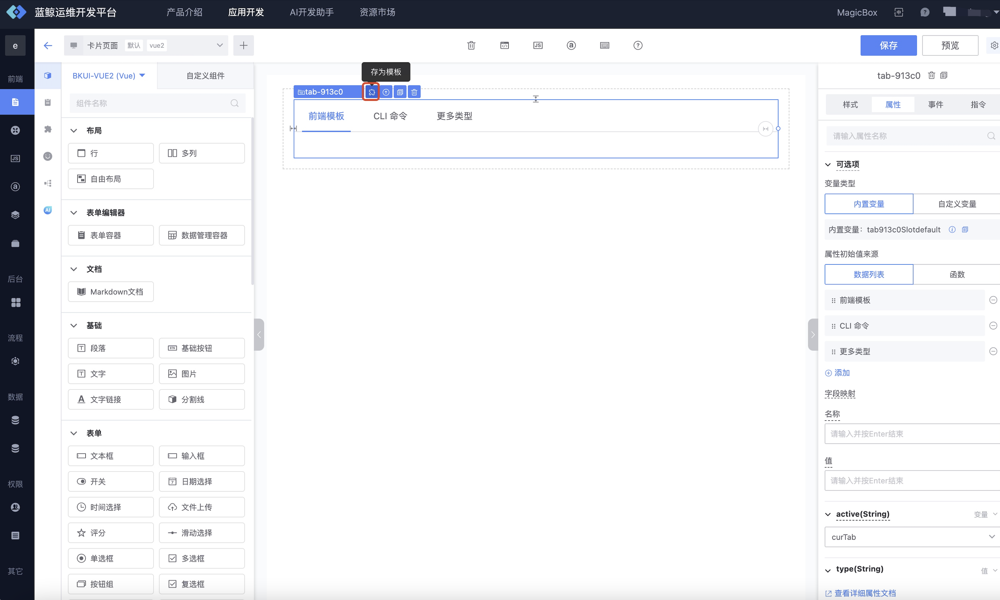
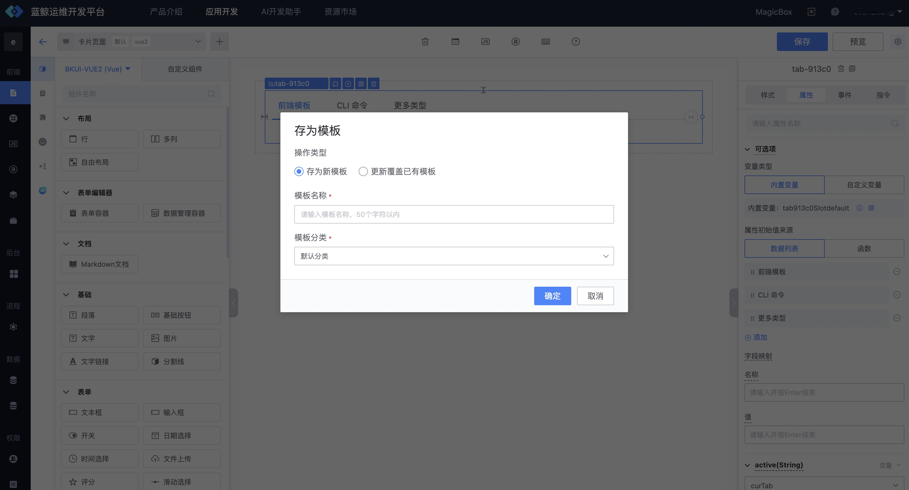
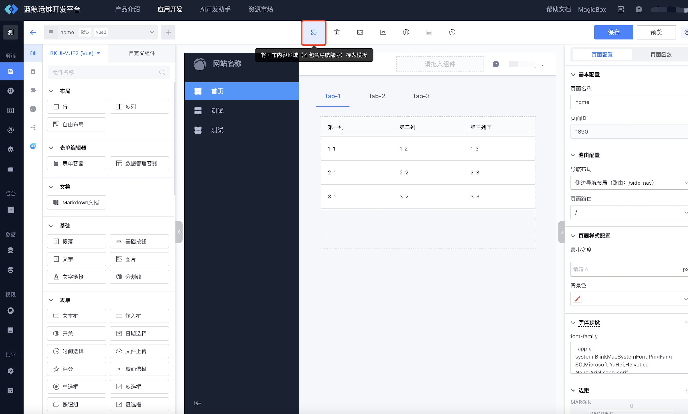
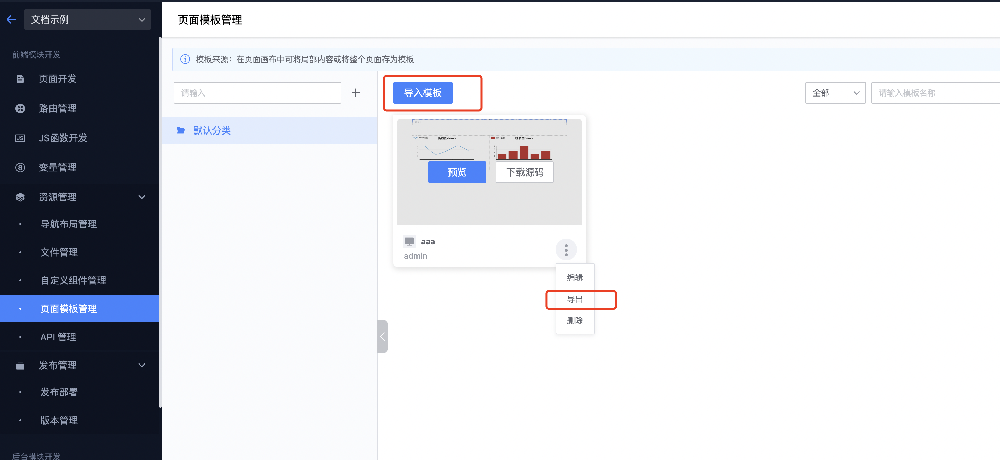
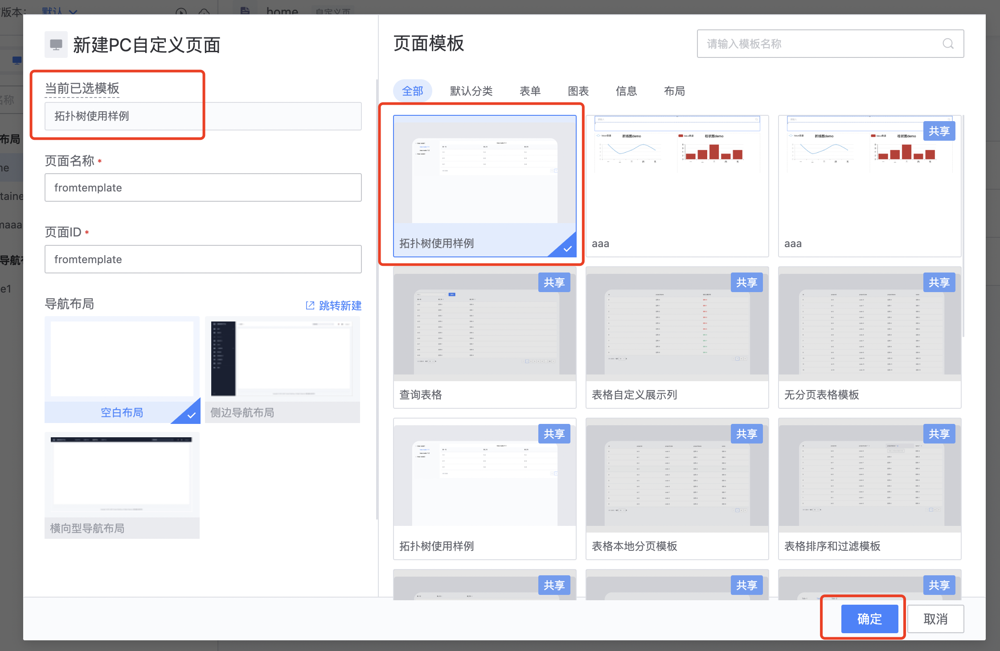
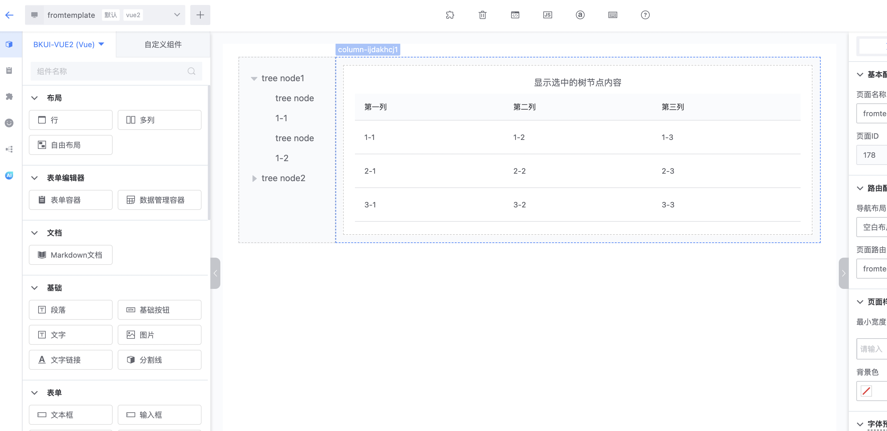
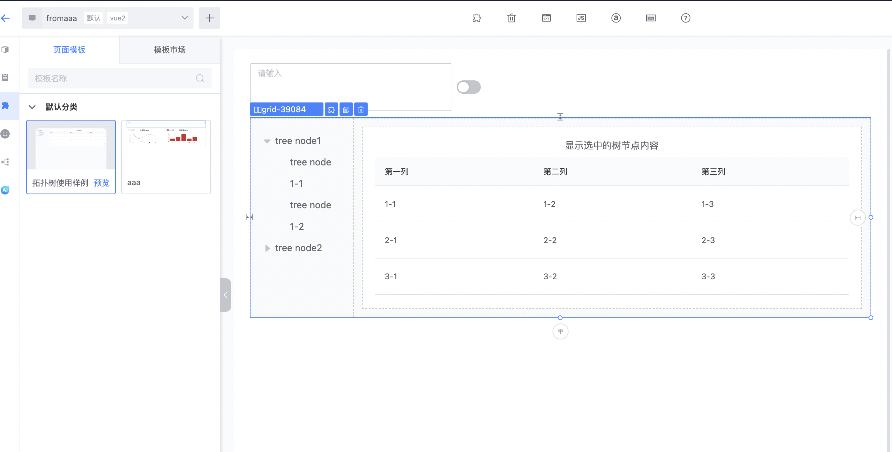
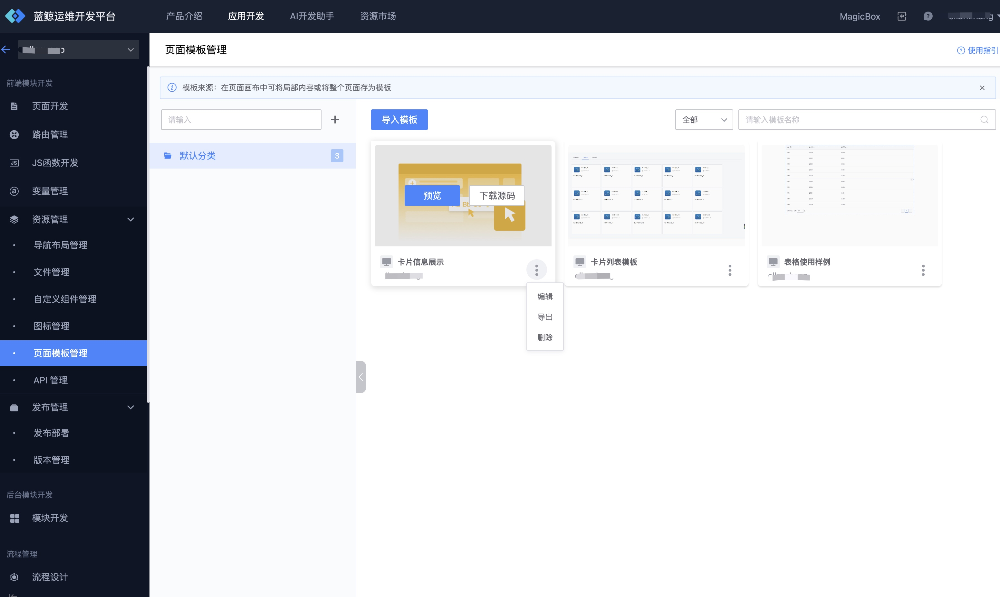

# 页面模板管理

页面模板是可以是一个完整的一个页面， 也可以是页面的任意一个片段， 用户可以基于页面模板快速创建页面、也可以通过页面模板实现内容的便捷快速复用

## 页面模板的来源
### 1、 从模板市场添加： 可以在顶导航的资源市场 -->模板市场入口、创建页面时模板列表， 画布区域的模板市场选择合适的页面模板添加到应用中
  
    
    

### 2、从本应用的页面画布中存存为模板

在页面的排版过程中，也可以将页面内容存为页面模板，实现局部内容的快速复用。
 
#### 2.1 选中对应的模块，点击“**存为模板**”

  
 
#### 2.2 填写要存入的模板分类

  
 
#### 2.3 还可以在画布中直接将某个页面的内容存为页面模板（不包含导航内容），可以嵌入进任何形式排版的页面
 
   

### 3、 通过模板JSON导入导出： 可以把某个应用中的模板导出为JSON， 然后在另一个应用中导入， 由此实现模板的跨应用共享
  

## 页面模板的使用
  ### 1、新建页面时、基于模板创建页面
  在新建页面时， 选择已有的页面模板， 就能创建出一个跟页面模板内容一致的页面
  
  

  ### 2、画布中、拖拽模板作为页面的部分
  在编辑页面时， 拖拽已有的页面模板到画布中， 就能将页面模板作为当前页面的一部分
  

## 页面模板管理
在页面模板管理模块下，用户可以对应用下的模板进行自定义分类管理，以及对模板进行编辑、删除，导出等。

   

