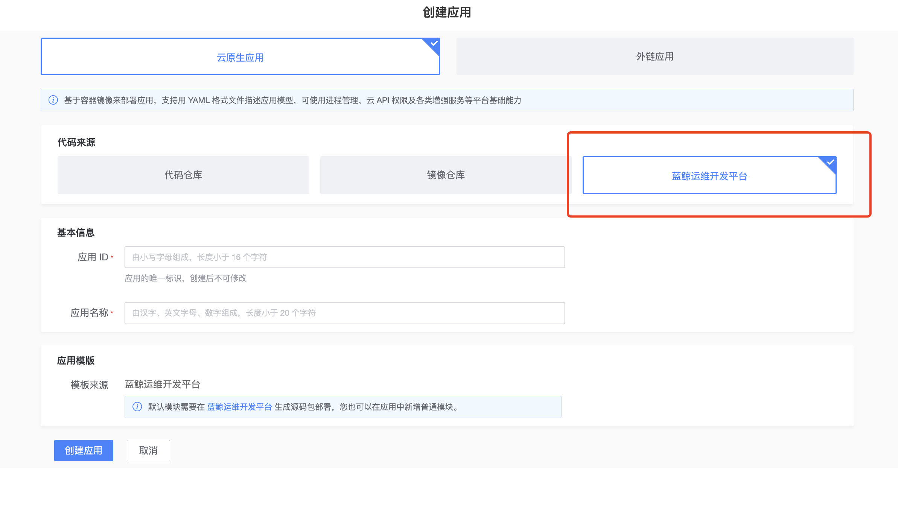
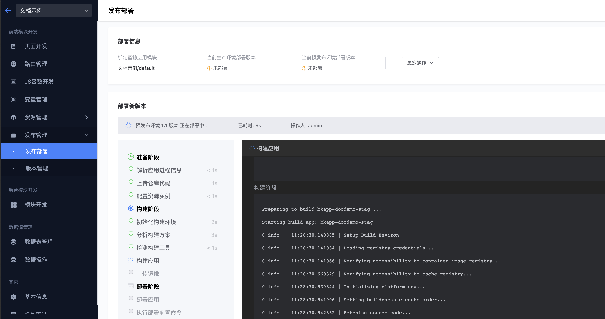
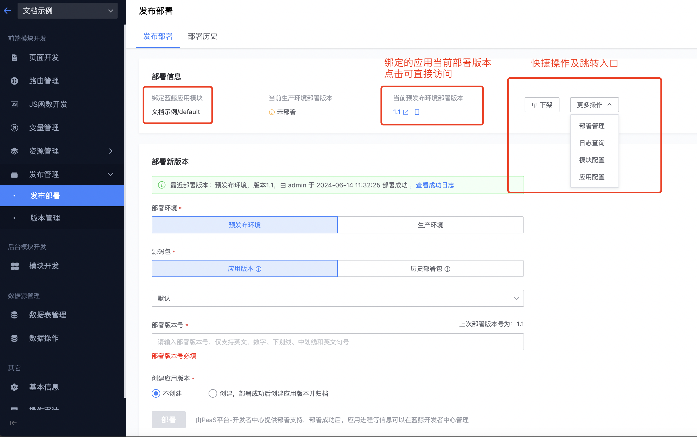

# 发布部署

发布部署模块，可以将在蓝鲸运维开发平台(LessCode)上拖拽的应用快速部署到蓝鲸PaaS平台-开发者中心

## 应用关联
- 在LessCode上创建应用时，会在PaaS平台-开发者中心创建同名应用的defalut模块。
- 在PaaS平台-开发者中心创建应用， 代码来源选择“蓝鲸运维开发平台(LessCode)”， 也会在LessCode上同步创建应用

## 部署
### 1、填写部署信息
- 未使用到版本管理功能的情况下， 每次只需选择部署的环境，填写版本号， 然后点击部署， 即可把LessCode上当前应用的最新内容部署到PaaS平台-开发者中心
- 源码包选项选择历史部署包的话， 可直接选择之前已经成功部署过的包到对应环境（如1.1版本已部署到预发布环境验证过， 即可选择历史部署包的1.1版本部署到生产环境）

### 2、展示部署日志

### 3、部署状态、访问入口、跳转开发者中心

