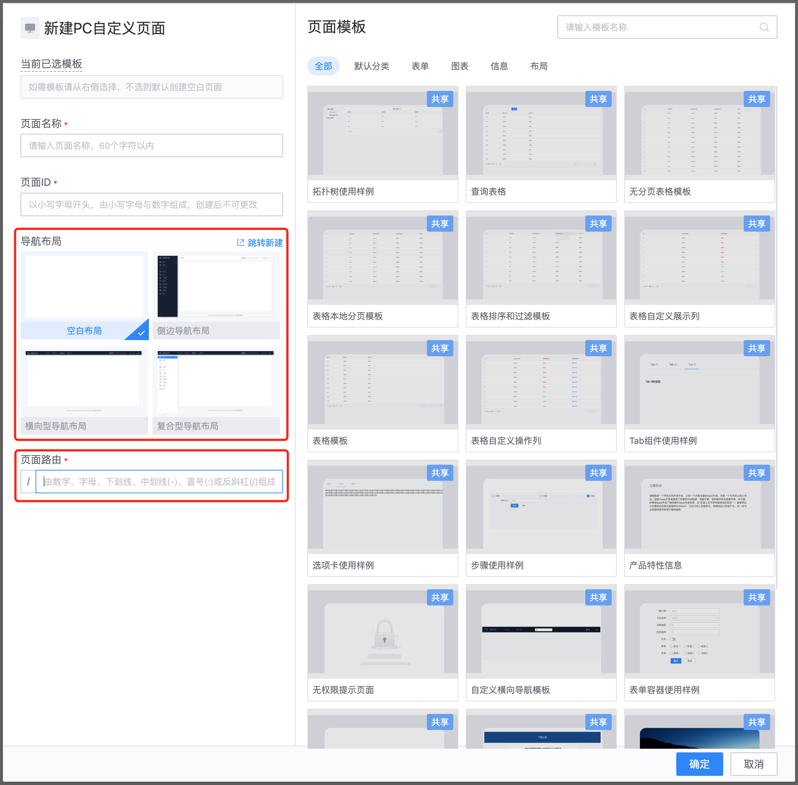
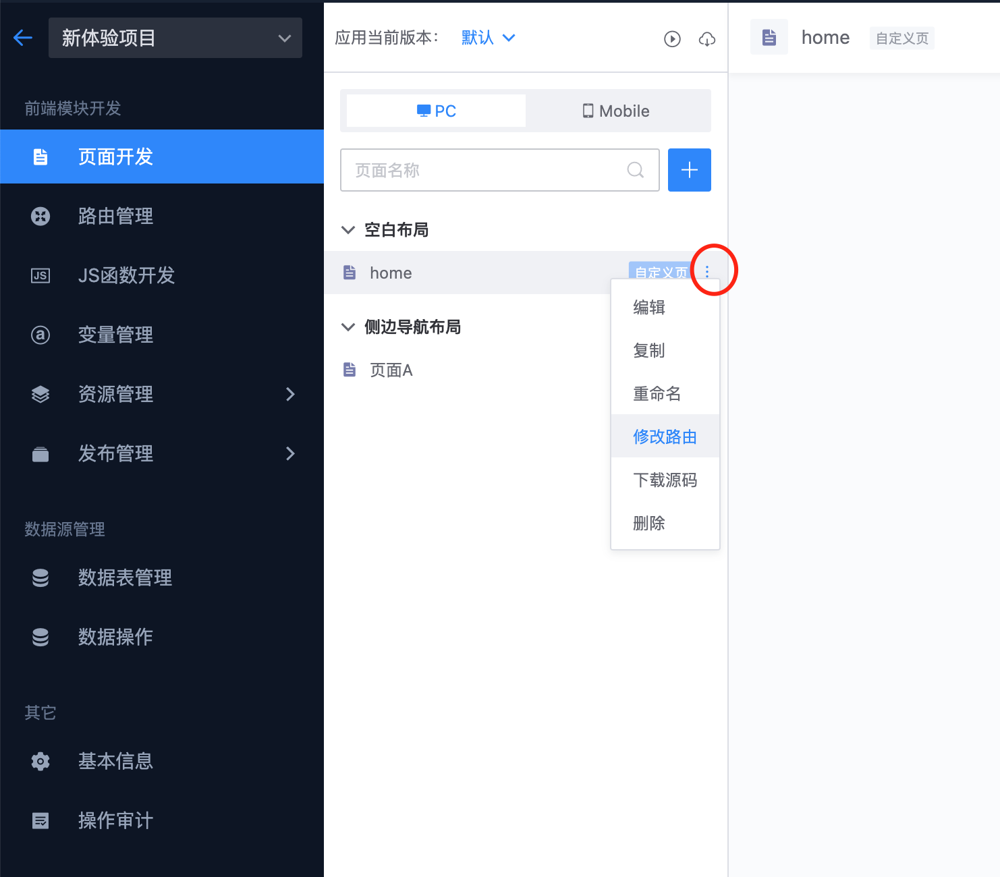
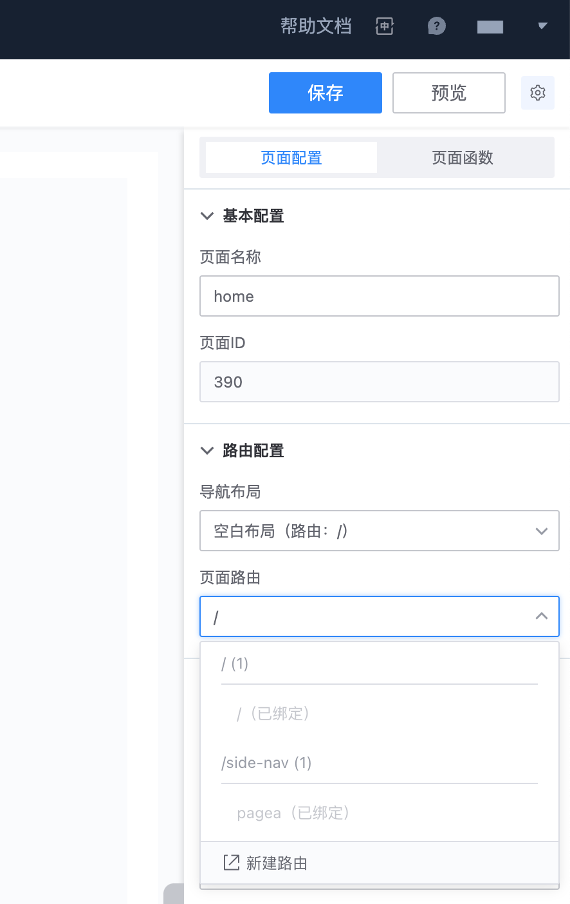
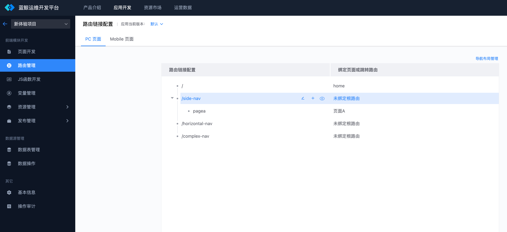
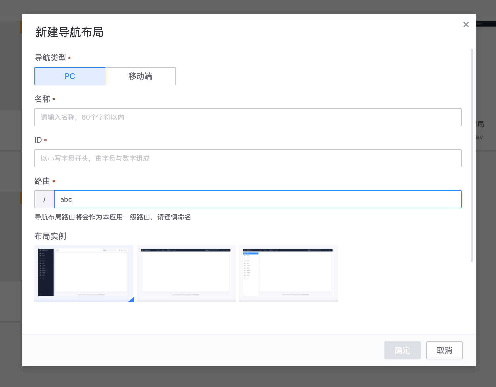
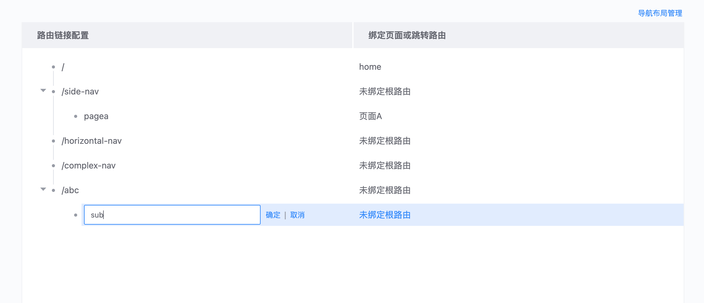
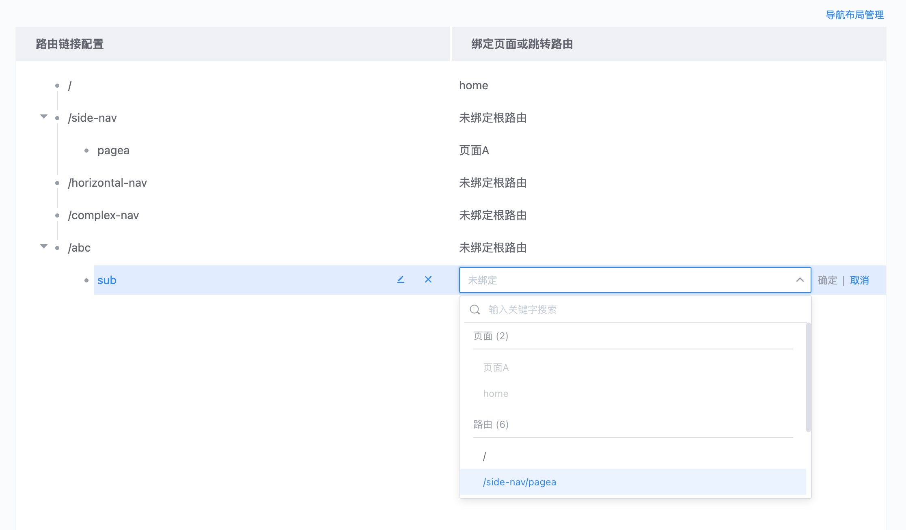
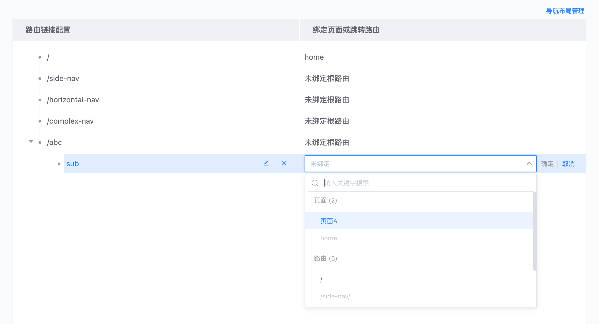

# 路由管理的使用指引

通常新建页面时即同时创建页面的路由，也可以通过“路由管理”功能维护整个应用的路由。路由被设计为两个层级，第一层级为“导航布局”的路由，第二层级为页面的路由。

## 页面与路由

1. 新建页面时需要填写页面的路由，可以看到页面的最终路由为导航布局（路由） + 页面路由组成。

> 如果想要新建或修改导航布局，可以进入到“导航布局管理”。

2. 修改页面的路由，页面与路由是相互绑定的关系，所以修改路由时需要选择一个未被使用的路由，以下为修改页面路由的常用功能入口。

 
（1）“页面开发”左侧布局与页面列表 

 
（2）编辑页面-右侧的“页面配置”面板

## 管理应用路由

在“**路由管理**”功能中，可以管理整个应用的路由。页面中左侧为路由链接，右侧对应地可以绑定页面或跳转路由。应用路由是一个二级的树形结构，第一层级为“导航布局”的路由，第二层级为页面路由。

添加一级路由，一级路由为导航布局的路由，所以需要通过新建导航布局添加一级路由。

添加二级路由，可以在一级路由下继续添加路由，并且在添加完成后为路由绑定一个页面或者跳转路由。

解绑路由，删除一个路由则路由的绑定关系被解除，如果一个页面的路由被删除则可以为该页面重新绑定一个路由。

 
（页面A 路由 pagea 被删除后，为其重新绑定路由）