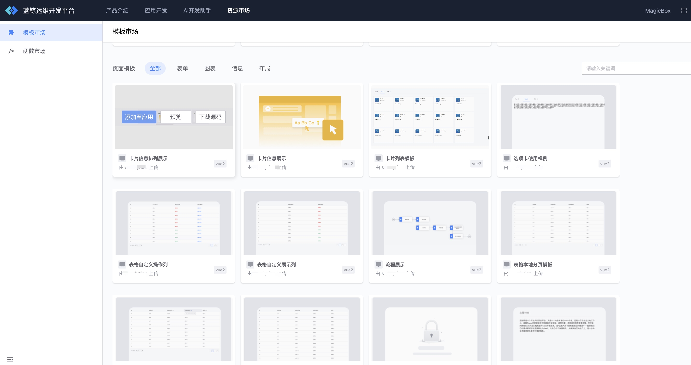
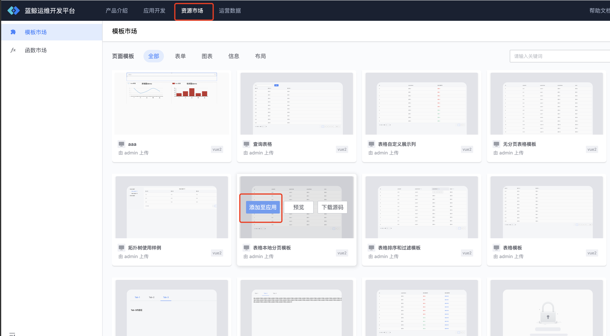
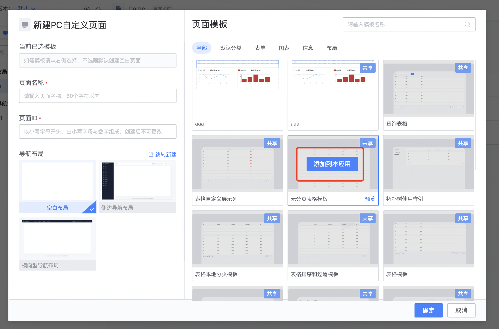

# 页面模板的使用指引

蓝鲸运维开发平台(LessCode)提供了两种不同粒度的模板，项目级模板和页面模板，页面模板是较项目级是更低粒度的模板，可以灵活的应用在各个页面当中。

## 添加模板市场的模板至应用
### 1、 通过资源市场 --> 模板市场添加

进入“**资源市场 --> 模板市场**”，选择合适的页面模板，然后“**添加至应用**”

<!--  -->
  

<!-- 2. 在添加完成后，就可以在画布模板库里使用了

 -->

### 2、通过创建页面的页面模板区域添加
新建页面时、右侧的页面模板区域也可以快捷的添加页面模板，有黑色遮照部分代表未添加至应用的页面模板，选择合适的页面模板， 点击“**添加到本应用**”

  

### 3、 通过画布模板市场添加

在画布的模板市场也可以快捷的添加页面模板，有黑色遮照部分代表未添加至应用的页面模板，选择合适的页面模板，点击“**添加到应用**”

  

### 更多关于页面模板的使用跟管理、请在 “**前端模块开发 --> 资源管理 --> 页面模板管理**” 文档查看

