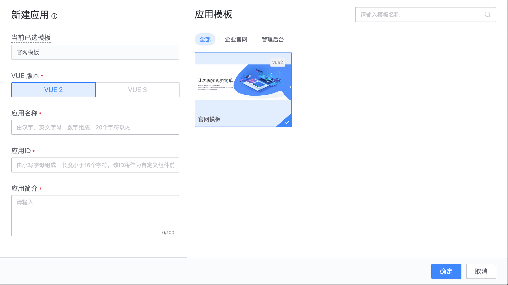

## 应用模板的使用指引

蓝鲸运维开发平台(LessCode)提供官网类、后台管理类、公告类等应用级模板，包含应用完整功能，如：函数，变量，数据库等，可直接基于应用模板创建新应用，无需从 0 到 1 进行组装，只需要将模板对应内容进行修改即可快速完成应用的开发。

## 如何使用应用模板

使用应用模板有两种方式：

### 通过应用模板市场创建新应用

进入资源市场-》模板市场，选择合适的应用模板，然后点击“创建为新应用”，或者直接下载应用模板源码并在本地进行二次开发

### 在新建应用时，选择通过模板创建

1.创建应用时选择从模板创建

{width="80%"}

2.应用创建成功后，就可以看到应用模板包含的所有页面并对页面内容进行修改
