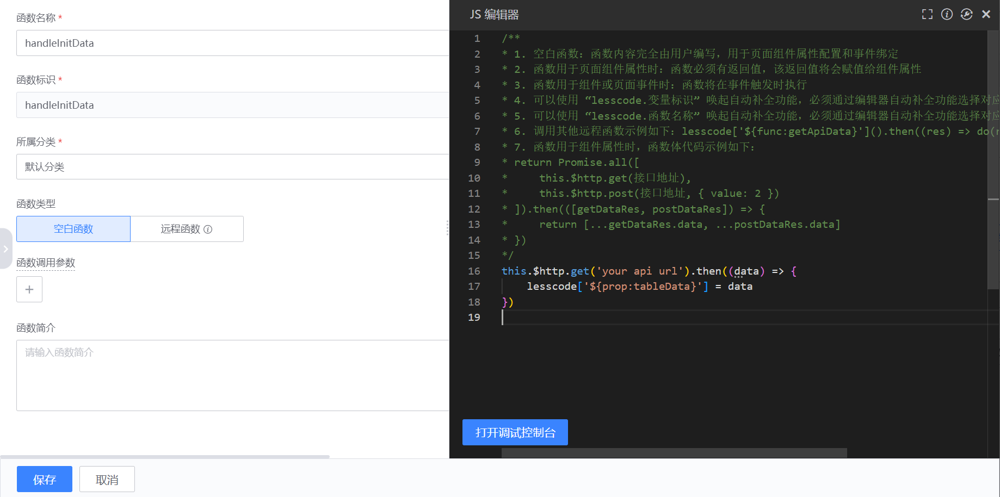
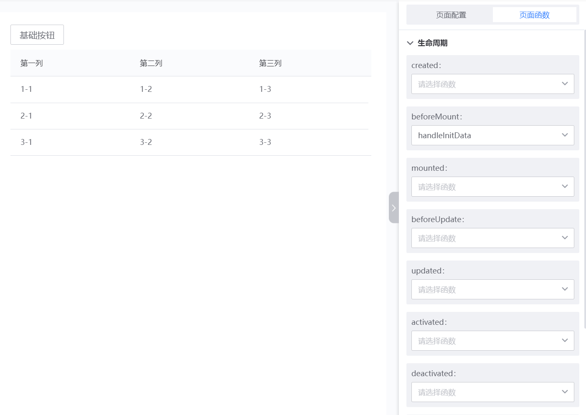
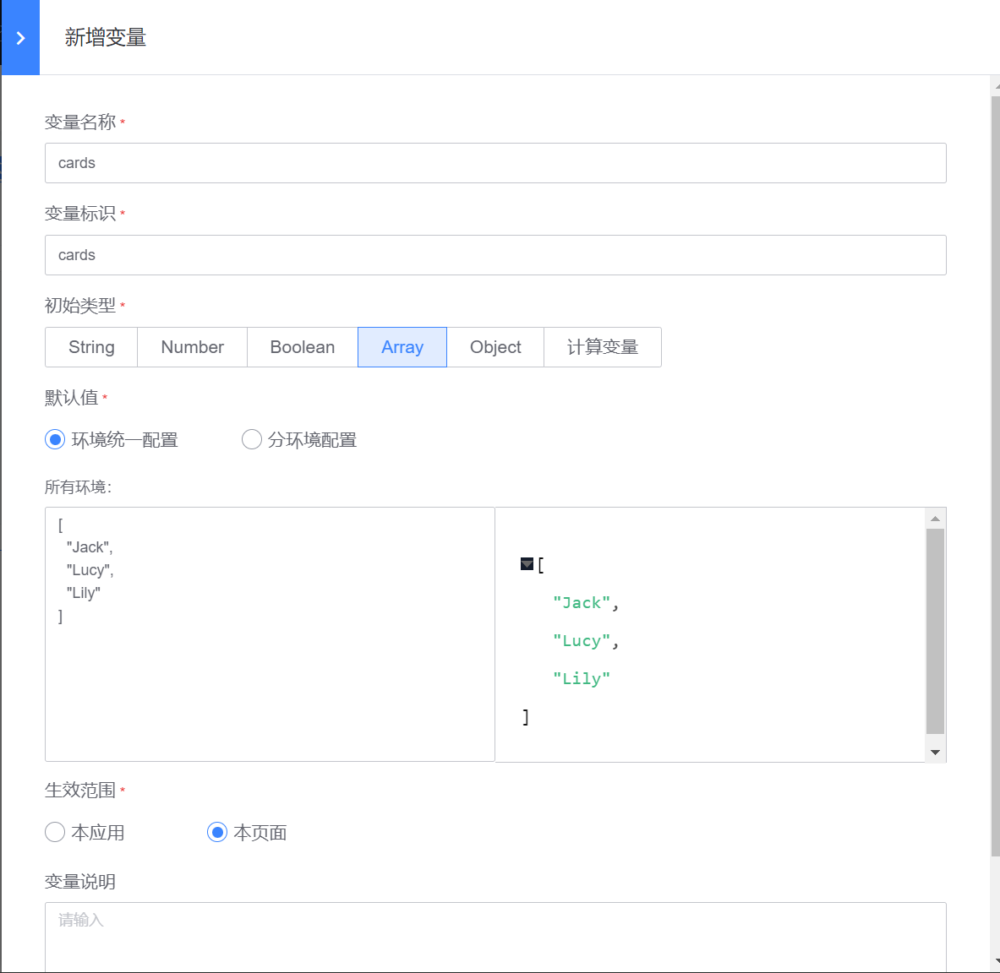
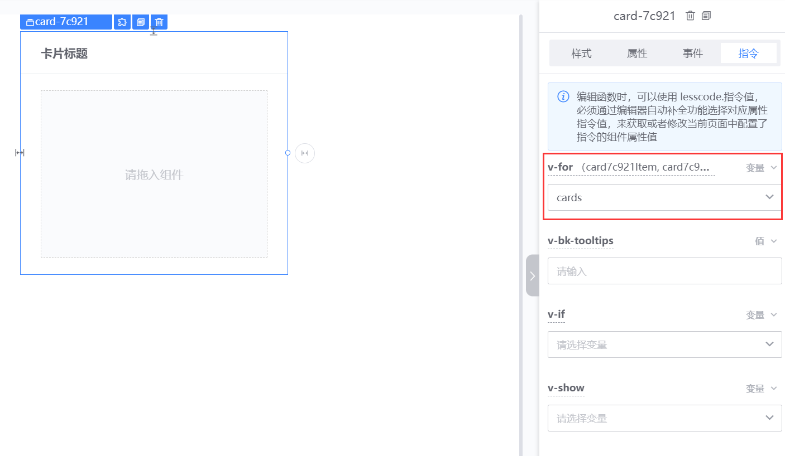
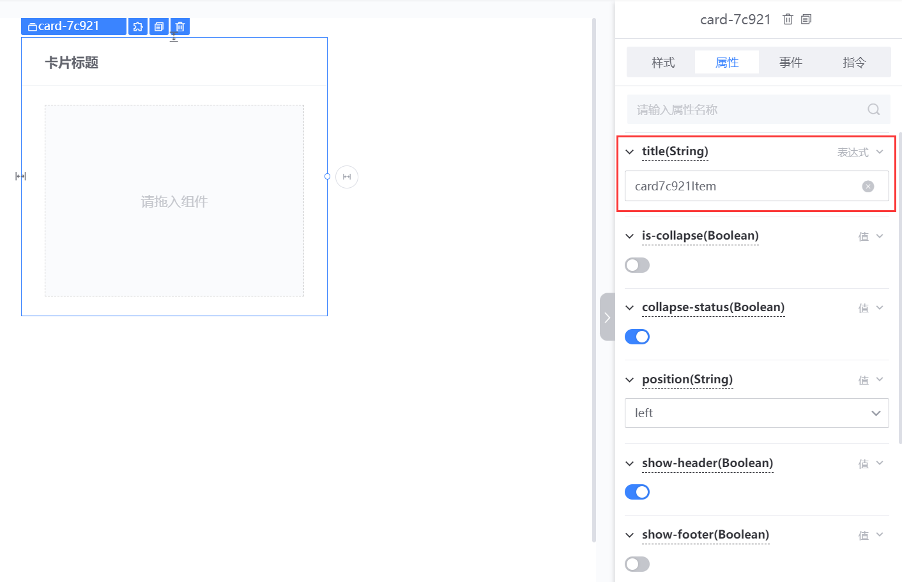
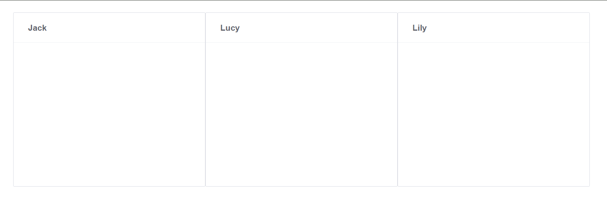
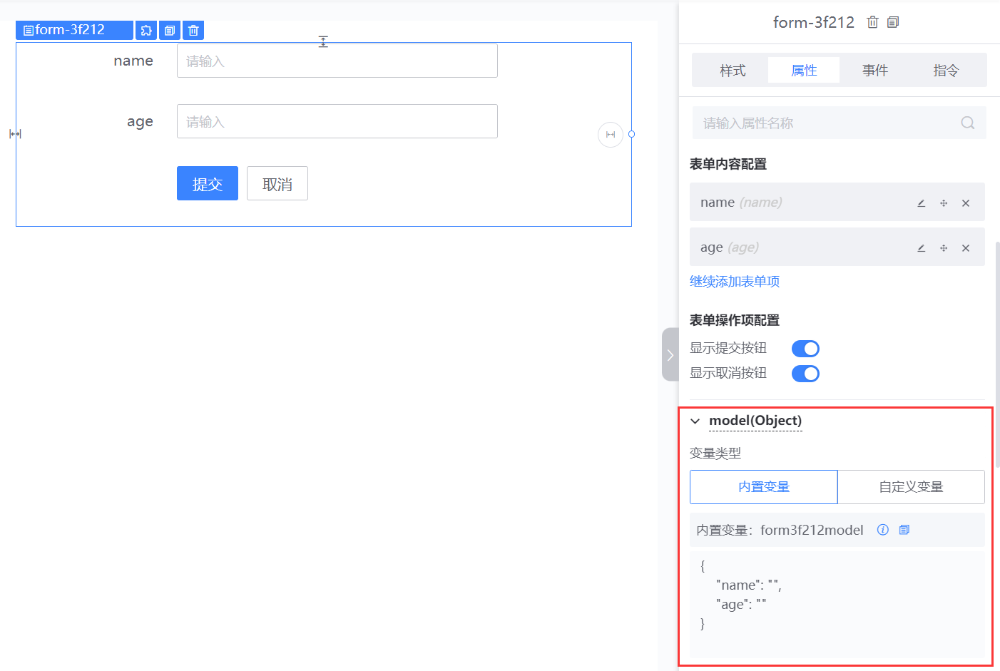
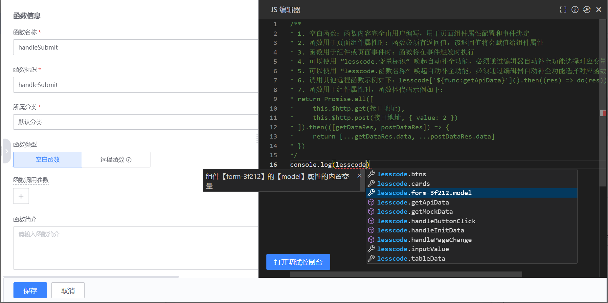
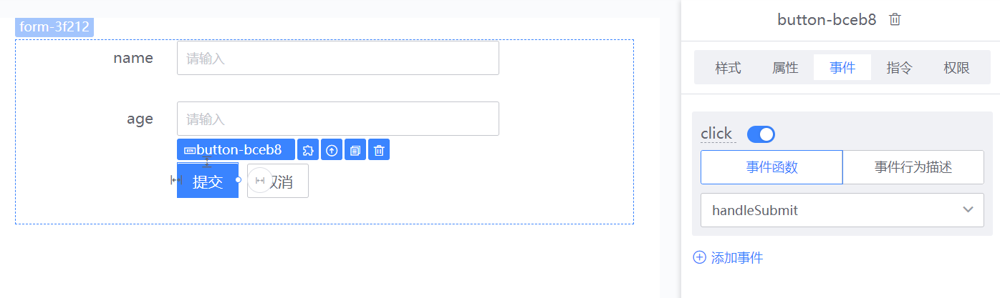

# 画布中变量使用

Vue 使用 MVVM 模式，也就是数据驱动视图，视图也可以修改数据。变量可以绑定到组件的属性、事件参数、指令中。我们可以通过修改变量来修改组件对应的状态，然后组件会自动更新。我们也可以在函数中通过变量的值来获取用户在组件中输入的值。所以变量是复杂交互中，连接函数和组件的数据。

## 修改变量直接影响视图的变化

### 使用变量将接口数据渲染到表格组件中

先给表格设置自定义变量`tableData`

然后新建函数，在函数内部通过调用 api 接口来获取想展示的数据，并将数据赋值给`tableData`变量（函数可以使用 lesscode 关键字唤起自动补全功能来选择变量或者函数）

然后在页面的`beforeMount`生命周期调用`handleInitData`函数。就可以在页面初始化的时候，通过接口获取数据，然后让数据渲染到表格组件中

### 使用变量将数组渲染成多个组件（v-for）

新增一个`cards`变量，设置初始值。

选中卡片组件以后，切换到指令面板，将`cards`变量绑定到 `v-for`指令中，这个卡片组件就会被渲染 3 次

如果需要基于 v-for 指令的值给每个组件单独赋值。可以使用如下规则（鼠标放到 v-for 指令标题上，可以看到变量名，这里是 `card7c921Item`）

1. 当输入的值为数组、数字或者对象时，请使用【card7c921Item】为表达式赋值
2. 当输入的值为数组且数组子项为对象时，请使用【card7c921Item.对象 key】为表达式赋值
3. 当输入的值为数据表时，请使用【card7c921Item.表字段名】为表达式赋值

 这里我们把数据赋值到卡片组件的标题上

预览可以看到效果如下：

## 在页面的输入框输入，会直接修改数据的值

### 表单容器组件，可以通过变量获取用户输入的值

可以先新建一个表单容器组件，并添加 2 个表单项（`name`,`age`）。然后在 model 这里可以直接使用内置变量或者选择自定义变量

新建函数`handleInitData`，并在函数内部打印表单容器内填的数据。这里必须使用 lesscode 关键字唤起自动补全功能，选择对应的数据

然后将函数`handleInitData`绑定到表单容器提交按钮的`click`事件上，就可以在点击提交的时候打印用户输入的数据了

