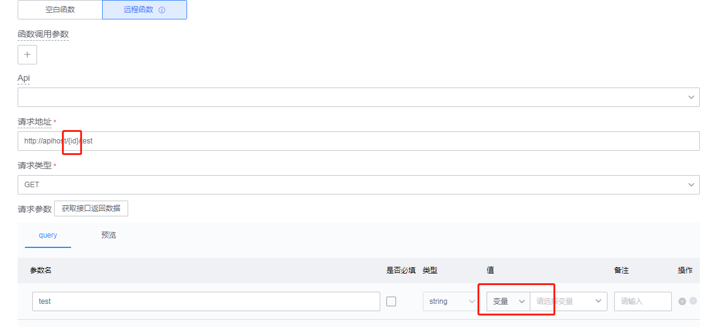

# 变量管理

蓝鲸运维开发平台(LessCode)中：可以由用户创建应用变量，并在页面开发中使用变量。通过使用变量，可以完成以下需求：

- 给组件属性动态赋值：将变量与属性绑定，后续可以通过函数操作变量来获取或者修改变量的值，来影响组件的属性
- 给组件指令动态赋值：目前平台提供了 VUE 语法中的指令，将变量与指令绑定，可以通过函数操作变量来控制指令的表现
- 应用全局变量：可以在应用定义全局变量，所有页面可以共享使用这个变量的值
- 变量分环境赋初始值：一个变量可以分别配置在预览环境、预发布环境和生产环境的初始值
- 函数参数使用变量：远程函数的【请求地址】和【请求参数】可以使用变量来组装和动态获取值

## 全局变量管理

### 全局变量管理页面路径：

应用开发（选择应用） -> 变量管理

### 全局变量使用说明：

- 可以在应用变量管理页面对全局变量进行增删改查操作
- 已经使用的变量可查询引用位置，不允许删除
- 全局变量的变量标识在应用内全局唯一
- 修改全局变量的默认值，所有页面中引用该变量的组件属性或指令的默认值将会被修改

## 页面变量管理

### 页面变量管理页面路径：

应用页面画布 -> 页面变量

### 页面变量使用说明

- 应用页面变量展示了本页面可用的变量详情（包含了全局变量和本页的页面变量）
- 只能操作页面变量，全局变量需要到全局变量管理页进行操作
- 已经使用的变量不允许删除
- 可以对本页面的页面变量进行增删改查操作

## 变量初始类型介绍

蓝鲸运维开发平台(LessCode)目前提供了六种变量初始化类型，以便应用开发使用，该类型只做为初始化的类型，可以在函数中对变量进行修改。

- 普通数据类型（String，Number，Boolean，Array，Object）：即 JS 数据类型，在绑定给属性的时候，会基于数据类型进行过滤
- 计算变量：可以根据多个变量或者函数进行组合，最后返回一个值，该变量可以应用到所有的属性和指令上。

## 变量与函数绑定

远程函数的【请求地址】 和 【请求参数】可以使用变量：如图所示，可以使用`{变量标识}`在请求地址中使用变量

 

## 函数中操作变量

在函数中，可以使用 `lesscode` 关键字唤起快捷输入，必须通过编辑器自动补全功能选择对应变量，来获取或者修改变量值，下面举例说明：

 

如上图所示：新增一个函数，函数里面可以通过 `lesscode`关键字唤起快捷输入，根据提示可以找到想修改的变量，选择对应的变量后，就可以对变量进行操作了
